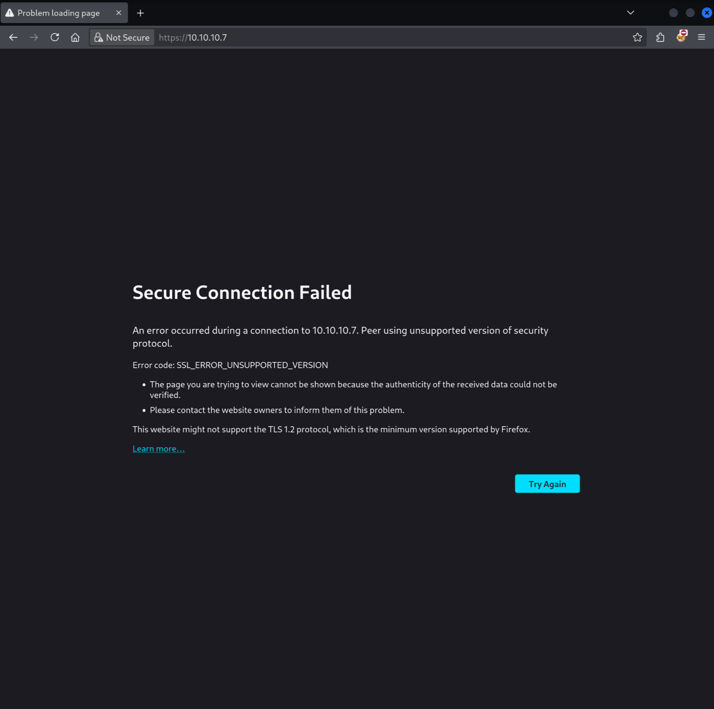
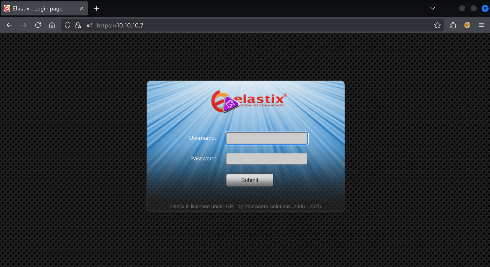
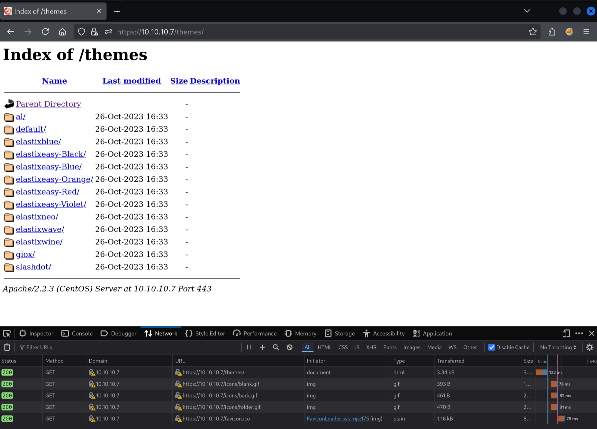

Today we are tackling Beep, an easy Linux machine on HackTheBox.

## Enumeration

As always we first do a port scan with `nmap`:

```
$ sudo nmap -sV -sC 10.10.10.7

Starting Nmap 7.95 ( https://nmap.org ) at 2025-07-21 12:11 CEST
Nmap scan report for 10.10.10.7
Host is up (0.032s latency).
Not shown: 988 closed tcp ports (reset)
PORT      STATE SERVICE    VERSION
22/tcp    open  ssh        OpenSSH 4.3 (protocol 2.0)
| ssh-hostkey:
|   1024 ad:ee:5a:bb:69:37:fb:27:af:b8:30:72:a0:f9:6f:53 (DSA)
|_  2048 bc:c6:73:59:13:a1:8a:4b:55:07:50:f6:65:1d:6d:0d (RSA)
25/tcp    open  smtp       Postfix smtpd
|_smtp-commands: beep.localdomain, PIPELINING, SIZE 10240000, VRFY, ETRN, ENHANCEDSTATUSCODES, 8BITMIME, DSN
80/tcp    open  http       Apache httpd 2.2.3
|_http-title: Did not follow redirect to https://10.10.10.7/
|_http-server-header: Apache/2.2.3 (CentOS)
110/tcp   open  pop3       Cyrus pop3d 2.3.7-Invoca-RPM-2.3.7-7.el5_6.4
|_pop3-capabilities: UIDL IMPLEMENTATION(Cyrus POP3 server v2) STLS AUTH-RESP-CODE RESP-CODES APOP TOP LOGIN-DELAY(0) USER PIPELINING EXPIRE(NEVER)
111/tcp   open  rpcbind    2 (RPC #100000)
| rpcinfo:
|   program version    port/proto  service
|   100000  2            111/tcp   rpcbind
|   100000  2            111/udp   rpcbind
|   100024  1            790/udp   status
|_  100024  1            793/tcp   status
143/tcp   open  imap       Cyrus imapd 2.3.7-Invoca-RPM-2.3.7-7.el5_6.4
|_imap-capabilities: Completed OK MULTIAPPEND X-NETSCAPE RIGHTS=kxte CATENATE RENAME UNSELECT ID QUOTA ANNOTATEMORE NO LIST-SUBSCRIBED SORT SORT=MODSEQ LISTEXT ACL MAILBOX-REFERRALS IDLE CONDSTORE CHILDREN THREAD=REFERENCES THREAD=ORDEREDSUBJECT IMAP4rev1 URLAUTHA0001 STARTTLS IMAP4 UIDPLUS BINARY NAMESPACE ATOMIC LITERAL+
443/tcp   open  ssl/http   Apache httpd 2.2.3 ((CentOS))
|_ssl-date: 2025-07-21T10:14:23+00:00; 0s from scanner time.
| ssl-cert: Subject: commonName=localhost.localdomain/organizationName=SomeOrganization/stateOrProvinceName=SomeState/countryName=--
| Not valid before: 2017-04-07T08:22:08
|_Not valid after:  2018-04-07T08:22:08
|_http-server-header: Apache/2.2.3 (CentOS)
|_http-title: Elastix - Login page
993/tcp   open  ssl/imap   Cyrus imapd
|_imap-capabilities: CAPABILITY
995/tcp   open  pop3       Cyrus pop3d
3306/tcp  open  mysql      MySQL (unauthorized)
4445/tcp  open  upnotifyp?
10000/tcp open  http       MiniServ 1.570 (Webmin httpd)
|_http-title: Site doesn't have a title (text/html; Charset=iso-8859-1).
Service Info: Hosts:  beep.localdomain, 127.0.0.1, example.com

Service detection performed. Please report any incorrect results at https://nmap.org/submit/ .
Nmap done: 1 IP address (1 host up) scanned in 387.66 seconds
```

That took quite a while! We have SSH, a mail server setup, and HTTP(s). What is Elastix?

> Elastix is a unified communications server software that brings together IP PBX, email, IM, faxing and collaboration functionality. It has a Web interface and includes capabilities such as a call center software with predictive dialing.

Let's check out the web interface. In Firefox, you will need to set `security.tls.version.min` in `about:config` to `1`, because the HTTPS certificate is so old.





There isn't much to go off of here, but I've traced the image being loaded to `  https://10.10.10.7/themes/elastixneo/login_styles.css`. When I access the `/themes` subdirectory, I get a directory listing:



This makes me wonder what other directories there are. We can use `gobuster` to enumerate this (pass the `-k` flag to skip the outdated SSL):

```
$ gobuster dir --url https://10.10.10.7 --wordlist /usr/share/seclists/Discovery/Web-Content/common.txt -k
===============================================================
Gobuster v3.6
by OJ Reeves (@TheColonial) & Christian Mehlmauer (@firefart)
===============================================================
[+] Url:                     https://10.10.10.7
[+] Method:                  GET
[+] Threads:                 10
[+] Wordlist:                /usr/share/seclists/Discovery/Web-Content/common.txt
[+] Negative Status codes:   404
[+] User Agent:              gobuster/3.6
[+] Timeout:                 10s
===============================================================
Starting gobuster in directory enumeration mode
===============================================================
/.hta                 (Status: 403) [Size: 282]
/.htaccess            (Status: 403) [Size: 287]
/.htpasswd            (Status: 403) [Size: 287]
/admin                (Status: 301) [Size: 309] [--> https://10.10.10.7/admin/]
/cgi-bin/             (Status: 403) [Size: 286]
/configs              (Status: 301) [Size: 311] [--> https://10.10.10.7/configs/]
/favicon.ico          (Status: 200) [Size: 894]
/help                 (Status: 301) [Size: 308] [--> https://10.10.10.7/help/]
/images               (Status: 301) [Size: 310] [--> https://10.10.10.7/images/]
/index.php            (Status: 200) [Size: 1785]
/lang                 (Status: 301) [Size: 308] [--> https://10.10.10.7/lang/]
/libs                 (Status: 301) [Size: 308] [--> https://10.10.10.7/libs/]
/mail                 (Status: 301) [Size: 308] [--> https://10.10.10.7/mail/]
/modules              (Status: 301) [Size: 311] [--> https://10.10.10.7/modules/]
/panel                (Status: 301) [Size: 309] [--> https://10.10.10.7/panel/]
/robots.txt           (Status: 200) [Size: 28]
/static               (Status: 301) [Size: 310] [--> https://10.10.10.7/static/]
/themes               (Status: 301) [Size: 310] [--> https://10.10.10.7/themes/]
/var                  (Status: 301) [Size: 307] [--> https://10.10.10.7/var/]
Progress: 4746 / 4747 (99.98%)
===============================================================
Finished
===============================================================
```

Using the wordlist means you only discover paths present in the wordlist, but it does speed up enumeration significantly, just pick the right size wordlist for the job.

We discovered `/admin`, but that is not accessible without a password:


