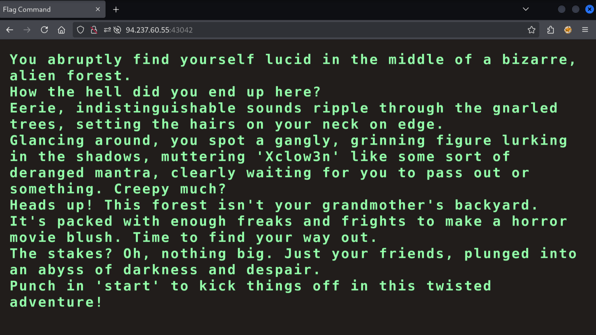
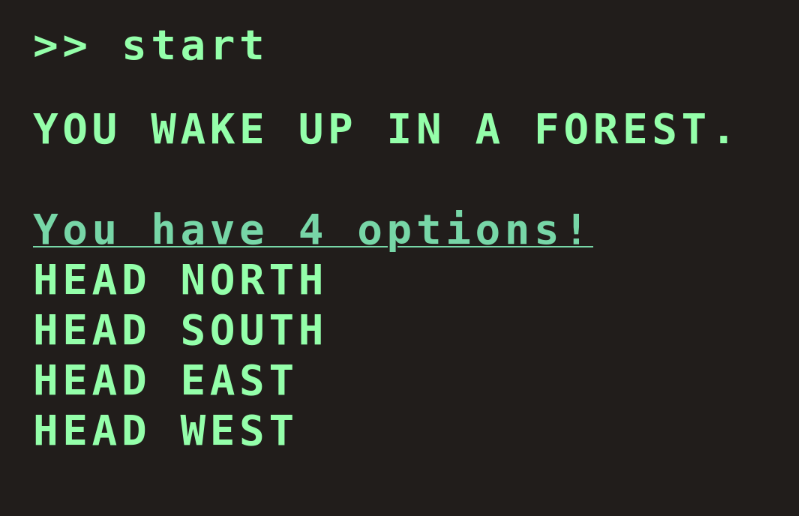
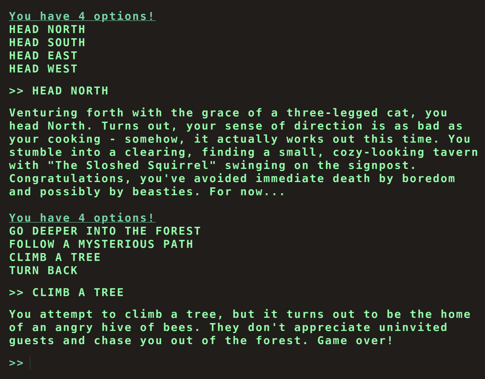
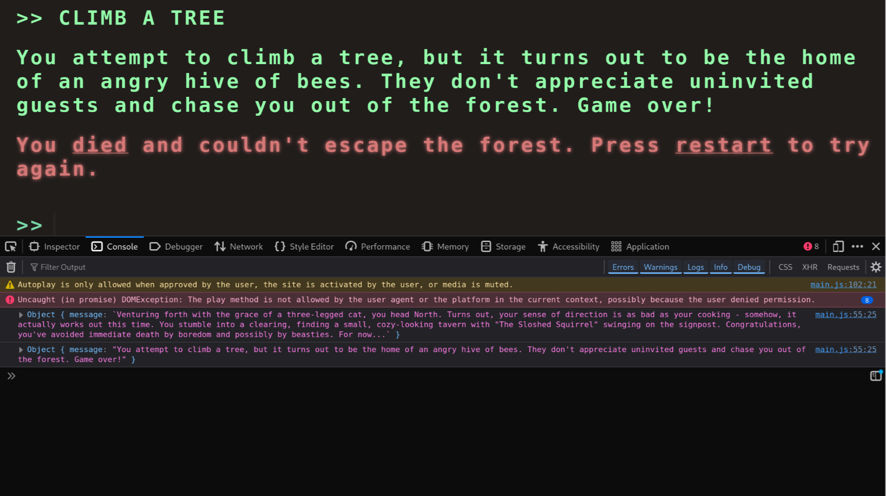
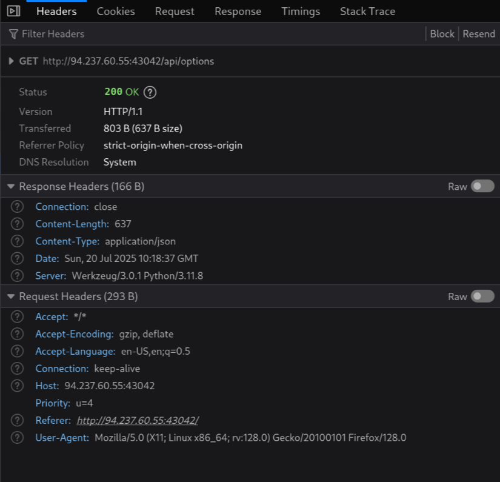
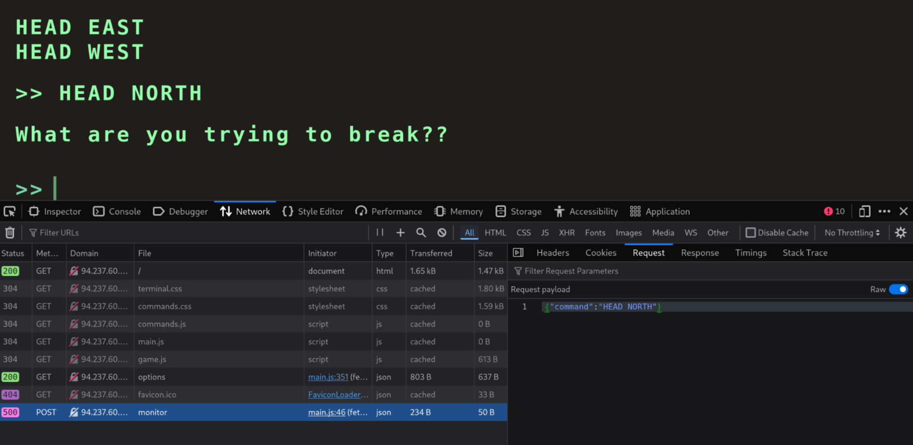

This very easy challenge provides us with a Docker host address (IP + random port): `94.237.60.55:43042`. Let's check out what it returns to a request:

```
$ curl 94.237.60.55:43042
<!DOCTYPE html>
<html lang="en">

<head>
  <meta charset="utf-8" />

...
```

It's a HTML file! We can open the address in the browser:



Seems like we are dealing with some kind of web puzzle.



I've spent quite some time enumerating all the possible options, and none seem to lead to the flag:



We have to approach this a different way. Let's open up the developer tools:



Switching to the "Network" tab reveals the files being loaded. We can notice several JavaScript files being fetched, including a `game.js` file. The developer tools show us that `game.js` sends a request to `/api/options`. Next I'll want to check out the request and response headers.



The response is a `JSON` type with a size of `637` bytes. Checking out the raw JSON reveals there is a secret option:

```json
"secret": [
      "Blip-blop, in a pickle with a hiccup! Shmiggity-shmack"
]
```

When we submit an option like `HEAD NORTH`, the `main.js` file, sends a POST request to `/api/monitor` with a JSON payload:



We should try sending such a request with our secret option!

```bash
$ curl --header "Content-Type: application/json" \
  --request POST \
  --data '{"command":"Blip-blop, in a pickle with a hiccup! Shmiggity-shmack"}' \
  94.237.60.55:43042/api/monitor
{
  "message": "HTB{D3v3l0p3r_t00l5_4r3_b35t__t0015_wh4t_d0_y0u_Th1nk??}"
}
```

The API returns our flag!
