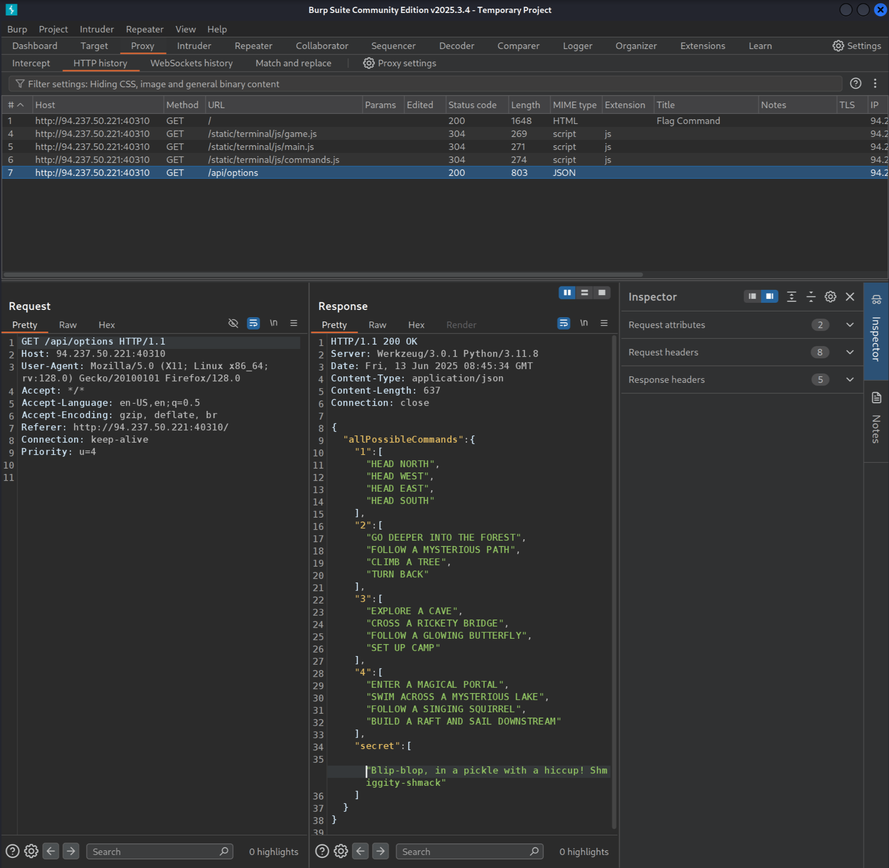
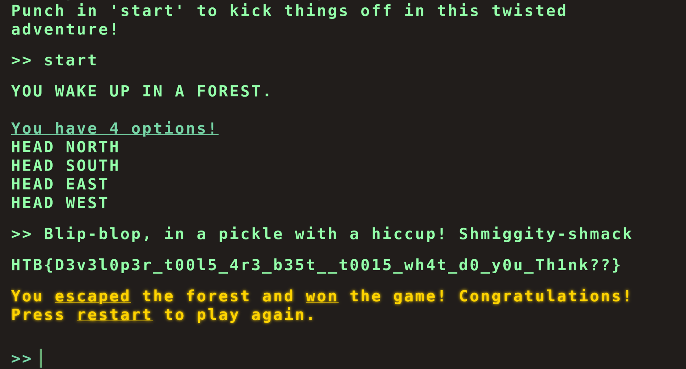
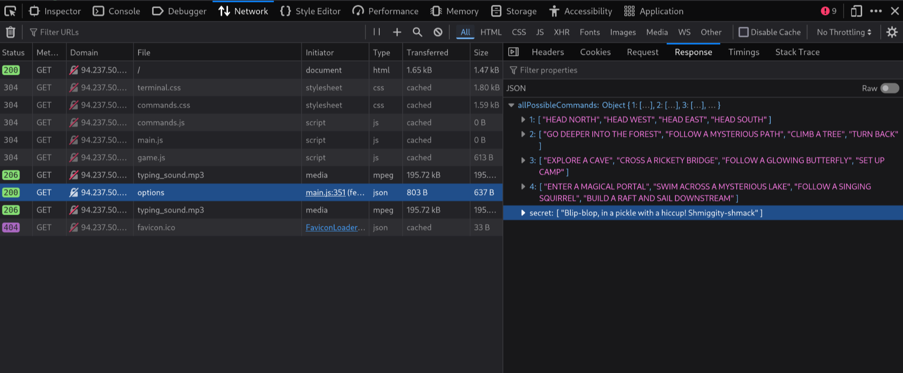

When we visit the IP address we are provided (`94.237.50.221:40310`), we get to see a welcome screen:


The page source is nothing interesting:

```html
<!DOCTYPE html>
<html lang="en">
  <head>
    <meta charset="utf-8" />
    <meta http-equiv="X-UA-Compatible" content="IE=edge" />
    <meta name="viewport" content="width=device-width, initial-scale=1" />
    <title>Flag Command</title>
    <link rel="stylesheet" href="/static/terminal/css/terminal.css" />
    <link rel="stylesheet" href="/static/terminal/css/commands.css" />
  </head>

  <body
    style="color: #94ffaa !important; position: fixed; height: 100vh; overflow: scroll; font-size: 28px;font-weight: 700;"
  >
    <div id="terminal-container" style="overflow: auto;height: 90%;">
      <a id="before-div"></a>
    </div>
    <div id="command">
      <textarea id="user-text-input" autofocus></textarea>
      <div id="current-command-line">
        <span id="commad-written-text"></span><b id="cursor">█</b>
      </div>
    </div>
    <audio
      id="typing-sound"
      src="/static/terminal/audio/typing_sound.mp3"
      preload="auto"
    ></audio>
    <script src="/static/terminal/js/commands.js" type="module"></script>
    <script src="/static/terminal/js/main.js" type="module"></script>
    <script src="/static/terminal/js/game.js" type="module"></script>

    <script type="module">
      import {
        startCommander,
        enterKey,
        userTextInput,
      } from "/static/terminal/js/main.js";
      startCommander();

      window.addEventListener("keyup", enterKey);

      // event listener for clicking on the terminal
      document.addEventListener("click", function () {
        userTextInput.focus();
      });
    </script>
  </body>
</html>
```

Next, I activated Burp Suite and set the FoxyProxy browser extension to proxy traffic through Burp Suite's port (8080). I reloaded the page, and now we can observe the network activity of the application:



I am particulary interested in this JSON response from `/api/options`:

```json
{
  "allPossibleCommands": {
    "1": ["HEAD NORTH", "HEAD WEST", "HEAD EAST", "HEAD SOUTH"],
    "2": [
      "GO DEEPER INTO THE FOREST",
      "FOLLOW A MYSTERIOUS PATH",
      "CLIMB A TREE",
      "TURN BACK"
    ],
    "3": [
      "EXPLORE A CAVE",
      "CROSS A RICKETY BRIDGE",
      "FOLLOW A GLOWING BUTTERFLY",
      "SET UP CAMP"
    ],
    "4": [
      "ENTER A MAGICAL PORTAL",
      "SWIM ACROSS A MYSTERIOUS LAKE",
      "FOLLOW A SINGING SQUIRREL",
      "BUILD A RAFT AND SAIL DOWNSTREAM"
    ],
    "secret": ["Blip-blop, in a pickle with a hiccup! Shmiggity-shmack"]
  }
}
```

This JSON document describes the possible inputs we can provide the applications. Indeed, if we enter `start` we will the list of options that are part of the key `"1"`:


But now, if we enter the "secret" input that we discovered:



The program succeeds and we get the flag! That was a brief but fun puzzle. I spent quite some time going through all the levels trying all of the possible options but never reached anything.

I used Burp Suite here but we could totally have done the same thing with just the Firefox Developer Tools:



Well, see you next time!
