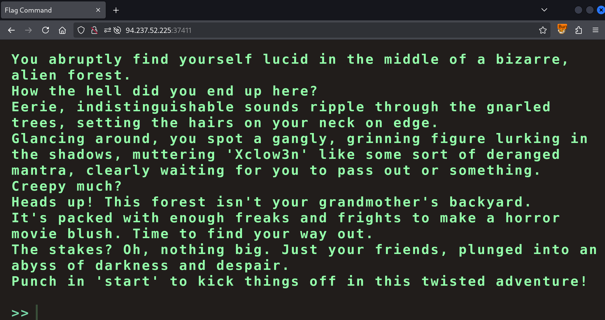
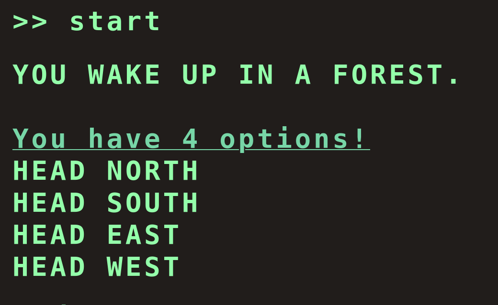
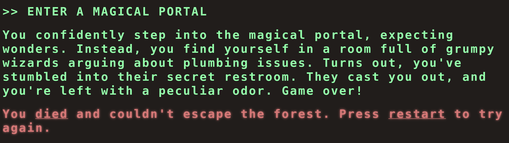
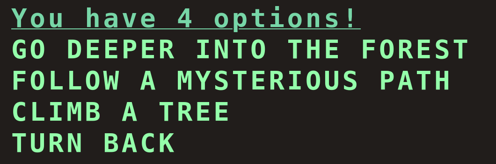
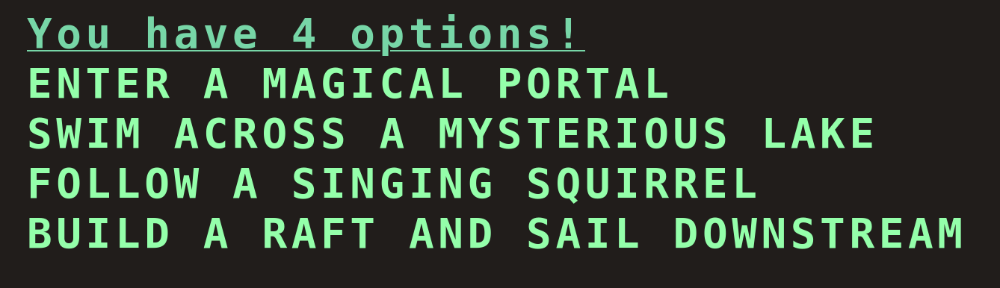
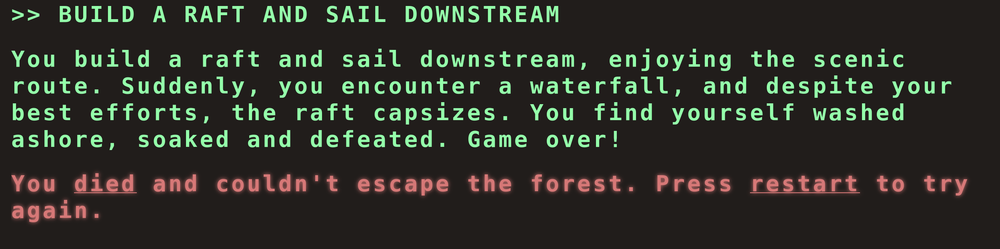
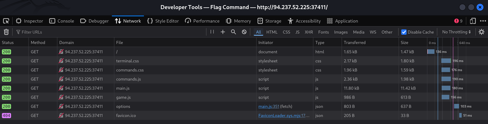
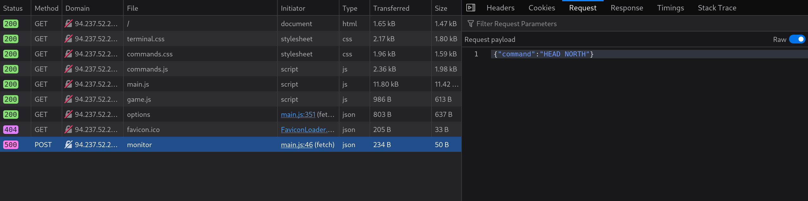
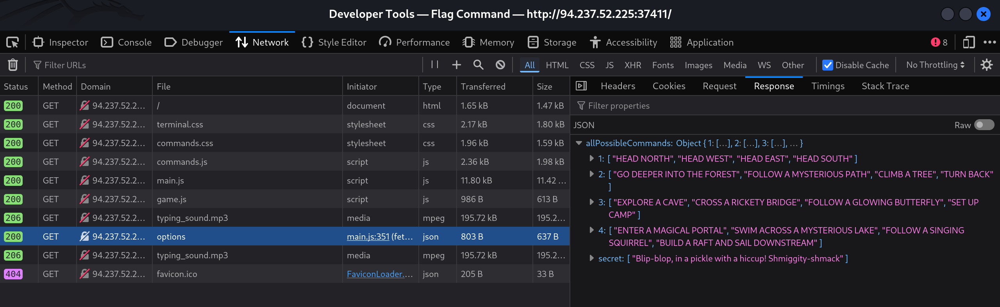
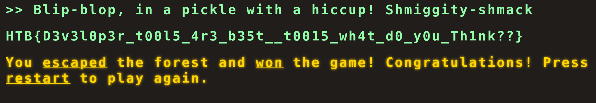

This is the second challenge on the HackTheBox platform, and it's an easy web challenge.

We are given the address `http://94.237.52.225:37411/` where we find an interactive game we can play:



When you enter `start` the game begins:



If you pick one of the options you either move forward to the next level with a new set of options or you "die":



I've played the whole game and the correct options are:

1. `HEAD NORTH` 
2. `FOLLOW A MYSTERIOUS PATH` 
3. `SET UP CAMP` 

Then at level 4 I've tried all the options but all of them result in death:



Apparently the flag is not to be found in playing the game! So we open up the network tab:



When we submit a command the application sends a `POST` request to `/api/monitor`:



The most interesting request ends up being the `GET` to `/api/options`.



Let's make the same request in our terminal:

```json
$ curl "http://94.237.52.225:37411/api/options" | jq .
  % Total    % Received % Xferd  Average Speed   Time    Time     Time  Current
                                 Dload  Upload   Total   Spent    Left  Speed
100   637  100   637    0     0  13606      0 --:--:-- --:--:-- --:--:-- 13847
{
  "allPossibleCommands": {
    "1": [
      "HEAD NORTH",
      "HEAD WEST",
      "HEAD EAST",
      "HEAD SOUTH"
    ],
    "2": [
      "GO DEEPER INTO THE FOREST",
      "FOLLOW A MYSTERIOUS PATH",
      "CLIMB A TREE",
      "TURN BACK"
    ],
    "3": [
      "EXPLORE A CAVE",
      "CROSS A RICKETY BRIDGE",
      "FOLLOW A GLOWING BUTTERFLY",
      "SET UP CAMP"
    ],
    "4": [
      "ENTER A MAGICAL PORTAL",
      "SWIM ACROSS A MYSTERIOUS LAKE",
      "FOLLOW A SINGING SQUIRREL",
      "BUILD A RAFT AND SAIL DOWNSTREAM"
    ],
    "secret": [
      "Blip-blop, in a pickle with a hiccup! Shmiggity-shmack"
    ]
  }
}
```

It seems to reveal a "secret" command:



Nice!
