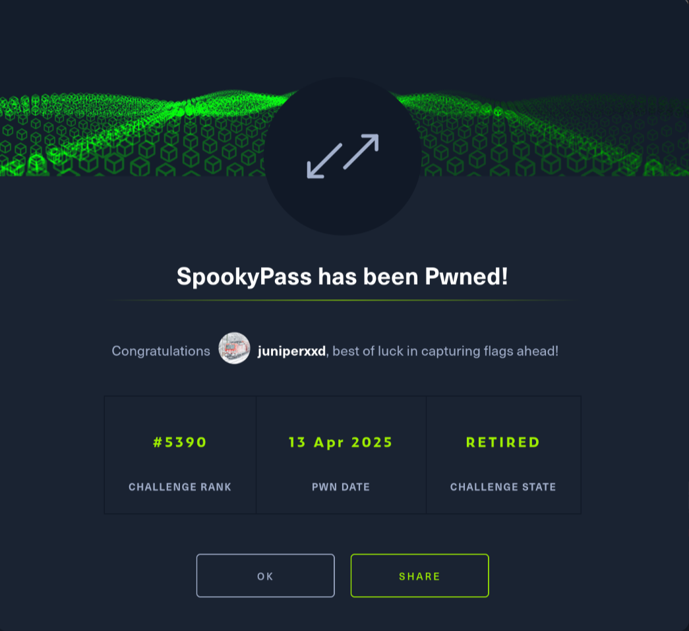

Hello, welcome to the first HackTheBox challenge I attempt to solve here on this website! Let's get started by looking at the file we have been provided:

```bash
$ ls -l

total 4
-rw-r--r-- 1 kali kali 2973 Apr 13 11:45 SpookyPass.zip
```

Cool, let's unzip the ZIP:

```bash
$ unzip SpookyPass.zip

Archive:  SpookyPass.zip
   creating: rev_spookypass/
[SpookyPass.zip] rev_spookypass/pass password:
   skipping: rev_spookypass/pass     incorrect password
```

Right, we need a password...

```bash
$ ls -l

total 8
drwxr-xr-x 2 kali kali 4096 Oct  4  2024 rev_spookypass
-rw-r--r-- 1 kali kali 2973 Apr 13 11:45 SpookyPass.zip

$ ls rev_spookypass

$ ls -la rev_spookypass

total 8
drwxr-xr-x 2 kali kali 4096 Oct  4  2024 .
drwxrwxr-x 3 kali kali 4096 Apr 13 11:47 ..
```

We really have nothing...

Turns out there is a password on the HackTheBox website! It is, surprise surprise, `hackthebox`! Let's continue:

```bash
$ unzip SpookyPass.zip

Archive:  SpookyPass.zip
[SpookyPass.zip] rev_spookypass/pass password:
  inflating: rev_spookypass/pass
```

We have just one file:

```bash
$ ls -la rev_spookypass
total 24
drwxr-xr-x 2 kali kali  4096 Apr 13 11:50 .
drwxrwxr-x 3 kali kali  4096 Apr 13 11:47 ..
-rwxr-xr-x 1 kali kali 15912 Oct  4  2024 pass
```

```bash
$ cd rev_spookypass

$ file pass
pass: ELF 64-bit LSB pie executable, x86-64, version 1 (SYSV), dynamically linked, interpreter /lib64/ld-linux-x86-64.so.2, BuildID[sha1]=3008217772cc2426c643d69b80a96c715490dd91, for GNU/Linux 4.4.0, not stripped
```

Ooh, we have a binary! Let's execute it:

```bash
$ ./pass

Welcome to the SPOOKIEST party of the year.
Before we let you in, you'll need to give us the password:
```

I do not know _this_ password, and it's not on the website! Let's try something:

```
Before we let you in, you'll need to give us the password: kaas
You're not a real ghost; clear off!
```

It's not correct! But how does this binary determine if the password is correct? Does it store the password?

We can check this using the `strings` tool:

```bash
$ strings ./pass

/lib64/ld-linux-x86-64.so.2
fgets
stdin
puts
__stack_chk_fail
__libc_start_main
__cxa_finalize
strchr
printf
strcmp
libc.so.6
GLIBC_2.4
GLIBC_2.2.5
GLIBC_2.34
_ITM_deregisterTMCloneTable
__gmon_start__
_ITM_registerTMCloneTable
PTE1
u3UH
Welcome to the
[1;3mSPOOKIEST
[0m party of the year.
Before we let you in, you'll need to give us the password:
s3cr3t_p455_f0r_gh05t5_4nd_gh0ul5
Welcome inside!
You're not a real ghost; clear off!
;*3$"
GCC: (GNU) 14.2.1 20240805
GCC: (GNU) 14.2.1 20240910
main.c
_DYNAMIC
__GNU_EH_FRAME_HDR
_GLOBAL_OFFSET_TABLE_
__libc_start_main@GLIBC_2.34
_ITM_deregisterTMCloneTable
```

Look at the line after the message asking for the password: `s3cr3t_p455_f0r_gh05t5_4nd_gh0ul5`. Is that the correct password? Let's try:

```
$ ./pass
Welcome to the SPOOKIEST party of the year.
Before we let you in, you'll need to give us the password: s3cr3t_p455_f0r_gh05t5_4nd_gh0ul5
Welcome inside!
HTB{un0bfu5c4t******}
```

And we find the answer! `HTB{un0bfu5c4t******}`. Time to submit it:



It is accepted! That was pretty easy, and definitely begs for more!
