Welcome back! Today we are tackling the "Dream Job-1" sherlock. I've gone ahead and downloaded the ZIP, and I received one file that was inside: `IOCs.txt`:

```bash
$ cat IOCs.txt

1. 7bb93be636b332d0a142ff11aedb5bf0ff56deabba3aa02520c85bd99258406f
2. adce894e3ce69c9822da57196707c7a15acee11319ccc963b84d83c23c3ea802
3. 0160375e19e606d06f672be6e43f70fa70093d2a30031affd2929a5c446d07c1
```

I'll move on to the questions and go over them one by one.

### 1. Who conducted Operation Dream Job?

I'm not sure what do to with these hashes. Let's search online for "Operation Dream Job":

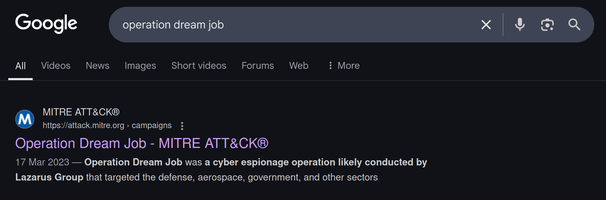

> _Operation Dream Job was a cyber espionage operation likely conducted by Lazarus Group that targeted the defense, aerospace, government, and other sectors in the United States, Israel, Australia, Russia, and India._

So looking at question 1 , the answer is `Lazarus Group`.

### 2. When was this operation first observed?


We can find the answer `September 2019` in the details section.

### 3. There are 2 campaigns associated with Operation Dream Job. One is Operation North Star, what is the other?

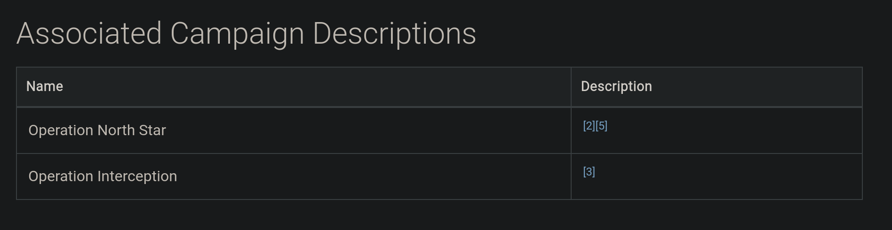

The campaigns section contains the answer `Operation Interception`.

### 4. During Operation Dream Job, there were the two system binaries used for proxy execution. One was `Regsvr32`, what was the other?

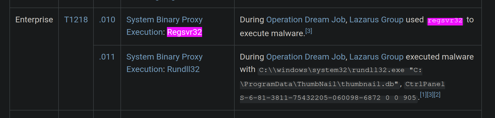

The other system binary is `Rundll32`.

### 5. What lateral movement technique did the adversary use?

If we press the "Navigation Layers" button, we are redirect to a interface where we can see the lateral movement technique used:

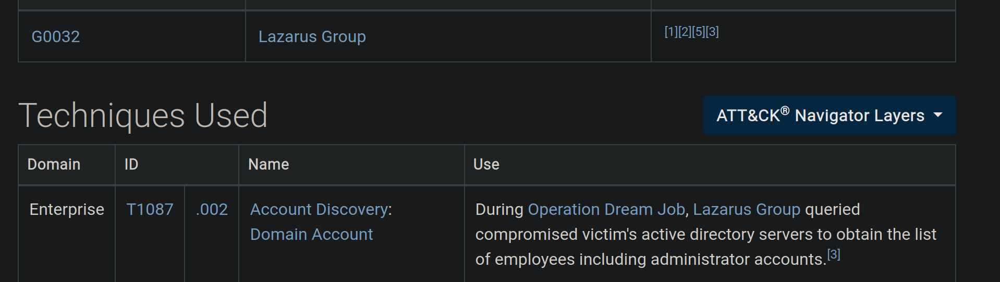

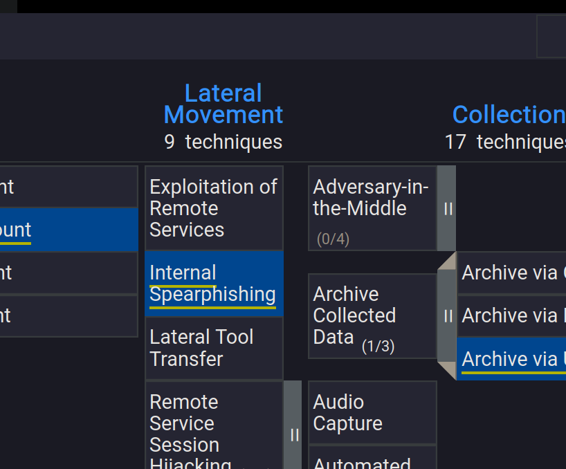

The answer is `Internal Spearphishing`

### 6. What is the technique ID for the previous answer?

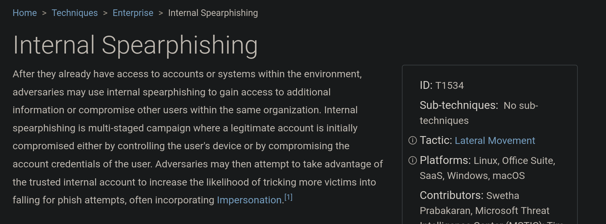

On the `Internal Spearphishing` technique page we can see the ID is `T1534`

### 7. What Remote Access Trojan did the Lazarus Group use in Operation Dream Job?

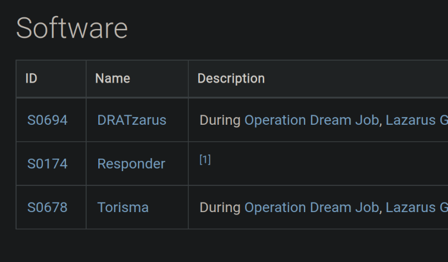

On the "Software" section for Operation Dream Job we can find `DRATzarus`.

### 8. What technique did the malware use for execution?

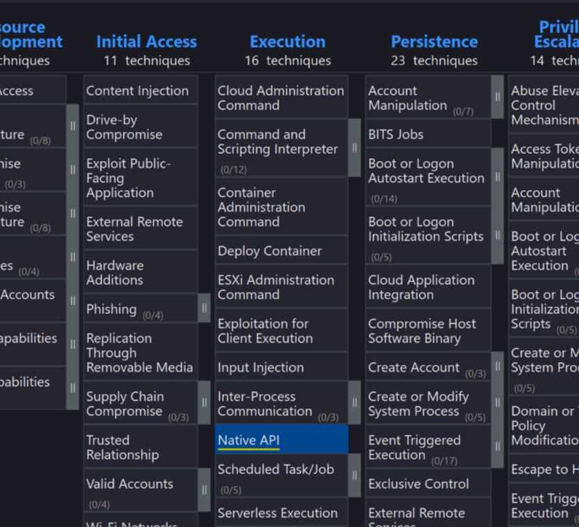

If we open the Navigation Layer for `DRATzarus` we can find "Native API" being used for execution.

### 9. What technique did the malware use to avoid detection in a sandbox?

If we look at the bottom of the `DRATzarus` page we will find our answer "Time Based Evasion":


### 10. To answer the remaining questions, utilize VirusTotal and refer to the IOCs.txt file. What is the name associated with the first hash provided in the IOC file?

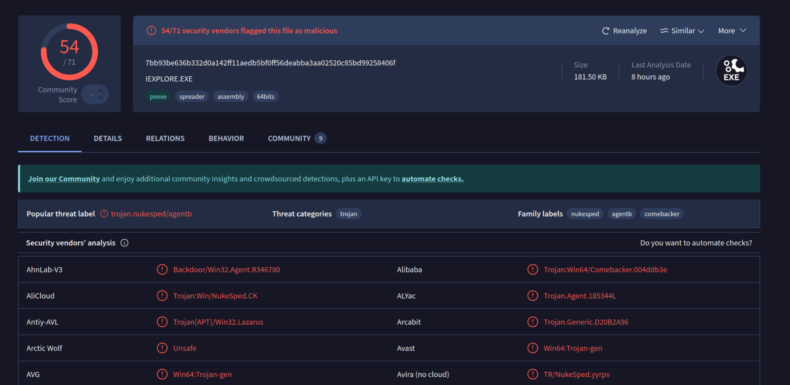

The name is `IEXPLORE.exe`

### 11. When was the file associated with the second hash in the IOC first created?

We can check the details of the second hash:

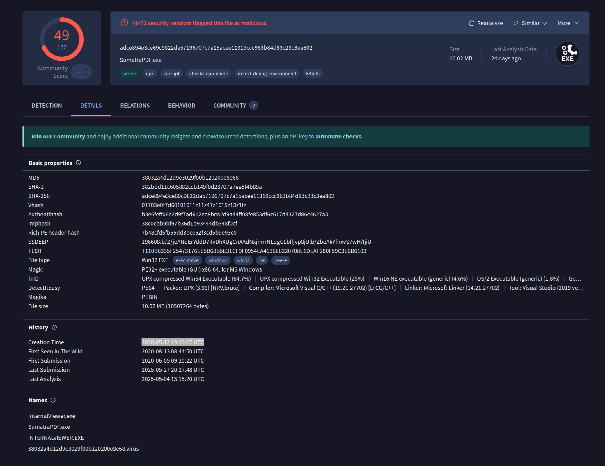

We find `2020-05-12 19:26:17`.

### 12. What is the name of the parent execution file associated with the second hash in the IOC?

Under the relation tab we will find `BAE_HPC_SE.iso`:

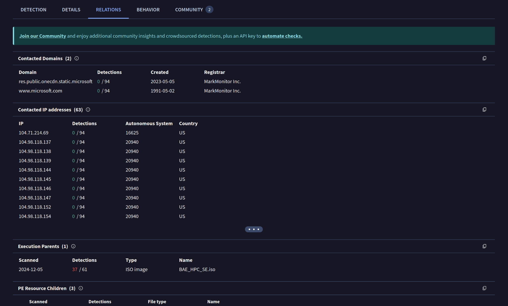

### 13. Examine the third hash provided. What is the file name likely used in the campaign that aligns with the adversary's known tactics?

Operation Dream Job targeted the defense industry:

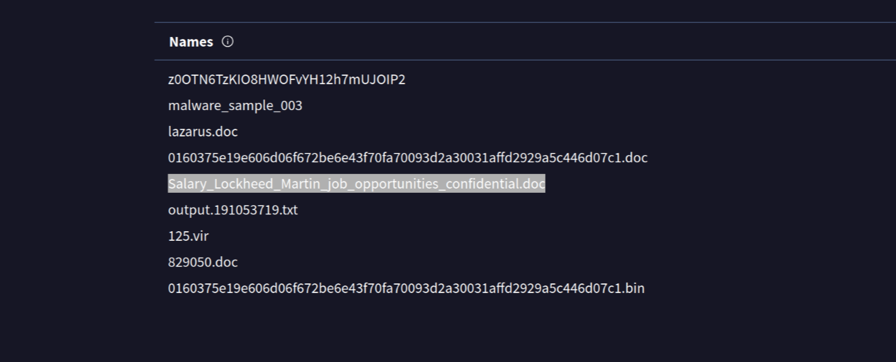

So the answer is `Salary_Lockheed_Martin_job_opportunities_confidential.doc`

### 14. Which URL was contacted on 2022-08-03 by the file associated with the third hash in the IOC file?


This will be `https://markettrendingcenter.com/lk_job_oppor.docx`.

## Great Success!!

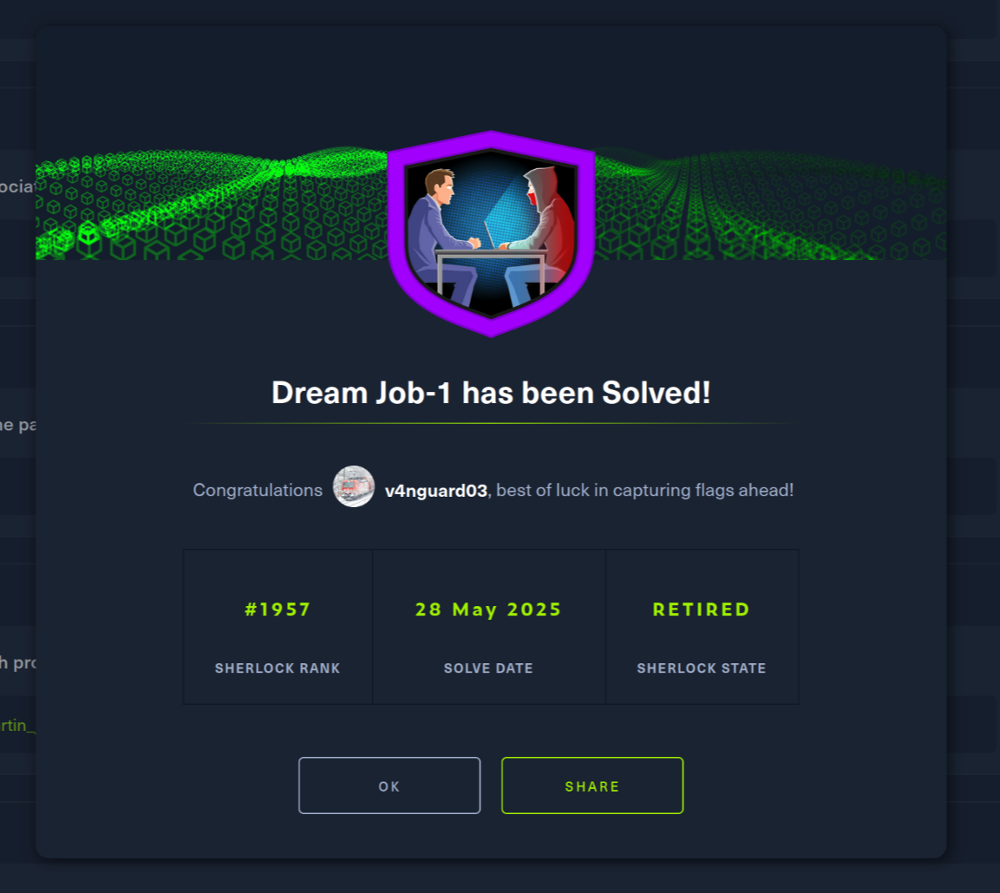
