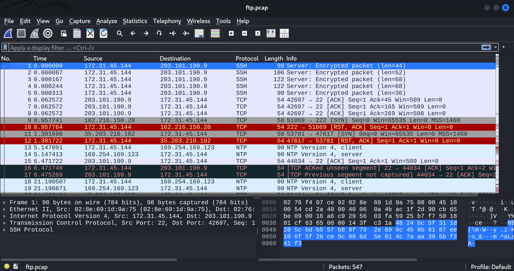
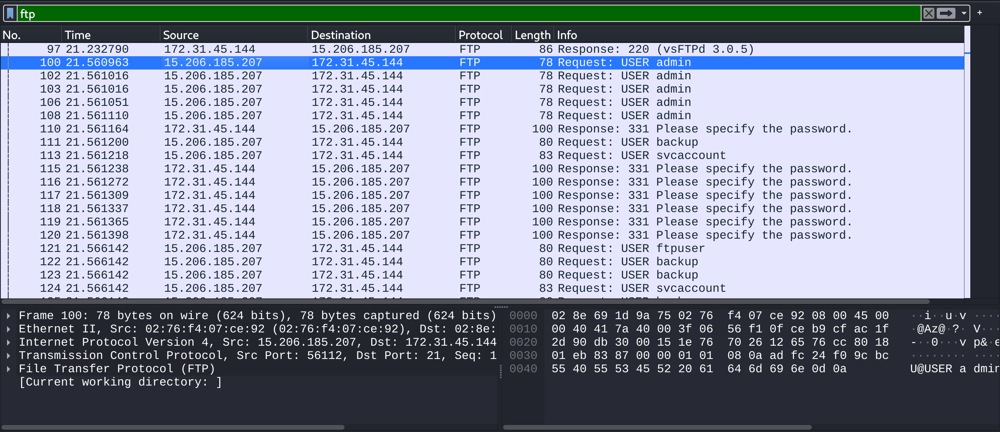
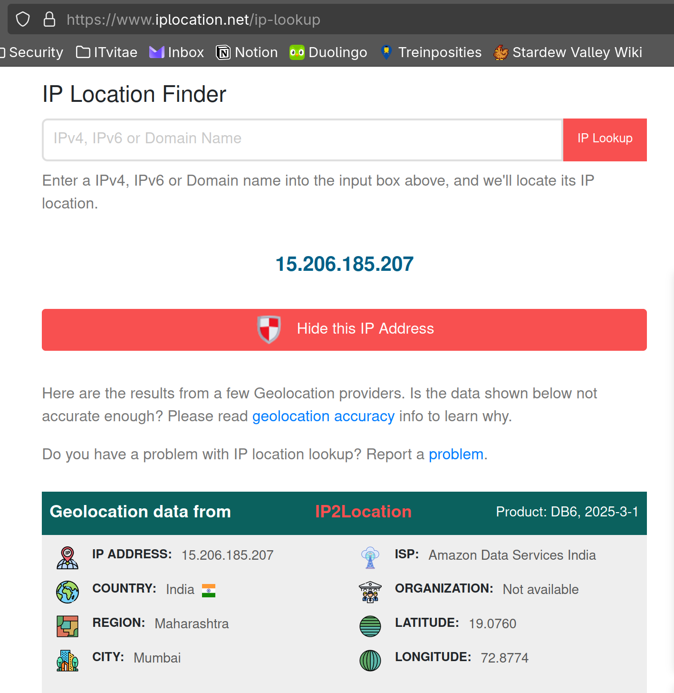
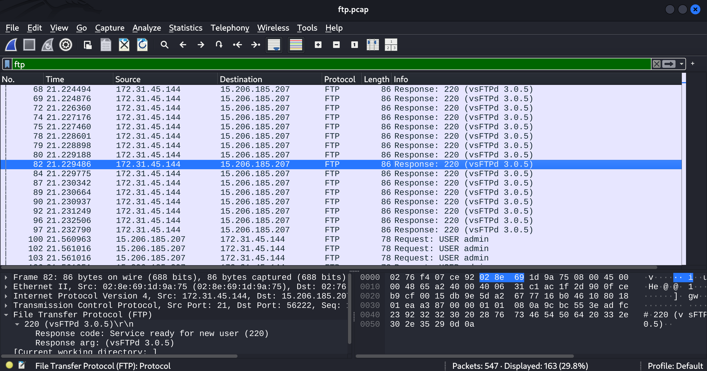
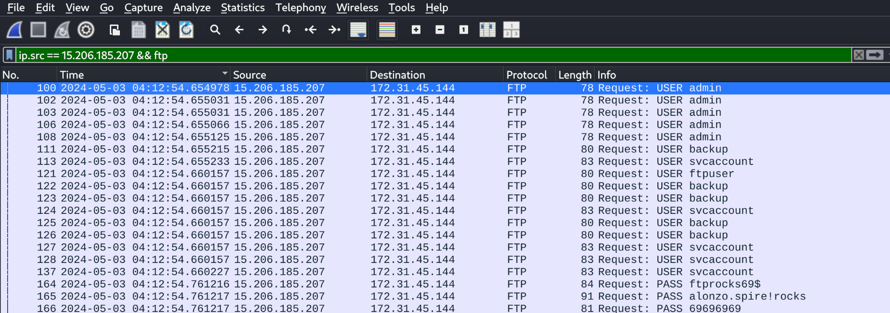
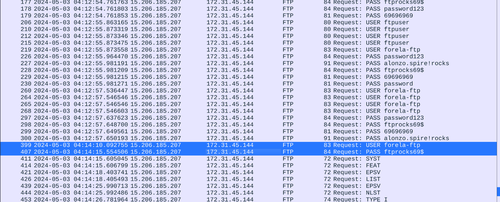
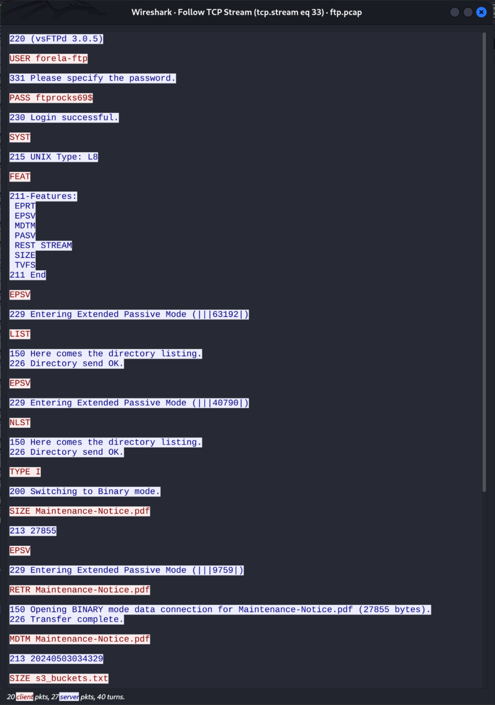
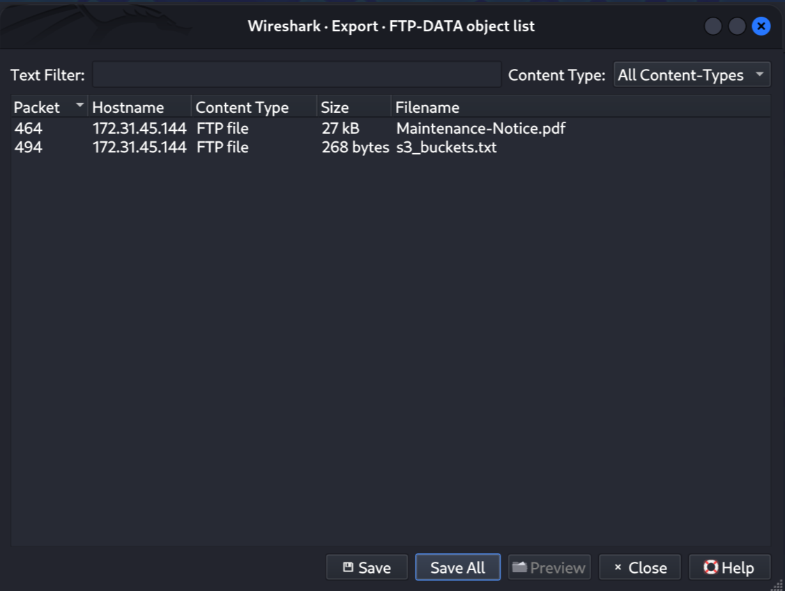
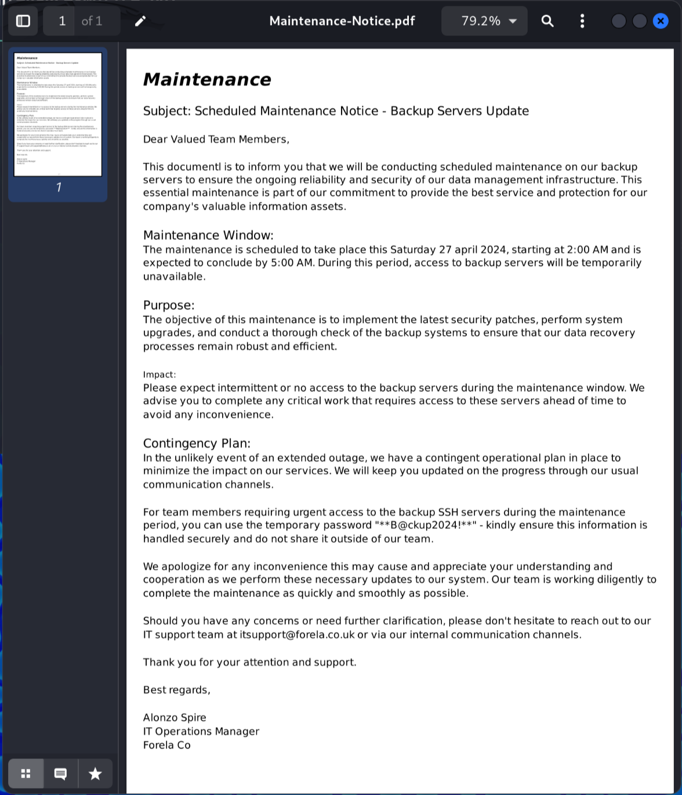

Hello and welcome to this HackTheBox Sherlock challenge! Today we are looking at "Origins". Let's get started by preparing our files:

```
$ 7z x Origins.zip

7-Zip 24.09 (x64) : Copyright (c) 1999-2024 Igor Pavlov : 2024-11-29
 64-bit locale=en_US.UTF-8 Threads:4 OPEN_MAX:1024, ASM

Scanning the drive for archives:
1 file, 40178 bytes (40 KiB)

Extracting archive: Origins.zip
--
Path = Origins.zip
Type = zip
Physical Size = 40178


Enter password (will not be echoed):
Everything is Ok

Size:       77250
Compressed: 40178
```

```
$ ls -l
total 116
-rw-rw-r-- 1 kali kali 77250 May  3  2024 ftp.pcap
```

We have a packet capture file, which means we are going to bust out Wireshark!



Moving on to question number 1:

### 1. What is the attacker's IP address?

If we filter for only FTP traffic, we notice that pretty much all of the requests are coming from a single IP address (`15.206.185.207`).



That is our answer.

### 2. It's critical to get more knowledge about the attackers, even if it's low fidelity. Using the geolocation data of the IP address used by the attackers, what city do they belong to?

To answer this question we can use a simple geolocation lookup website:



The attackers are from Mumbai, India (answer = `Mumbai`).

### 3. Which FTP application was used by the backup server? Enter the full name and version. (Format: Name Version)

The answer can easily be found by looking more closely at the FTP traffic:



The application is `vsftpd` and the version is `3.0.5` (answer = `vsFTPd 3.0.5`).

### 4. The attacker has started a brute force attack on the server. When did this attack start?

We can filter for the source IP address and for a traffic type of FTP:



We select the first packet:

```
100 2024-05-03 04:12:54.654978 15.206.185.207 172.31.45.144 FTP 78 Request: USER admin
```

So the answer to question 4 is `2024-05-03 04:12:54`.

### 5. What are the correct credentials that gave the attacker access? (Format username:password)?

This one is really straightforward: we simply take the first "command" and follow that TCP stream to see which credentials were used as part of it:



The correct credentials are `forela-ftp:ftprocks69$`

### 6. The attacker has exfiltrated files from the server. What is the FTP command used to download the remote files?

Notice the commands being send as we look through the TCP stream:



It's the `RETR` command that's being used to download files.

### 7. Attackers were able to compromise the credentials of a backup SSH server. What is the password for this SSH server?

If we go to `File > Export Objects > FTP-Data`, we have the ability to extract the several files that were uploaded or downloaded over the FTP channel while we were capturing:




If we then open the `Maintenance Notice.pdf` file, we can find the password of the backup SSH server:



The answer is `**B@ckup2024!**`.

### 8. What is the s3 bucket URL for the data archive from 2023?

The other file we extracted using `File > Export Objects` is `s3_buckets.txt`:

```
https://2023-coldstorage.s3.amazonaws.com # bulk data from 2023, if required anything from here contact simon or alonzo. Retention period is 4 years
https://2022-warmstor.s3.amazonaws.com # pending audit, email alonzo at archivebackups@forela.co.uk for any clearance
```

The s3 bucket URL for the data archive from 2023 is `https://2023-coldstorage.s3.amazonaws.com`.

### 9. The scope of the incident is huge as Forela's s3 buckets were also compromised and several GB of data were stolen and leaked. It was also discovered that the attackers used social engineering to gain access to sensitive data and extort it. What is the internal email address used by the attacker in the phishing email to gain access to sensitive data stored on s3 buckets?

This is the email address we can find in the `s3_buckets.txt` file (`archivebackups@forela.co.uk`).

## Conclusion

That was Origins, thanks for coming along!
