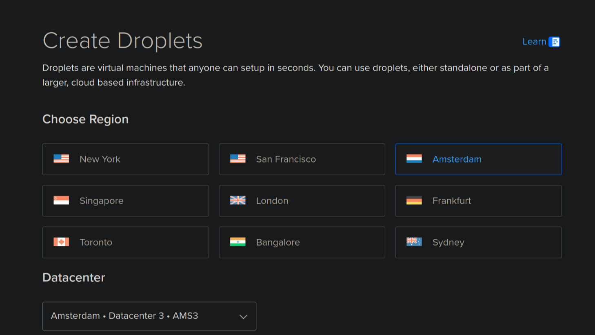
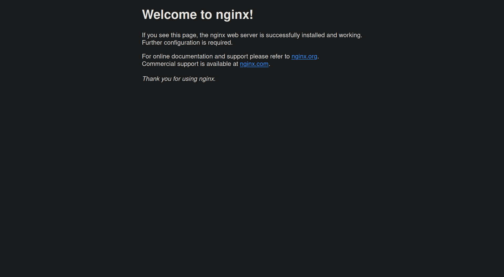

Nowadays there are many a ways to deploy your application to the world. All the way from a Raspberry Pi in your basement to serverless computing in the cloud. It can be overwhelming to try to pick the right platform for your little hobby projects. It's easy to convince yourself that you need to go for expensive options because there seem to be always endless problems and downsides to cheap solutions. But do you really need advanced computing solutions to address your zero customers?

Where did the days go of self-hosting on a $5/month VPS? Has this really become so difficult or have these big tech companies managed to convince you you need their expensive solutions? I wanted to challenge myself to set up a fully-automated CI/CD pipeline with containerization, database migrations and persistent file storage.

We'll be using Docker, GitHub Actions, Cloudflare and DigitalOcean Droplets.

## Setting up

To start off I'll head over to the DigitalOcean dashboard to create a new droplet.

1. First we'll pick a region:



2. Then we'll pick an image and a size:


3. Finally we'll hit that "Create" button and set DigitalOcean on its way for us.

## Basic installation

Once the Droplet has been created we'll find it in the "Resources" panel:


We will follow ["Initial Server Setup with Ubuntu 22.04"](https://www.digitalocean.com/community/tutorials/initial-server-setup-with-ubuntu):

1. `ssh root@your_server_ip`
2. `adduser <username>`
3. `usermod -aG sudo <username>`
4. `rsync --archive --chown=<username>:<username> ~/.ssh /home/<username>`
5. `exit`
6. `ssh <username>@your_server_ip`

For convenience I'll add an entry to `~/.ssh/config` on my host:

```
Host vps
  HostName 164.92.214.12
  User jens
```

Next we will set up a firewall:

```
$ sudo ufw allow OpenSSH

$ sudo ufw enable
```

## Nginx

Following [the official Nginx tutorial for DigitalOcean](https://www.digitalocean.com/community/tutorials/how-to-install-nginx-on-ubuntu-22-04), we'll install and configure Nginx to serve as a reverse proxy for our applications:

1. Installing Nginx comes first

   ```bash
   $ sudo apt update

   $ sudo apt install nginx
   ```

2. Next, we should configure UFW to allow Nginx traffic over HTTPS (pick `Nginx HTTP` if you are not following my next steps on configuring Cloudflare end-to-end SSL):

   ```
   $ sudo ufw allow 'Nginx HTTPS'
   ```

   Oh yeah, I've also gone ahead and placed my Cloudflare Origin Server certificate and private key (generated on the dashboard under "SSL/TLS - Origin Server") and [the Cloudflare Authenticated Origin Pulls certificate](https://developers.cloudflare.com/ssl/static/authenticated_origin_pull_ca.pem) (as `cloudflare.pem`) on my droplet under `/etc/ssl`:

   ```
   $ scp cloudflare.pem certificate.pem key.pem root@vps:/etc/ssl/
   cloudflare.pem                                             100% 2156   138.7KB/s   00:00
   certificate.pem                                            100% 1689   122.6KB/s   00:00
   key.pem                                                    100% 1705   124.4KB/s   00:00
   ```

3. Then, we can follow [the offical guide](https://www.digitalocean.com/community/tutorials/how-to-host-a-website-using-cloudflare-and-nginx-on-ubuntu-22-04) to configure Nginx:

   - Add a new Nginx configuration for your domain (`/etc/nginx/sites-available/your_domain`):

   ```
   server {
     listen 443 ssl;
     listen [::]:443 ssl;
     ssl_certificate          /etc/ssl/certificate.pem;
     ssl_certificate_key      /etc/ssl/key.pem;
     ssl_client_certificate   /etc/ssl/cloudflare.pem;
     ssl_verify_client on;

     server_name your_domain;

     root /var/www/html;
     index index.html;

     location / {
       try_files $uri $uri/ =404;
     }
   }
   ```

   - Link this file into `sites-enabled` to activate it:

     ```
     $ sudo ln -s /etc/nginx/sites-available/your_domain /etc/nginx/sites-enabled/
     ```

   - `sudo nginx -t`
   - `sudo nginx -s reload`

   - Finally, as mentioned in the article, we'll want to enable "Authenticated Origin Pulls" in the Cloudflare dashboard to improve end to end security and ensure no-one can interact with our Nginx without going through Cloudflare (great for DDOS protection!)

4. If you haven't done that yet, you will want to add a `A` DNS record for your domain on the Cloudflare dashboard pointing towards the VPS IPv4 address. Then, at last, we can observe the fruits of our labor:



## Docker

[Again we'll follow the DigitalOcean guide](https://www.digitalocean.com/community/tutorials/how-to-install-and-use-docker-on-ubuntu-22-04):

```
$ sudo apt install apt-transport-https ca-certificates curl software-properties-common

$ curl -fsSL https://download.docker.com/linux/ubuntu/gpg | sudo gpg --dearmor -o /usr/share/keyrings/docker-archive-keyring.gpg

$ echo "deb [arch=$(dpkg --print-architecture) signed-by=/usr/share/keyrings/docker-archive-keyring.gpg] https://download.docker.com/linux/ubuntu $(lsb_release -cs) stable" | sudo tee /etc/apt/sources.list.d/docker.list > /dev/null

$ sudo apt update

$ apt-cache policy docker-ce

> docker-ce:
>  Installed: (none)
>  Candidate: 5:20.10.14~3-0~ubuntu-jammy
>  Version table:
>     5:20.10.14~3-0~ubuntu-jammy 500
>        500 https://download.docker.com/linux/ubuntu jammy/stable amd64 Packages
>     5:20.10.13~3-0~ubuntu-jammy 500
>        500 https://download.docker.com/linux/ubuntu jammy/stable amd64 Packages

$ sudo apt install docker-ce

```

Now running `sudo systemctl status docker` should show `Active: active (running)`.

Lastly add yourself to the `docker` group: `sudo usermod -aG docker ${USER}`. You will need to exit your SSH session and log back in for this to take effect!

We can now make Docker run containers:

```
$ docker run hello-world

Unable to find image 'hello-world:latest' locally
latest: Pulling from library/hello-world
e6590344b1a5: Pull complete
Digest: sha256:7e1a4e2d11e2ac7a8c3f768d4166c2defeb09d2a750b010412b6ea13de1efb19
Status: Downloaded newer image for hello-world:latest

Hello from Docker!
This message shows that your installation appears to be working correctly.

To generate this message, Docker took the following steps:
 1. The Docker client contacted the Docker daemon.
 2. The Docker daemon pulled the "hello-world" image from the Docker Hub.
    (amd64)
 3. The Docker daemon created a new container from that image which runs the
    executable that produces the output you are currently reading.
 4. The Docker daemon streamed that output to the Docker client, which sent it
    to your terminal.

To try something more ambitious, you can run an Ubuntu container with:
 $ docker run -it ubuntu bash

Share images, automate workflows, and more with a free Docker ID:
 https://hub.docker.com/

For more examples and ideas, visit:
 https://docs.docker.com/get-started/
```

## CI/CD

### Integration

I will now focus on getting my Docker images from GitHub to the VPS. I will build the image in GitHub Actions, then export it using `docker save`, send it over SSH to the VPS, then import it there using `docker load`. But first, I'll create a separate `github` user on my VPS whose home directory I can fill with the scripts:

```
<ssh into VPS>

$ sudo adduser github

info: Adding user `github' ...
info: Selecting UID/GID from range 1000 to 59999 ...
info: Adding new group `github' (1001) ...
info: Adding new user `github' (1001) with group `github (1001)' ...
info: Creating home directory `/home/github' ...
info: Copying files from `/etc/skel' ...
New password:
Retype new password:
passwd: password updated successfully
Changing the user information for github
Enter the new value, or press ENTER for the default
	Full Name []:

...
```

This user will also need to be added to the `docker` group so it can execute the required commands:

```
$ sudo usermod -aG docker github
```

Then, generate a key with `ssh-keygen` on your local machine, and place the generated `.pub` key in `/home/github/.ssh/authorized_keys` on your VPS. This will allow you to SSH into the `github` account from your local machine by passing `-i <private_key>` to the `ssh` command, and we will also use this private key in the GitHub Actions workflow to authenticate in the same way.

Testing this out in my local terminal we see that this works great:

```
$ docker save myimage:latest | gzip | ssh github@vps -i ~/documents/id_github "docker load"

Loaded image: myimage:latest
```

Checking on the VPS we see the image has been transferred successfully:

```
$ docker images

REPOSITORY        TAG       IMAGE ID       CREATED          SIZE
myimage           latest    cf84d869dbed   18 minutes ago   208MB
hello-world       latest    74cc54e27dc4   2 months ago     10.1kB
```

Time to set up the `deploy` workflow in GitHub Actions.

```
deploy:
  needs: [formatting, lint, typecheck]
  runs-on: ubuntu-latest
  steps:
    - name: Set up Docker Buildx
      uses: docker/setup-buildx-action@v3

    - name: Build
      uses: docker/build-push-action@v6
      with:
        load: true
        tags: myimage.com:latest

    - name: List images
      run: |
        docker images

    - name: Trigger deployment over SSH
      run: |
        mkdir -p ~/.ssh
        echo "${{ secrets.VPS_KEY}}" > ~/.ssh/id_ed25519
        chmod 600 ~/.ssh/id_ed25519
        docker save myimage.com:latest | \
          gzip | \
          ssh -i ~/.ssh/id_ed25519 -o StrictHostKeyChecking=no
            github@${{ secrets.VPS_HOST }} "docker load"
```

### Deployment

I will create a directory structure under `/var/lib/applications`, containing a directory for each application:

```bash
$ cat /var/lib/applications/myimage/port
5000

$ cat /var/lib/applications/myimage/environment
SESSION_SECRET=abc
DATABASE_URL="file:/app/data/database.db?connection_limit=1"

$ $ ls -l /var/lib/applications/myimage/data/
total 24
-rw-r--r-- 1 root root 24576 Apr  9 09:51 database.db
```

The `deploy.sh` script that will be executed:

```bash
#!/bin/bash

# Ensure script receives an argument for container name
if [ -z "$1" ]; then
  echo "Usage: $0 <container_name>"
  exit 1
fi

CONTAINER_NAME=$1
APP_DIR="/var/lib/applications/$CONTAINER_NAME"
DATA_DIR="$APP_DIR/data"
PORT_FILE="$APP_DIR/port"
ENV_FILE="$APP_DIR/environment"

# Ensure the necessary files and directories exist
if [ ! -d "$APP_DIR" ]; then
  echo "Error: Directory $APP_DIR does not exist."
  exit 1
fi

if [ ! -f "$PORT_FILE" ]; then
  echo "Error: Port file $PORT_FILE does not exist."
  exit 1
fi

if [ ! -f "$ENV_FILE" ]; then
  echo "Error: Environment file $ENV_FILE does not exist."
  exit 1
fi

# Stop the existing container if it is running
echo "Stopping existing container: $CONTAINER_NAME"
docker stop "$CONTAINER_NAME" && docker rm "$CONTAINER_NAME"

# Read the port from the port file
PORT=$(cat "$PORT_FILE")
if [ -z "$PORT" ]; then
  echo "Error: Port is not specified in $PORT_FILE."
  exit 1
fi

# Read environment variables from the environment file
ENV_VARS=""
while IFS= read -r line; do
  ENV_VARS="$ENV_VARS -e $line"
done < "$ENV_FILE"

ENV_VARS="$ENV_VARS -e PORT=$PORT"

# Run the new container with the same name, exposing the port, and mounting the data volume
echo "Starting new container: $CONTAINER_NAME"
docker run --detach \
  --name "$CONTAINER_NAME" \
  --restart always \
  --publish "$PORT:$PORT" \
  --volume "$DATA_DIR:/data" \
  $ENV_VARS \
  "$CONTAINER_NAME:latest"

echo "Deployment complete: $CONTAINER_NAME is now running on port $PORT."

docker image prune --force
```

Lastly, we will modify Nginx to direct to localhost:

```
...

location / {
  proxy_pass http://localhost:5000;
  proxy_set_header Host $host;
  proxy_set_header X-Real-IP $remote_addr;
  proxy_set_header X-Forwarded-For $proxy_add_x_forwarded_for;
  proxy_set_header X-Forwarded-Proto $scheme;
}
```

That's it! We have a fully functional CI/CD pipeline running from GitHub to DigitalOcean to Cloudflare, with a database for each application and persistent storage! You can now go ahead and deploy tens more of amazing applications, all on this one cloud computer!
